# Synthese-oefening

## Inleiding

Op dit moment van de cursus zijn we toegekomen aan het werken met:

* **Klassen** en **objecten**
* **Collecties** en arrays

### Step-by-step

Deze **nieuwe elementen** laten ons toe om **grotere programma's** te maken (met veel meer functionaliteit).  

Om zulke **grotere programma's** - die in het beroepsveld worden gebouwd - schrijven vereist echter een zekere **discipline** en **aanpak** nodig met onder andere:

* **Step-by-step**-aanpak
* **Opbouw** en **design**
* Gebruik van **tooling** om je **code-base** te **beheersen**

### Mini-projectje

We bouwen hier voor een **éénvoudige commandline** applicatie - een **Winkelmandje** - op basis van een **event-loop**
die we **stelselmatig** **uitbreiden**.

Dit hoofdstukje is dus **enerzijds** een **herhalings**-oefening maken rond het werken met **klassen en objecten** gecombineerd met het gebruik van **lijsten**.  

Naast het herhalen van het OO-principe willen we hier ook aantonen dat eender welk wat grotere applicatie **step-by-step** moet worden opgebouwd.

### Step-by-step met Git

Dit doe je door de volgende stappen constant te herhalen:

* **Coderen:** Een heel **kleine subset** van de **applicatie** opbouwen/toevoegen
* **Testen:**
  * Werkt je nieuwe functionaliteit?  
    Testen van je functie/code die je hebt gebouwd, ook soms **unit-testing**
  * Werkt de functionaliteit die je hebt toe nog altijd even goed?  
    Dit noemen ze ook **testen op regressie**
* **Revisioneren**
  * Een maal getest **slagen** we onze **wijziging** (step) **op**
  * We voegen een **duidelijke** **commentaar** toe
* ...en we starten opnieuw...

De laatste actie - **revisioneren** - is iets wat we nu voor de **eerste maal** introduceren.  
Het komt er op neer van (met behulp van een tool) de evolutie en verschillende versies bij te houden, waardoor dat je:

* Een **historiek** kan behouden van de wijzigingen van je code
* Kan **terugkoppelen** naar een **vroegere** specifieke **revisie**
* Code **delen** tussen **verschillende** **personen** (en zelfs organisaties)
* ...

De tool die we hiervoor gebruiken is **Git**, en quasi **standaard** op **gebied** van **code-beheer**.  

## Opzetten van het project

In dit voorbeeld gaan we Git gebruiken om de **wijzigingen** van onze **applicatie** bij te houden.  

### Met Visual Studio (Windows)

We starten met:

* We **maken** een **Visual Studio-project** aan (we noemen deze **basket**)
* **Navigeren** (in de command-line-prompt) naar deze folder
* We voeren in het commando **"git init"** uit binnen deze folder

#### Stap 1: Aanmaak project

We starten met een nieuw project aan:

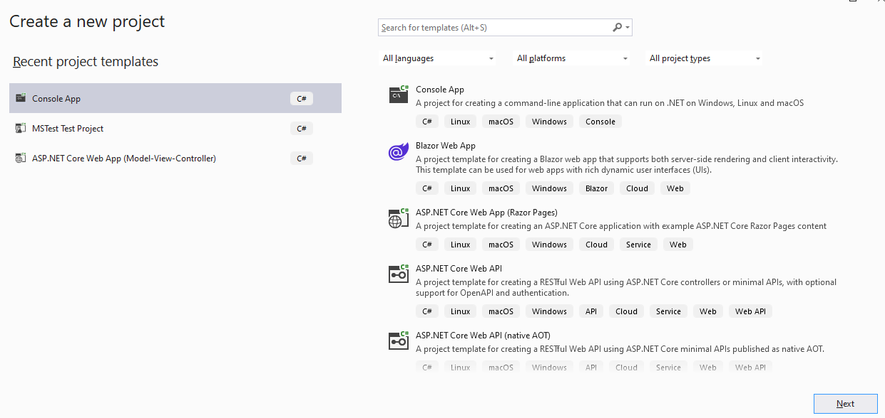

We noemen we dit **PRB.ShoppingBasket.Bart** waar je **Bart** **vervangt** door je **eigen naam**...

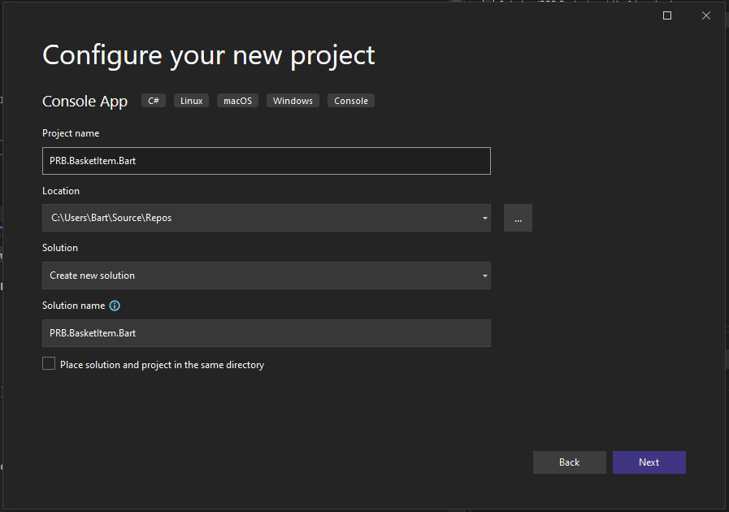

Tenslotte maak je het project aan met de optie "Do not use top-level statements"

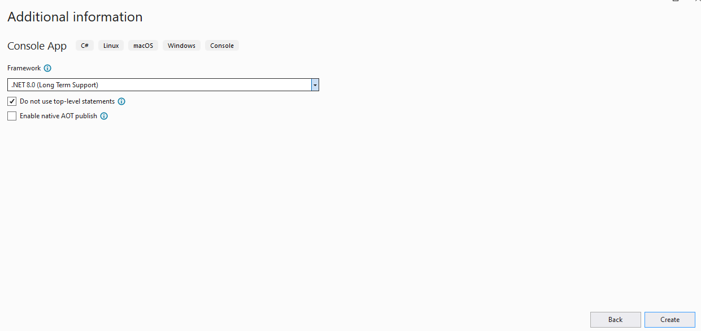

Als resultaat zou je een project moeten krijgen zoals hieronder...

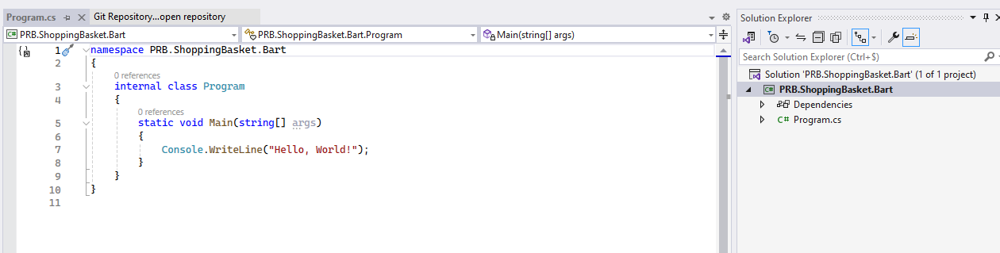

#### Stap 2: Git toevoegen aan dit project

We selecteren in het menu Git/Create Repository

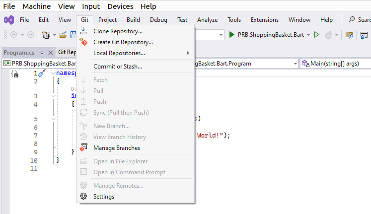

Binnen dat menu kiezen we:

* Local Only (linkerkant)
* Optioneel mag je ook nog "Add README.md" toevoegen (komen we later nog op terug)

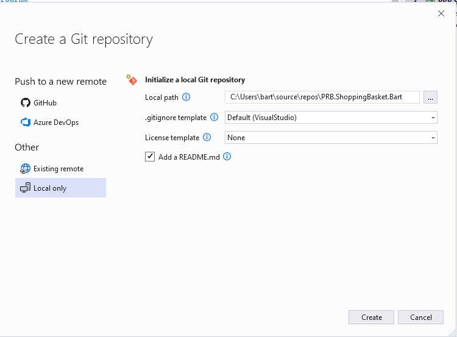

#### Resultaat

Wat is er nu gebeurd?  
Op in het menu "Git/Open in File Explorer", dit opent een file explorer met je project.  

> Zie wel dat je in je file explorer aanduidt dat je "hidden files" kan zien

Binnen deze folder zie je dat er aantal nieuwe hidden files zijn:

* Een **.git-folder** deze bevat de database-objecten die je code-wijzigingen bijhoudt
* Een **.gitignore** die aanduidt welke files (extensies) er moeten genegeerd worden door git
* **.gitattributes** die configuratie bevat hoe om te gaan met files

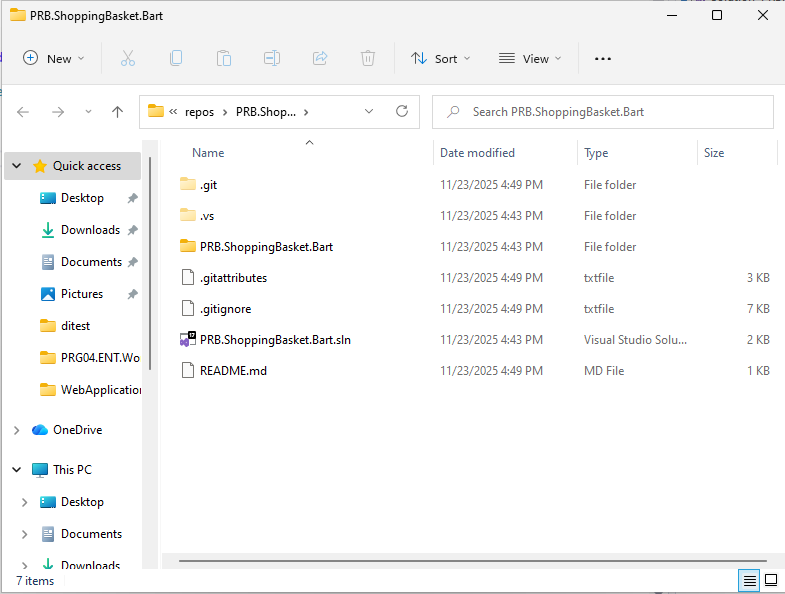

Die .git-folder noemen we ook een **lokale** **git-repository**, dit is 

* Een soort van database waar je **code-wijzigingen** kan **bijhouden/traceren**
* Als een soort van **snapshot** (zoals je bijvoorbeeld een snapshot van een harde schijf zou nemen)
* Het stelt je in staat een historiek bij te houden en zelfs terug te keren naar een vorige **revisie**

De files die deze database omvatten bevinden zich in een verborgen folder **.git** .

#### Git Commits

Deze repository houdt dus code-wijzigingen bij, we noemen dit **commits**.  

Deze **commits** zijn eigenlijk **incrementele wijzigingen** aan je code die **samengebundeld** zitten in een **historiek** (fysiek zijn deze geregistreerd in de .git-folder die we eerder vermeldden).  
Vanuit Visual Studio kan je deze **history** van deze commits zien door in het *menu "Git/View Branch History"* te selecteren.

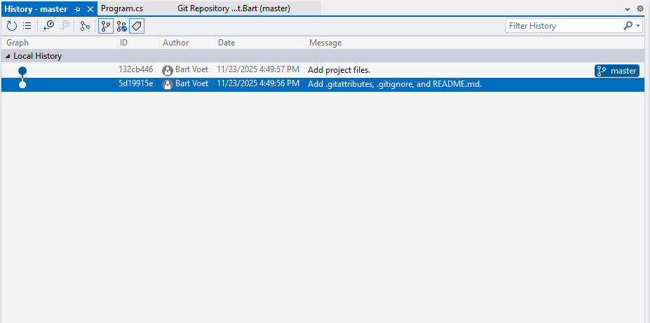

Hier zie je dat Visual Studio voor jou reeds 2 commits heeft aangemaakt.  
Hoe je **zelf** code-**wijzigingen** moeten **registreren** gaan we zo dadelijk in deze **oefening** in de praktijk brengen...

Je kan ook deze commits bekijken door hier met de rechtermuisknop op te klikken "View Commit Details" te selecteren

Vervolgens zie je dan de files die gewijzigd zijn met de inhoud daarbij gelinkt:

In dit geval zie je dat er 3 files zijn toegevoegd, de **A** opzij aan de files staat voor **APPEND**.  
Daarnaast zie je ook in **groen** de inhoud die is **toegevoegd** op de geselecteerde file

### Met VS Code (Linux, Mac, ...)

#### Stap 1: Aanmaken project

Start met het aanmaken van een folder met de naam *PRB.ShoppingBasket.Bart* aan waar je Bart **wijzigt** door je **eigen naam**.  

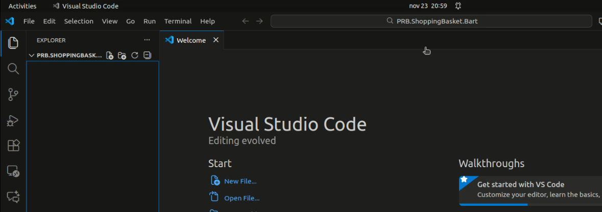

Vervolgens **open** je deze **folder** met **VS Code**.  
Hier gebruik je het command palette (ctrl+shift+p of command+shift+p voor Mac) om een **nieuw project** aan te maken.

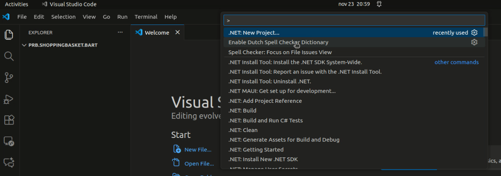

Nadat u de opdracht hebt geselecteerd, moet u de **project template** kiezen. Kies **Console-app**.  
(gemakkelijkste is Console te typen om de selectie te versnellen)

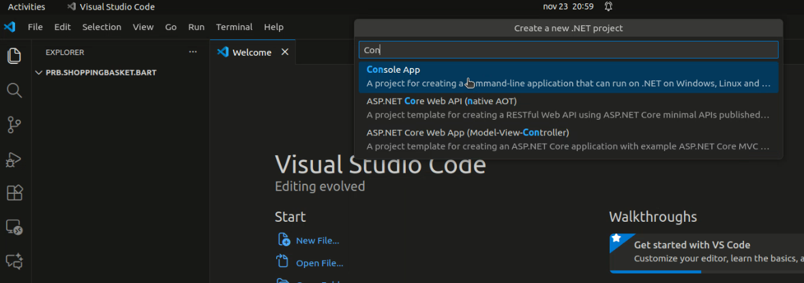

Geef uw nieuwe project dezelfde naam als de solution (folder) "PRB.ShoppingBasket.Bart" waar je Bart
wijzigt door je eigen naam..

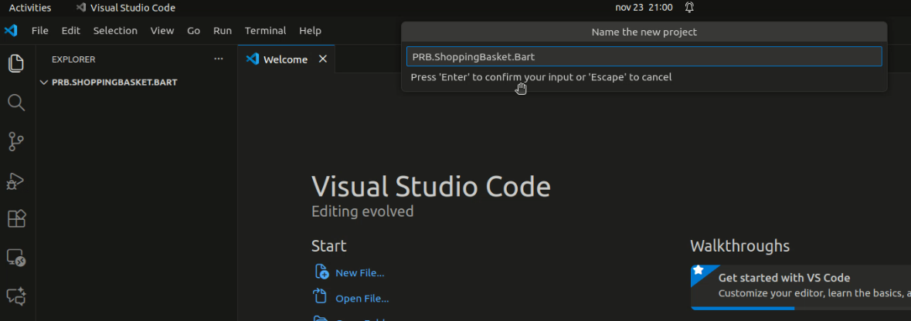

Selecteer vervolgens de locatie van nieuwe project (kies hier de default zijnde deze folder).

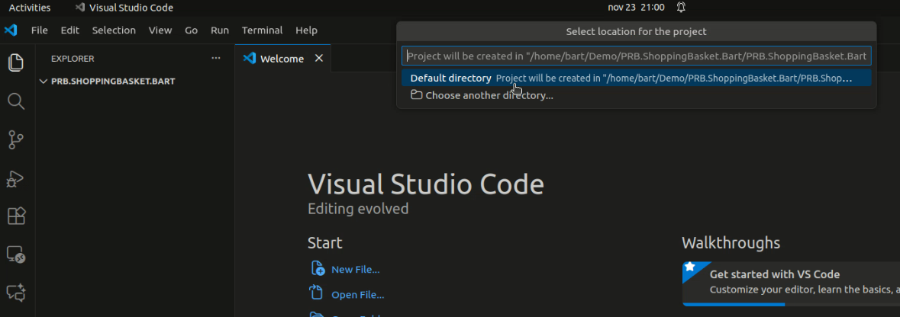

Alvorens je het project "aanmaakt" zorg er eerst voor dat je de top-level statements uitschakelt.   Selecteer "Show all template options." zoals je hieronder ziet:

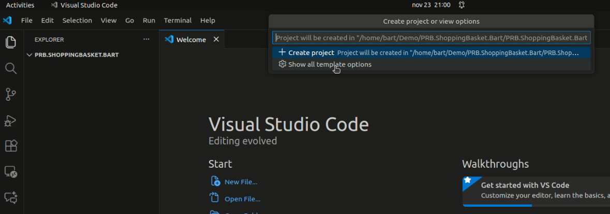

Stel "Do not use top-level statements" in op "true".  

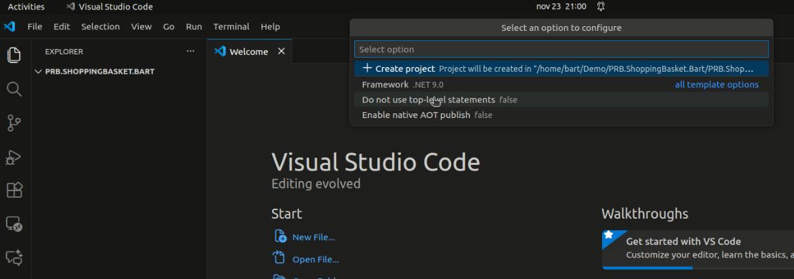

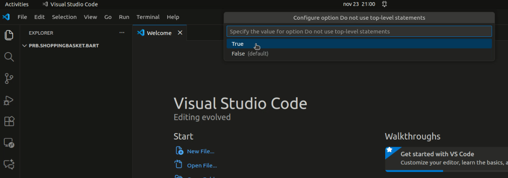

Selecteer tot slot "Create Project".  
Nadien is het project aangemaakt bestaande uit een solution met 1 project (beiden zelfde naam)

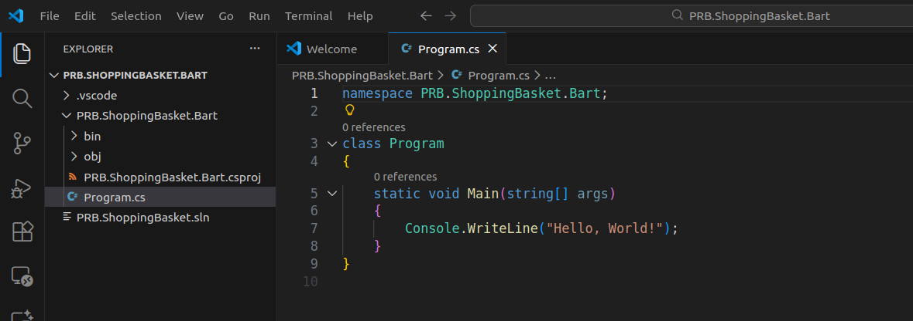

1 klasse is aangemaakt als gevolg, als je de top-level-statements hebt uitgeschakeld zal 
deze als volgt eruit zien:

~~~cs
namespace PRB.ShoppingBasket.Bart
{
    internal class Program
    {
        static void Main(string[] args)
        {
            Console.WriteLine("Hello, World!");
        }
    }
}
~~~

#### Stap 2: git-repo aanmaken

Om met git te werken in VS Code heb je iets meer setup werk nodig vergeleken tot Visual Studio.  

Visual Studio maakt namelijk automatisch reeds een .gitignore file aan, dit is een file die er voor zorgt dat git niet-source-code elementen negeert (zoals de eigenlijke executable)

Je maakt hiervoor een nieuwe file aan in de root van je solution met de naam .gitignore.

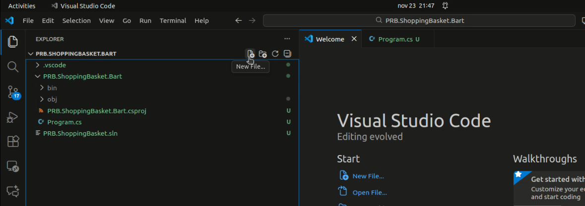

Vervolgens copieer je onderstaande inhoud in deze file

~~~.gitignore
[Dd]ebug/
[Rr]elease/
x64/
[Bb]in/
[Oo]bj/
~~~

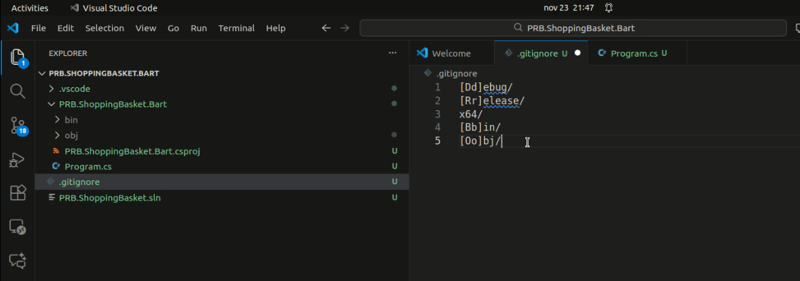

Vervolgens maken we een nieuwe git-repository aan door te navigeren naar het "Source Code"-gedeelte.  
Hier druk je op de knop "Create repository".

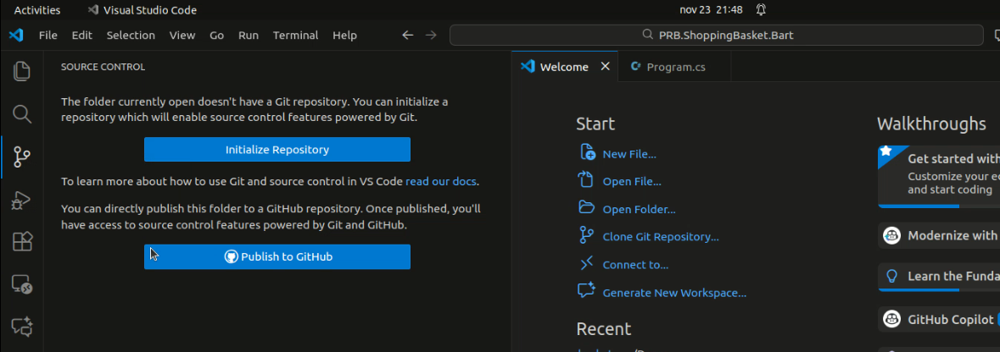

Dit command zal een lokale git-repository aan, als het volgende command in de terminal type zie je dat er wat nieuwe folders zijn aangemaakt:

~~~bash
bart@linuxcomputers:~/Demo/PRB.ShoppingBasket.Bart$ ls -la
total 28
drwxrwxr-x  5 bart bart 4096 nov 23 21:48 .
drwxrwxrwx 17 bart bart 4096 nov 23 20:44 ..
drwxrwxr-x  8 bart bart 4096 nov 23 21:49 .git
-rw-rw-r--  1 bart bart   42 nov 23 21:48 .gitignore
drwxrwxr-x  4 bart bart 4096 nov 23 21:47 PRB.ShoppingBasket.Bart
-rw-rw-r--  1 bart bart 1045 nov 23 21:00 PRB.ShoppingBasket.sln
drwxrwxr-x  2 bart bart 4096 nov 23 21:00 .vscode
bart@linuxcomputers:~/Demo/PRB.ShoppingBasket.Bart$ 
~~~

Die .git-folder noemen we ook een **lokale** **git-repository**, dit is 

* Een soort van database waar je **code-wijzigingen** kan **bijhouden/traceren**
* Als een soort van **snapshot** (zoals je bijvoorbeeld een snapshot van een harde schijf zou nemen)
* Het stelt je in staat een historiek bij te houden en zelfs terug te keren naar een vorige **revisie**

De files die deze database omvatten bevinden zich in een verborgen folder **.git**.  
In VS Code ga je dan onderstaande view zien met de files die klaar staan om te **committen**

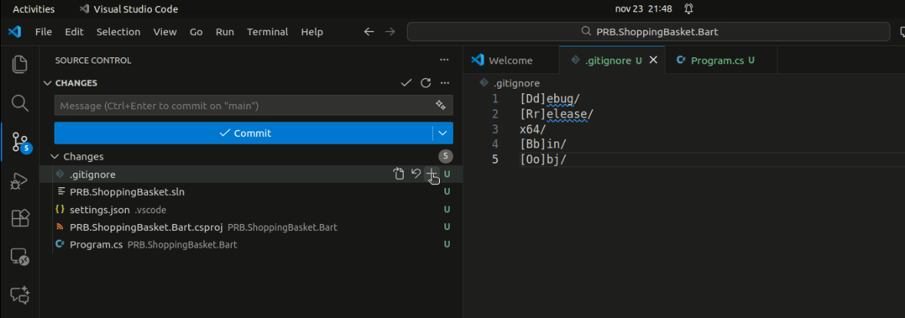

#### Git Repo en Commits

Deze repository houdt dus code-wijzigingen bij, we noemen dit **commits**.  

Deze **commits** zijn eigenlijk **incrementele wijzigingen** aan je code die **samengebundeld** zitten in een **historiek** (fysiek zijn deze geregistreerd in de .git-folder die we eerder vermeldden).  

Momenteel zijn er nog geen commits aanwezig, we gaan echter al onze 1ste commit aanmaken
om het initiele project te registreren.  
Om dit te doen moet je files aanduiden om te committen door op het plusje te klikken naast elke file die je wil toevoegen (in dit geval all files die je ziet)

Vervolgens zal je zien dat al deze files zijn verhuisd naar een "Staging Area".  
Van de files die daar staan zullen de wijzigingen mee worden opgenomen in de commit:

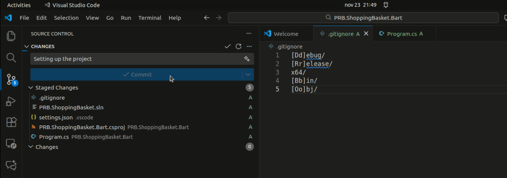

Vervolgens geeft je een comment in het tekstvenstertje "Setting up project" en druk je op de knop "Commit"

#### Git commits en Historiek

Na deze commit zal je - onderaan - zien dat er een 1ste commit is toegevoegd aan je historiek van de 

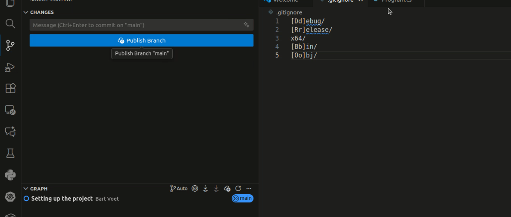

Als je op deze commit klikt kan je dan ook zien welke files en wijzigingen zijn toegevoegd...

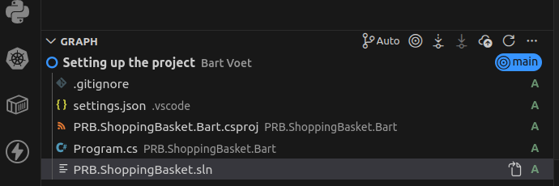

In dit geval zie je dat er 3 files zijn toegevoegd, de **A** opzij aan de files staat voor **APPEND**.  

## Code schrijven (deel 1): klasses, objecten en properties

In dit 1ste deel gaan een kleine basis applicatibouwen

### Basket-item-class

Alvorens met git verder te gaan starten we met **code te schrijven**.  
Bedoeling is dat we een **applicatie** gaan maken die een **winkelmandje** (of **winkellijstje**) gaat beheren.

Zo'n winkelmandje bestaat uit verschillende **items** die je in dat **mandje** mag droppen.  
Laten we starten met er van uit te gaan dat zo'n **item** een **beschrijving** en een **prijs** bevat...

We hebben in het studenten-voorbeeld gezien hoe je zulke gestructureerde data kan **bijhouden/groeperen** in een **klasse**.

We starten met een file **BasketItem.cs** aan te maken en voorzien daarin een klasse **BasketItem** voorzien:

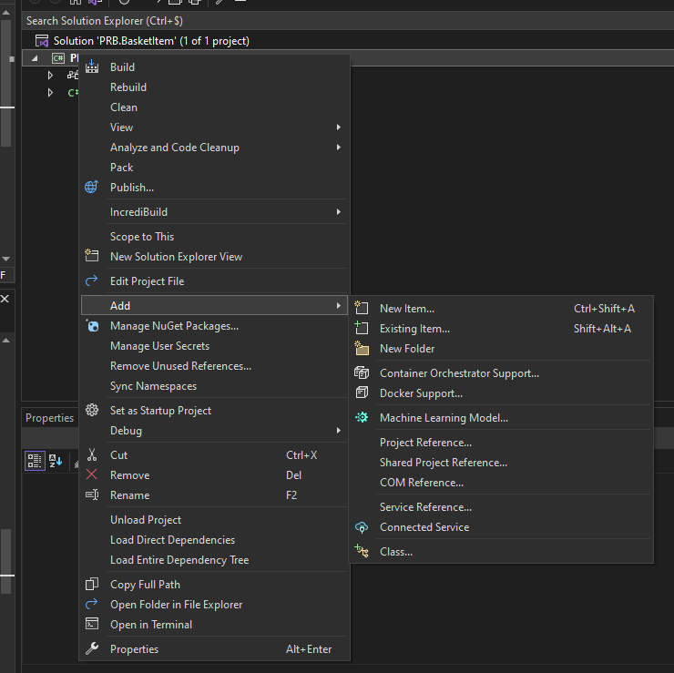

In VS Code gebruik je het command palet, selecteer je "New File" zoals hieronder

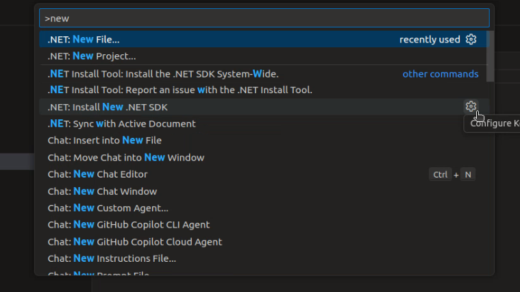

De klasse zou er als volgt moeten uit zien:

~~~cs
namespace PRB.ShoppingBasket.Bart
{
    public class BasketItem
    {

    }
}
~~~

Deze zou je ook moeten zien in je explorer:

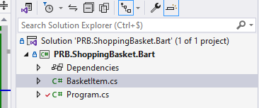

Voorzie vervolgens in de klasse **2 properties**:

* Price
* Description

en **initialiseer** deze via een **constructor**, het resultaat zou er als
volgt moeten uitzien:

~~~cs
namespace PRB.ShoppingBasket.Bart
{
    public class BasketItem
    {
        public BasketItem(int price, string description)
        {
            Price = price;
            Description = description;
        }

        public int Price { get;private set; }

        public string Description { get;private set; }
    }
}
~~~

Bemerk ook dat we de **setter private** hebben gezet, dit doen we ter encapsulatie.  
We willen bijvoorbeeld dat logica gerelateerd aan het beheer in de BasketItem-klasse
zelf zit (en dat je die niet zo maar kan wijzigen)

Om zeker te zijn van correctheid passen we Program.cs aan om zeker te zijn dat deze geen code-fouten bevat, maw we **testen** bij elke **stap**.

~~~cs
using PRB.ShoppingBasket.Bart.Model;

namespace PRB.ShoppingBasket.Bart
{
    internal class Program
    {
        static void Main(string[] args)
        {
            BasketItem item = new BasketItem(10, "Patatten");
            Console.WriteLine($"Item {item.Description} met prijs {item.Price}");
        }
    }
}
~~~

Vanzelfsprekend doet deze nog **niet** erg **veel**, maar het is een 1ste stap...  
Eerst gaan we echter onze eerste **code-wijzigen registereren/revisioneren** in git.

#### Git: Je 1ste (echte) code-commit

We hebben ons **eerste stuk code** geschreven.  
De volgende stap is dat we deze files gaan toevoegen aan een **nieuwe commit**.

Als je nu in het menu "Git/Commit" selecteert zie je de wijzigingen die klaarstaan

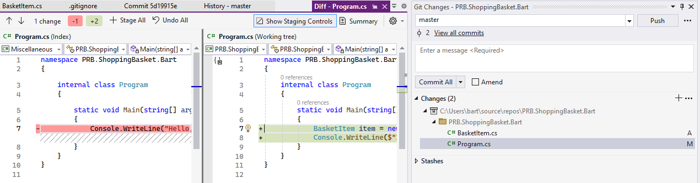

**Merk** ook dat naast de **files** ook nog letters staan, deze tonen aan wat er met de file is gebeurd:

* **A** staat voor toevoegen (**A**ppend)
* **M** staat voor wijzigen (**M**odify)

##### Files naar staging-area

Voor dat je deze commit gaat maken moet je 1st nog de files selecteren die je aan deze commit wil
binden.  Als je dit doet ga je deze brengen naar een staging-omgeving (maw ze staan dan klaar om te committen).

Als je **"hoovert"** over het item zie je dat er een **+** verschijnt:

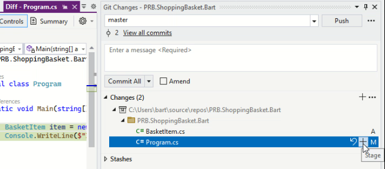

Als je daar op die **+ klikt** komt de specifiek file terecht in de staged area:

Doe dit vervolgens ook voor de andere file en dan zouden beide wijzigingen moeten klaarstaan:

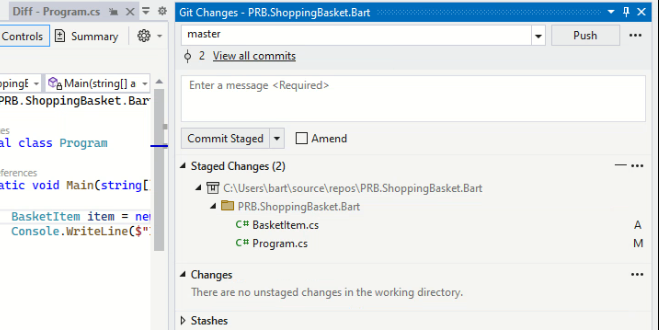

##### Committen...

De volgende stap is nog een **boodschap** te **selecteren** die je wijzigingen documenteert.  
Het is extreem belangrijk dat je deze **boodschap** **duidelijk** (maar wel beknopt) houdt.

Hoe **duidelijker** deze is hoe **gemakkelijker achteraf** om te consulteren wat je wijziging waren.  
Je vult gewoon het tekstveldje met een duidelijk maar korte zin...

Vervolgens druk je op de button "Commit Staged" en is deze commit geregistreerd in je history.  
Om naar deze history te gaan kies je in het Git-menu "View Branch History" of klik je op de "View all commits"-link.

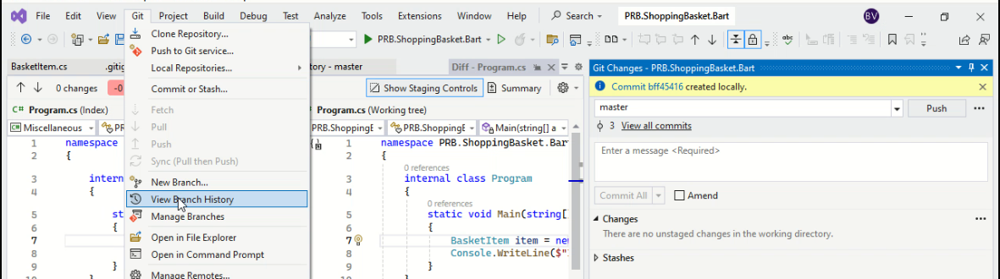

en krijg je een overzicht van de commits die zijn gemaakt met je laatste commit 1st in de rij

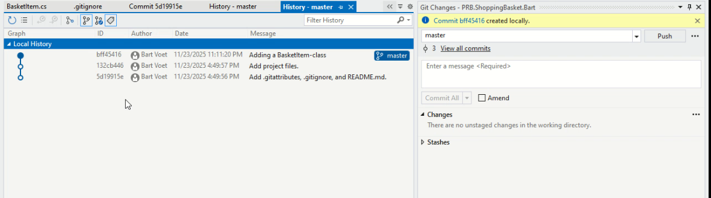

##### Stelselmatig verder werken en committen

Bedoeling nu is dat je dit proces stelselmatig verder werkt:

* **Kleine** maar **significante** wijziging maken
* Dit **testen** op 
  * **regressie** -> werkt je wijziging nog altijd, niets gebroken?
  * werkt de nieuwe **functionaliteit** die je hebt toegevoegd
* Een **commit** samenstellen met je **wijzigingen**

> Het testen gaat na een tijdje veel werk zien, we gaan hievoor later nog 
> de techniek van unit-testen zien die je in staat stelt je testen te automatiseren...

### Code schrijven: event-loop

We hebben nu echter **nog geen applicatie** daarvoor zijn er nog **2** belangrijke **elementen** nodig:

* Een **lijst** van BasketItem-objecten die kan worden bijgewerkt
* Een **event-loop** waar we de nodige acties implementeren

#### Lijst van BasketItem-objecten

De **eerste stap** is een **lijst** aan te maken als globale variable waarin we BasketItems kunnen toevoegen en bewerken.

~~~cs
using PRB.ShoppingBasket.Bart.Model;

namespace PRB.ShoppingBasket.Bart
{
    internal class Program
    {
        static void Main(string[] args)
        {
            List<BasketItem> items = new List<BasketItem>();
        }
    }
}
~~~

#### Event-loop (loop)

De applicatie moet natuurlijk nog wel iets doen, dus om deze lijst aan te vullen
zetten als **eerste stap** zetten we de **interactie met de gebruiker** op.  

Om met de gebruiker te praten voegen we:

* Een **oneindige lus** toe
* Waar we telkens **input** gaan vragen aan de gebruiker
* Als deze gebruiker antwoordt (**event**)
* Voeren we een **actie** uit 
* En geven we **feedback** aan de gebruiker

Zo'n loop is wat we noemen een **event-loop**, telkens als de gebruiker een ingave doet zal deze event-loop een reactie geven.

Een eerste versie van de loop...

~~~cs
using PRB.ShoppingBasket.Bart.Model;

namespace PRB.ShoppingBasket.Bart
{
    internal class Program
    {
        static void Main(string[] args)
        {
            List<BasketItem> items = new List<BasketItem>();

            while(true)
            {
                Console.Write("Geef een item-naam: ");
                string name = Console.ReadLine();

                Console.Write("Geef een prijs");
                int price = int.Parse(Console.ReadLine());

                items.Add(new BasketItem(price, name));
            }
        }
    }
}
~~~

Hier ontbreekt nog een stuk om van een event-loop te spreken maar we hebben reeds de basisstructuur
opgezet die 

#### Event-loop (menu)

Een **oneindige loop** is natuurlijk **niet voldoende**, de gebruiker moet een **menu** hebben (afgeprint).  
We printen hier het menu telkens af en vangen gebruikers-input op via de functie **input()**

> Voor het menu gebruiken we een **multiline string** die start en eindigt met 3 dubbele quotes

~~~cs
using PRB.ShoppingBasket.Bart.Model;

namespace PRB.ShoppingBasket.Bart
{
    internal class Program
    {
        static void Main(string[] args)
        {
            List<BasketItem> items = new List<BasketItem>();

            string menu = """
                            1> Voeg item toe
                            2> Print items af
                            3> Sluit af
                            """;

            while(true)
            {
                Console.WriteLine(menu);
                string menuChoice = Console.ReadLine();
                Console.WriteLine(menuChoice);
            }
        }
    }
}
~~~

De **user-input** wordt gevraagd en **opgevangen**, maar er is nog **meer nodig**...

##### En nog een commit...

Maak nu een commit waarin je deze code commit.  
Geen hierbij een duidelijke boodschap zoals bijvoorbeeld "Setting up event-loop with basic menu"

#### Event-loop (if-else)

We moeten er natuurlijk voor zorgen dat deze **user-input verwerkt** wordt.  
Hiervoor plaatsen we een **if/elif-clausule** voor elke **menu-optie**.

~~~cs
    while(true)
    {
        Console.WriteLine(menu);
        string menuChoice = Console.ReadLine();
        
        switch(menuChoice)
        {
            case("1"): Console.WriteLine("TODO: voeg item toe");break;
            case("2"): Console.WriteLine("TODO: print item toe");break;
            case("3"): Console.WriteLine("TODO: sluit de applicatie af");break;
            default: Console.WriteLine("Foutieve keuze");break;
        }
    }
~~~

Voorlopig printen we een **tijdelijke TODO-boodschap** waarmee we kunnen **testen** of onze event-loop correct werkt.  
We voeren even een **korte test** uit zoals hieronder...

~~~
1> Voeg item toe
2> Print items af
3> Sluit af
1
TODO: voeg item toe
1> Voeg item toe
2> Print items af
3> Sluit af
2
TODO: print item toe
1> Voeg item toe
2> Print items af
3> Sluit af
5
Foutieve keuze
1> Voeg item toe
2> Print items af
3> Sluit af
~~~

...en zien dat de boodschappen worden afgeprint overeenkomstig de keuzes.  
Het **basis-skelet** van onze **event-loop** lijkt **ok** te zijn.  

##### En nog een commit...

Maak nu een commit waarin je deze code commit.  
Geen hierbij een duidelijke boodschap zoals bijvoorbeeld *"Feedback within event-loop for each item"*

### Code schrijven: programma/event-loop beëindigen

Tot nog toe moesten we ons eerste programma afsluiten met **ctrl+c**  
Het eerste event dat we al kunnen afwerken is **"3> Sluit af"** opdat we het programma op een elegante manier kunnen afwerken.

Hiervoor stoppen we het programma door uit de **main-functie** een **return** uit te voeren, dat zal er voor zorgen dat het programma wordt afgesloten.

~~~cs
    switch(menuChoice)
    {
        case("1"): Console.WriteLine("TODO: voeg item toe");break;
        case("2"): Console.WriteLine("TODO: print item toe");break;
        case("3"): Console.WriteLine("Applicatie sluit af");return;
        default: Console.WriteLine("Foutieve keuze");break;
    }
~~~

> Bemerk ook dat je hier de break door een return vervangt (gezien bij return de break niet veel zin meer heeft)

En vervolgens testen we:

~~~
1> Voeg item toe
2> Print items af
3> Sluit af
3
Het programma wordt beeindigd
~~~

##### En nog een commit...

Maak nu een commit waarin je deze code commit.  
Geen hierbij een duidelijke boodschap zoals bijvoorbeeld *"Implementing menu-item exit"*

### Git Historiek en Commit-id's

We we zien dat de **git-historiek** zich langzaam maar zeker begint **op te bouwen** ondertussen.  
In git spreken we dan ook van een **history**, letterlijk een historiek van commits

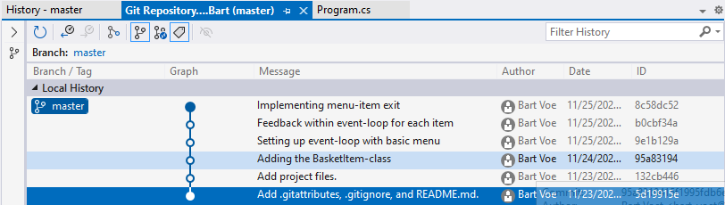

Bemerk ook dat deze **commits** allen een **id** hebben dit is een unieke (hash-)code voor je commit
die je achter kan gebruiken om een specifieke commit te identifieren voor diverse operaties

### Code schrijven: Afdrukken van items

We hebben bij een vorige commit een **lijst** gemaakt die wordt gebruikt om de **items** bij te houden.  

In **deze wijziging/commit** gaan we deze **lijst afdrukken**, gezien we echter de invulling nog niet hebben we uitgewerkt maken we voorlopig een fake/hardcoded lijst aan:

> **Belangrijk:**  
> Het gebruik van deze fake data dient achteraf verwijderd te worden 
> maar het laat ons toe onze code-wijziging te testen.
> In een volgende les gaan we meer geavanceerde technieken zien om onze code te testen
> (en deze testen zelf te automatiseren)

We **voegen** deze **code** **toe** boven de **event-loop**

~~~cs
        items.Add(new BasketItem(10, "Patatten"));
        items.Add(new BasketItem(20, "Bloemkool"));

        while (true)
~~~

Onder **optie 2** voegen we vervolgens een **loop** toe die deze **items afdrukt**.  

~~~cs
        switch (menuChoice)
        {
            case ("1"): Console.WriteLine("TODO: voeg item toe"); break;
            case ("2"):
                foreach (BasketItem item in items)
                {
                    Console.WriteLine($"{item.Description} voor {item.Price} als prijs");
                }
                break;
            case ("3"): Console.WriteLine("Applicatie sluit af"); return;
            default: Console.WriteLine("Foutieve keuze"); break;
        }
~~~

Als we even testen

~~~
1> Voeg item toe
2> Print items af
3> Sluit af
2
Patatten voor 10 als prijs
Bloemkool voor 20 als prijs
1> Voeg item toe
2> Print items af
3> Sluit af
3
Applicatie sluit af
~~~

#### git: ... volgende commit

We voegen onze **wijzigingen** toe aan de git repo met een commit *"Printing the current menu-items"*

### Code schrijven: items toevoegen

Om er een **interactieve applicatie** van te maken moeten we **user-input** gebruiken om de het **winkelmandje** aan te vullen.  
We doen dit door **event 1** te **implementeren** door de 3 volgende taken te implementeren:

* Vraag **user-input** op (beschrijving en prijs)
* **Maak BasketItem-object** aan met input
* Voeg BasketItem-object toe aan **lijst**

* Stap 1: We **verwijderen** hierbij ook de eerder aangemaakte **hard-coded** lijst
* Stap 2: We **vragen** de **prijs** en **beschrijving** op en **voegen** deze als object **toe** aan de lijst

~~~cs
    case ("1"):
        Console.Write("Geef prijs: ");
        int price = int.Parse(Console.ReadLine());

        Console.Write("Geef omschrijving: ");
        string description = Console.ReadLine();

        items.Add(new BasketItem(price, description));

        break;
~~~

Als we dit **testen** zie we dat we nu dynamisch items kunnen toevoegen:

~~~
1> Voeg item toe
2> Print items af
3> Sluit af
1
Geef prijs: 20
Geef omschrijving: Frieten
1> Voeg item toe
2> Print items af
3> Sluit af
1
Geef prijs: 25
Geef omschrijving: Ijsjes
1> Voeg item toe
2> Print items af
3> Sluit af
2
Frieten voor 20 als prijs
Ijsjes voor 25 als prijs
1> Voeg item toe
2> Print items af
3> Sluit af
3
~~~

De test is uitgevoerd:

* We kunnen meerdere items **toevoegen**
* En deze nog altijd **afprinten**

#### git: ... volgende commit

We **voegen** onze wijzigingen **toe** aan de **git** repo met de commit-boodschap *"Adding new items"*

### Code schrijven: Voeg een attribuut quantity toe

#### Nieuwe property Quantity toevoegen

In een winkelmandje dien je soms **meerdere items** van **hetzelfde product** bij te houden.  
Om dit op te lossen voegen we aan onze klasse BasketItem een **attribute quantity** toe

Hiervoor **voegen** we aan de **constructor** een **attribuut toe**...

> *Nota:*  
> Net zoals we eerder bij functies hebben gezien kan je attributen optioneel maken 
> door er een default waarde bij te plaatsen.  
> Als men dan deze waarde zou weglaten (bij aanroep van de constructor) krijgt dit attribuut
> deze default waarde

Hiervoor breiden we onze constructor uit met een nieuw argument.  

~~~cs
namespace PRB.ShoppingBasket.Bart
{
    public class BasketItem
    {
        public BasketItem(int price, string description, int quantity = 1) 
        {
            Price = price;
            Description = description;
            Quantity = quantity;
        }

        public int Quantity { get; set; }

        public int Price { get; private set; }

        public string Description { get; private set; }
    }
}
~~~

Hiervoor gebruiken we een nieuw element in C#, namelijk **default arguments**.  
Als je geen quantity meegeeft aan je constructor zal deze op 1 worden gezet...

#### Nieuwe (afgeleide) property TotalPrice toevoegen

... daarnaast voegen we een extra property **TotalPrice** toe, hiermee bereken we de werkelijke prijs

~~~cs
    public int TotalPrice 
    {      
        get { return Price * Quantity; }
    }
~~~

Bemerk dat deze property **geen setter** heeft en volledig **afhankelijk** is van de 2 **andere properties**...

#### Opvragen van de hoeveelheid

We zorgen nu 1ste dat de hoeveelheid mee wordt opgevraagd:

~~~cs
case ("1"):
    Console.Write("Geef prijs: ");
    int price = int.Parse(Console.ReadLine());

    Console.Write("Geef omschrijving: ");
    string description = Console.ReadLine();

    Console.Write("Geef hoeveelheid: ");
    int quantity = int.Parse(Console.ReadLine());

    items.Add(new BasketItem(price, description, quantity));

    break;
~~~

#### Print wijzigen

Vervolgens passen we dan de weergave aan zodat die niet enkel de prijs van 1 stuk afdrukt maar ook de prijs van de totaal aantal items.

~~~cs
case ("2"):
    foreach (BasketItem item in items)
    {
        Console.WriteLine($"{item.Quantity} maal {item.Description} voor {item.Price} per item, totaal {item.TotalPrice}");
    }
    break;
~~~

Als we dit dan **testen** krijgen we volgende output

~~~
1> Voeg item toe
2> Print items af
3> Sluit af
1
Geef prijs: 10
Geef omschrijving: Patatten
Geef hoeveelheid: 20
1> Voeg item toe
2> Print items af
3> Sluit af
2
20 maal Patatten voor 10 per item, totaal 200
1> Voeg item toe
2> Print items af
3> Sluit af
3
Applicatie sluit af
~~~

Test OK, we kunnen vervolgen met onze commit...

#### git: commit

Als git-comment geef je dan iets zoals *"Adding Quantity to BasketItem"*

### Totaal van de items

Interessant om te weten als gebruiker is de **totaal waarde** van deze items.  
We voegen hier een nieuw event toe aan het menu

~~~cs
string menu = """
                1> Voeg item toe
                2> Print items af
                3> Totaalprijs
                4> Sluit af
                """;
~~~

Vervolgens voegen we een **case** voor **3** toe:

~~~cs
    case ("3"):
        int totalPrice = 0;
        foreach (BasketItem item in items)
        {
            totalPrice += item.TotalPrice;
        }
        Console.WriteLine($"De totale prijs van uw winkelmandje is {totalPrice}");
        break;
~~~

Vergeet niet de oude optie 3 (afsluiten) aan te passen naar optie 4 

~~~cs
    case ("4"):
        Console.WriteLine("Applicatie sluit af");
        return;
~~~

Vervolgens even **testen**:

~~~
1> Voeg item toe
2> Print items af
3> Totaalprijs
4> Sluit af
1
Geef prijs: 10
Geef omschrijving: Bier
Geef hoeveelheid: 25
1> Voeg item toe
2> Print items af
3> Totaalprijs
4> Sluit af
1
Geef prijs: 5   
Geef omschrijving: Cola
Geef hoeveelheid: 15
1> Voeg item toe
2> Print items af
3> Totaalprijs
4> Sluit af
3
De totale prijs van uw winkelmandje is 325
1> Voeg item toe
2> Print items af
3> Totaalprijs
4> Sluit af
4
Applicatie sluit af
~~~

De test is geslaagd...

#### git: volgende commit...

...We kunnen dit **committen** met de boodschap "Adding a total price for the basket"

## Code schrijven (deel 2): hergebruik en error handling

### Optimalisatie en hergebruik: Extractie naar functie inlezen

We starten eerst met **hergebruik** via **functies** om **repetitie** in de **code** te **vermijden**.

#### Extractie naar aparte functie

Een 1ste (vanzelfsprekende) is het vragen naar **input** van een **gebruiker** (binnen een console) adhv **functies**
per "datatype".  
Een **1ste** **voorbeeld** is het **uitlezen** van een **string** waar we de **vraag** als **functieargument** meegeven:

~~~cs
public static string ReadString(string message)
{
    Console.Write($"{message}: ");
    return Console.ReadLine();
}
~~~

Gelijkaardig daaraan kan je ook een **integer** **opvragen**:

~~~cs
public static int ReadInt(string message)
{
    Console.Write($"{message}: ");
    int result = int.ParseInt(Console.ReadLine());
    return result;
}
~~~

Hierdoor wordt het **opvragen** van input gemakkelijker en duidelijker.  
**ipv** De volgende **"loodgieter"-code** te schrijven...

~~~cs
Console.Write("Geef prijs: ");
int price = int.Parse(Console.ReadLine());
~~~

...kan je dit herleiden naar een simpele functie-aanroep (1 lijn):

~~~cs
int price = ReadInt("Geef prijs");
~~~

Dit is maar **1 lijn code** en geeft door de **duidelijke naam** - **ReadInt** - ook veel
beter de **intentie** weer van **wat** de **code** **doet**.

#### Nog hergebruik...

Nog **idealer** (of meer **hergebruik**) is dat we onze **ReadInt** kunnen optimaliseren door **ReadString** te **hergebruiken**.

~~~cs
public static int ReadInt(string message)
{
    return int.Parse(ReadString(message));
}
~~~

#### Probleem: ingave van niet-getallen

Het **probleem** is nu dat als we iets **inlezen** dat geen getal is we een **error**
krijgen zoals hieronder geïllustreerd:

~~~
1> Voeg item toe
2> Print items af
3> Sluit af
1
Geef prijs: a2
Unhandled exception. System.FormatException: The input string 'a2' was not in a correct format.
   at System.Number.ThrowFormatException[TChar](ReadOnlySpan`1 value)
   at System.Int32.Parse(String s)
   at PRB.ShoppingBasket.Bart.Program.Main(String[] args) in C:\Users\bart\source\repos\PRB.ShoppingBasket.Bart\PRB.ShoppingBasket.Bart\Program.cs:line 35
~~~

Meer specifiek krijgen we een **ThrowFormatException**.  

#### Oplossing: testen en blijven vragen tot getal is ingegeven

Om dit te **vermijden** kan je voor dit type exception een **try-catch** om deze op te vangen zoals hieronder geïllustreerd.  

~~~cs
try 
{
    string result = int.Parse(ReadString(message));
} 
catch(ThrowFormatException e)
{
    Console.WriteLine("Foutieve ingave, dit is geen nummer");
}
~~~

In dit geval **combineren** we dit dan met een **loop** die deze **informatie** 
blijft **opvragen** (maar wel zorgen dat we een duidelijke boodschap hebben)
totdat de gebruiker dit goed ingeeft...

~~~cs
public static int ReadInt(string message)
{
    while (true)
    { 
        try 
        {
            return int.Parse(ReadString(message));
        } 
        catch(FormatException e)
        {
            Console.WriteLine("Foutieve ingave, dit is geen nummer");
        }
    }
}
~~~

~~~
1> Voeg item toe
2> Print items af
3> Sluit af
1
Geef prijs:
abc
Foutieve ingave, dit is geen nummer
Geef prijs:
10
Geef omschrijving:
~~~

#### Testen

Je kan nu (in Program) de code aanpassen in de **1ste case** als volgt:

~~~cs
int price = ReadInt("Geef prijs");
string description = ReadString("Geef omschrijving");
int quantity = ReadInt("Geef hoeveelheid");
~~~

Als je daar bijvoorbeeld geen getal geeft voor prijs, zie je dat de applicatie dit opnieuw opvraagt:

~~~
1> Voeg item toe
2> Print items af
3> Sluit af
1
Geef prijs: abc
Foutieve ingave, dit is geen nummer
Geef prijs: 10
Geef omschrijving:
~~~

#### TryParse gebruiken met loop

Er is echter een **alternatief** op bovenstaande code (try-catch) en dat de functie **TryParse**.  
int.TryParse zal voor jou:

* een **string** waarde converteren naar een **integer**
* een **boolean** teruggeven die aangeeft of de conversie geslaagd is (ipv een exceptie op te werpen)

Hieronder zie je het gebruik van int.Parse binnen de ReadInt-functie

~~~cs
public static int ReadInt(string message)
{
    int result;
    while (!int.TryParse(ReadString(message), out result));
    {
        Console.WriteLine("Foutieve ingave, dit is geen nummer");
    }
    return result;
}
~~~

Hier wordt er gebruik gemaakt van een **speciaal keyword** **out**.  
Dit keyword wordt gebruikt om een integer of andere primitieve (niet objecten) door
te geven als referentie (in tegenstelling tot wat we tot nog toe hebben gezien.)

In tegenstelling tot wat we hebben gezien kan er nu een **int** (primitieve) worden 
meegeven als **referentie** (zoals we dat kennen van objecten).

(achter de schermen zal dit een een soort van pointer vormen naar de bovenliggende stack)

#### Aanpassen van Program.cs

Nu hebben we **2 vliegen in 1 klap** gevangen:

* We **vermijden** dat het programma zal **crashen** (door excepties)
* Onze code in de **Program**-klasse wordt nu wat **gereduceerd** en is ook **duidelijker** doordat de functies een duidelijk naam hebben

#### Commit maken

En maak vervolgens een **commit** met de boodschap *"Extracting read-logic to separate functions"*

### Defensief programmeren: geen negatieve bedragen

De volgende stap - in het defensief programmeren - is er voor te zorgen dat in onze **logica**
**geen negatieve bedragen** terecht kunnen komen.

Deze **controle** gaan we **inlassen** in onze **BasketItem**-klasse door een **exceptie** op te werpen wanneer deze wordt geïnitialiseerd of gewijzigd met een negatieve waarde (prijs of hoeveelheid)

#### Excepties maken

We maken hiervoor een **specifieke exceptie** aan die we gaan **opwerpen** vanuit onze **property-setters**.  

**Definieer** hiervoor de **volgende exceptie-klasse**:

~~~cs
namespace PRB.ShoppingBasket.Bart
{
    public class NoNegativeAmountAllowed : Exception
    {
        public NoNegativeAmountAllowed(string element) : base($"No negative amount allowed for {element}")
        {
            Element = element;
        }

        public string Element { get; private set; }
    }
}
~~~

#### Exceptie werpen

Deze **exceptie** zal dus moet worden **opgeworpen** worden vanuit onze **property-setter**.

Om dit te kunnen doen moeten we echter onze **"lazy"-setter** veranderen door
een **"Field Backed Property"**

Dit  houdt in dat je 2 **extra** **veld**en (geen properties) dient bij te houden in je klasse die dan
je property ondersteunen:

> Nota: C# heeft de **naming-conventie** om zulke properties te laten starten met een **underscore**

~~~cs
public class BasketItem
{
    private int _price;
    private int _quantity;
    //...

    public int Price
    {
        get
        {
            return _price;
        }
        private set
        {
            _price = value;
        }
    }
    //... zelfde voor quantity...
}
~~~
 
Nu kan je vervolgens dan een **controle** **toevoegen** voor de **Price-property**.

~~~cs
public class BasketItem
{
    //... 
    public int Price
    {
        
        get
        {
            return _price;
        }
        private set
        {
            if (value < 0)
            {
                throw new NoNegativeAmountAllowed("prijs");
            }
            _price = value;
        }
    }
    //... zelfde voor quantity...
}
~~~

!! Doe nu ook **hetzelfde** voor de **Quantity-property** maar let op dat je daar de string "prijs"
door "hoeveelheid" verandert !!

> Zie ook https://learn.microsoft.com/en-us/dotnet/csharp/programming-guide/classes-and-structs/properties voor wat meer verdieping

#### Excepties opvangen

Eénmaal deze **controles** **toegevoegd** kan je dit nu **opvangen** binnen de **Program**-code zoals hieronder:

~~~cs

case ("1"):
    int price = ReadInt("Geef prijs: ");
    string description = ReadString("Geef omschrijving: ");
    int quantity = ReadInt("Geef hoeveelheid: ");
    try
    {
        items.Add(new BasketItem(price, description, quantity));
    }    
    catch(NoNegativeAmountAllowed e)
    {
        Console.WriteLine($"Geen negatief getal toegelaten voor {e.Element}")
    }

    break;
~~~

We drukken ook de extra **property** **Element** mee af om het **onderscheid** te kunnen maken
tussen de verschillende **velden** in de boodschap naar de gebruiker.

#### En committen maar...

Zorg nu voor een **commit** met de boodschap *"Disallow negative price or quantity"*

## Code schrijven (deel 3): Compositie met meerdere klassen

**Tot nog toe** hebben we enkel met **1 klasse** gewerkt (of 2 als je Program mee telt).  
In de echte wereld heb je meestal **meerdere** **klasses** waarvan deze **objecten**
(van verschillende klassen) met elkaar **samenwerken**.

### Modularisatie door Compositie: Basket-klasse maken

In dit geval gaan we een 2de klasse **Basket** toevoegen, deze klasse gaat de lijst van
**BasketItem**-objecten wrappen.

Het 1ste stuk logica dat we kunnen toevoegen aan deze klasse is het **toevoegen** van een 
nieuw **BasketItem**

~~~cs
namespace PRB.ShoppingBasket.Bart
{
    public class Basket
    {
        public List<BasketItem> Items {get;private set;} = new List<BasketItem>();

        public void AddNewItem(BasketItem item)
        {
            Items.Add(item);
        }
    }
}
~~~

Hiervoor dienen we ook onze code in Program.cs aan te passen.  
We vervangen hierbij onderstaande code...

~~~cs
static void Main(string[] args)
{
    List<BasketItem> items = new List<BasketItem>();
    //...
}
~~~

...door het gebruik van deze klasse

~~~cs
static void Main(string[] args)
{
    Basket basket = new Basket();
    //...
}
~~~

**Vervang** daarvoor in de verschillende cases de items-lijst door het basket-object.  
Binnen de 1ste case gaat dit als volgt...

~~~cs
case ("1"):
    int price = ReadInt("Geef prijs: ");
    string description = ReadString("Geef omschrijving: ");
    int quantity = ReadInt("Geef hoeveelheid: ");
    try
    {
        basket.AddNewItem(new BasketItem(price, description, quantity));
    }    
    catch(NoNegativeAmountAllowed e)
    {
        Console.WriteLine($"Geen negatief getal toegelaten voor {e.Element}");
    }

    break;
case ("2"):
    foreach (BasketItem item in basket.Items)
~~~

#### Property TotalBasketPrice

Het bereken van de totaalprijs kan nu ook worden geplaatst binnen de **Basket**-klasse.  
Daarvoor voegen we een read-only property TotalBasketPrice toe:

~~~cs
int TotalBasketPrice 
{
    get 
    {
        int totalPrice = 0;
        foreach (BasketItem item in Items)
        {
            totalPrice += item.TotalPrice;
        }
        return totalPrice;
    }
}
~~~

En passen we onze 3de case aan zoals hieronder:

~~~cs
    case ("3"):
        Console.WriteLine($"De totale prijs van uw winkelmandje is {basket.TotalPrice}");
        break;
~~~

... werk dit nu ook verder uit voor de andere cases waar de **property Items** gebruikt van
het **basket-object**, bijvoorbeeld in de 2de case ga je nu de "basket.Items" moeten gebruiken...

#### Commit

Maak hier een **commit** met als comment *"Creating new class to collect the BasketItems"*.

### Increment/Decrement

We gaan nog een nieuwe optie toevoegen aan het menu, namelijk de mogelijkheid om de hoeveelheid
te verlagen of te verhogen...

#### Methodes toevoegen aan Basket

We gaan dit doen adhv 2 nieuwe **methodes** in de **BasketItem**-klasse, namelijk
**IncrementQuantity** en **DecrementQuantity** die de hoeveel met 1-tje naar boven
of beneden brengen.

~~~cs
public IncrementQuantity()
{
    Quantity++;
}

public DecrementQuantity()
{
    Quantity--;
}
~~~

> Let wel dat je hier op een bepaald moment op een negatief getal kan 
> komen.  Dit wordt echter gecontroleerd met als gevolg een exception
> die we dan ook gaan opvangen in het menu...

#### Opzoeking BasketItem binnen Basket

Hiervoor ga een opzoeking moeten doen **binnen** de **Basket**-klasse op basis van de naam.

~~~cs
public BasketItem Lookup(string description)
{
    foreach(BasketItem item in Items) 
    {
        if(item.Description.Equals(description)) 
        {
            return item;
        }
    }
    return null;
}
~~~

#### Menu-items toevoegen

We voegen een nieuw menu-item (4) toe, daarnaast wijzigen we de vorige optie 4 naar Q.  
Als we dan een nieuwe optie willen toevoegen moeten we niet altijd de "Sluit af" optie wijzigen.

~~~cs
string menu = """
                1> Voeg item toe
                2> Print items af
                3> Totaalprijs
                4> Pas hoeveelheid aan
                Q> Sluit af
                """;
~~~

Wanneer we nu optie 4 selecteren moeten we 2 extra zaken:

* Welke BasketItem adhv van beschrijving?
* Verlagen of verhogen (+ OF -)?

Bemerk dat je ook nog exceptie moet opvangen gezien de hoeveel nog altijd onder 0 kan gaan...

~~~cs
    case ("4"):
        string description = ReadString("Welk item (beschrijving)");
        BasketItem item = basket.Lookup(description);
        if (item == null)
        {
            Console.WriteLine($"Item met beschrijving '{description}' bestaat niet")  
        }

        string choice = ReadString("Kies lager (-) of hoger (+)");
        try
        {
            switch(choice)
            {
                case("+"): item.Increment();
                case("-"): item.Decrement();
                default: Console.WriteLine($"{choice} is een ongeldige keuze");
            }
        }
        catch(NoNegativeAmountAllowed e)
        {
            Console.WriteLine($"Geen negatief getal toegelaten voor {e.Element}")
        }
        break;
    case("Q"):
    case("q"):
        Console.WriteLine("Applicatie sluit af");
        return;
~~~

Vergeet daarbij ook niet de laatste optie aan te passen

#### Voeg hiervoor een commit toe

Voeg een commit to met als comment *"Incrementing and decrementing BasketItems"*

### Niet 2 maal dezelfde item in Basket

Nu we de lookup functie hebben kunnen we ook gaan opzoeken of een item reeds bestaat.

#### Nieuwe exceptie

We gaan dit op een gelijkaardige manier implementeren als we voor negatieve getallen
hadden voorzien, we starten met een nieuwe exceptie.

~~~cs
namespace PRB.ShoppingBasket.Bart
{
    public class ItemAlreadyInBasket : Exception
    {
        public ItemAlreadyInBasket(string description) : base($"No negative amount allowed for {description}")
        {
            Description = description;
        }

        public string Description { get; private set; }
    }
}
~~~

We gebruiken een property Description als extra informatie...

#### Exceptie opwerpen vanuit de Basket-klasse

In de Basket-klasse kunnen we nu nieuwe **Lookup**-functie gebruiken om 
na te kijken of een item (met de zelfde beschrijving) reeds voorzien is
in deze Basket.

~~~cs
public void AddNewItem(BasketItem item)
{
    if(ItemProvidedInBasket(item)) 
    {
        throw new ItemAlreadyInBasket(item.Description);
    }
    Items.Add(item);
}

public bool ItemProvidedInBasket(BasketItem item) 
{
    return Lookup(item.Description) != null;
}
~~~

We hebben hiervoor ook nog een extra helper-functie voorzien die ItemProvidedInBasket
een deze verificatie opneemt.

Als deze  true geeft zullen we een exceptie opwerpen.

#### Exceptie opvangen

Het enige resterende is nu nog een extra catch-clausule toe te voegen
aan de huidige try-block

~~~cs
try
{
    basket.AddNewItem(new BasketItem(price, description, quantity));
}
catch (NoNegativeAmountAllowed e)
{
    Console.WriteLine($"Geen negatief getal toegelaten voor {e.Element}");
}
catch (ItemAlreadyInBasket e)
{
    Console.WriteLine($"Het item met beschrijving {e.Description} bestaat reeds");
}
~~~

#### Voeg hiervoor een commit toe

Voeg een commit to met als comment *"Not allowing twice item with same description"*

### Extra opdracht: elke case als functie

Gezien momenteel er al veel code gaat staan in de case probeer hier de inhoud van elke case
te extracten naar een functie binnen Program.

Bijvoorbeeld de laatste toevoeging zou je kunnen isoleren in een functie DecrementOfIncrement

~~~cs
case ("4"):
    IncrementOrDecrementItem();
    break
~~~

Doe dit voor elke case (buiten de exit waar dit niet nodig is)

#### Testen en committen

Test je oplossing en voorzie een commit-boodschap in trend van 
*'Verminderen en verhogen van hoeveelheid'*

## Code schrijven (deel 4): Overerving en polymorfisme

### Verschillende soorten van items

### ToString() gebruiken

## Code schrijven (deel 4): Abstracties en interfaces

### BasketItem abstract maken

### IBasketItem toevoegen

