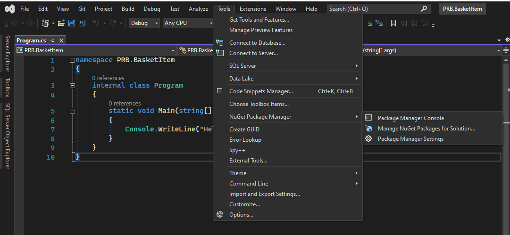
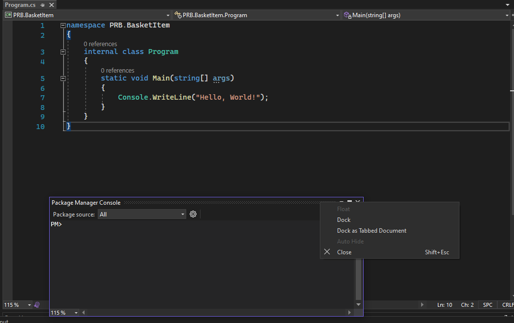
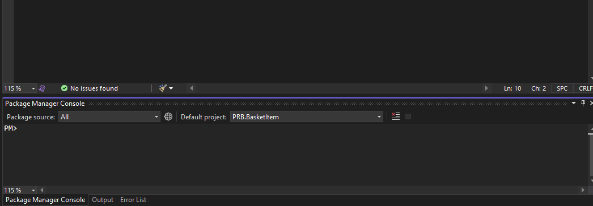
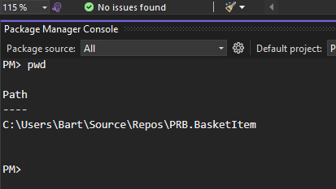
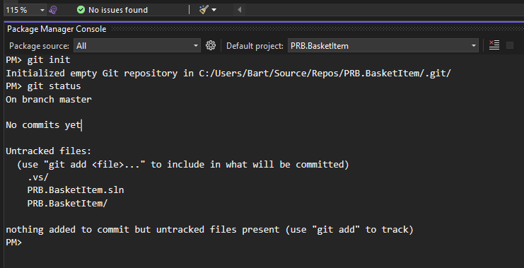

## Synthese-oefening: Winkelmandje

Dit hoofdstukje bouwt rond een herhalings-oefening maken rond het werken met **klassen en objecten** gecombineerd met het gebruik van **lijsten**.

Naast het herhalen van het OO-principe willen we hier ook aantonen dat eender welk wat grotere applicatie **step-by-step** moet worden opgebouwd.  

De oefening gaat er van uit dat je reeds Git hebt geïnstalleerd.  
Indien dit nog niet het geval is, zie https://git-scm.com/ voor installatie-instructies.

### Step-by-step coderen (zeer belangrijk!!!)

Dit doe je door de volgende stappen constant te herhalen:

* **Coderen:** Een heel **kleine subset** van de **applicatie** opbouwen/toevoegen
* **Testen:**
  * Werkt je nieuwe functionaliteit?  
    Testen van je functie/code die je hebt gebouwd, ook soms **unit-testing**
  * Werkt de functionaliteit die je hebt toe nog altijd even goed?  
    Dit noemen ze ook **testen op regressie**
* **Revisioneren**
  * Een maal getest **slagen** we onze **wijziging** (step) **op**
  * We voegen een **duidelijke** **commentaar** toe
* ...en we starten opnieuw...

De laatste actie - revisioneren - is iets wat we nu voor de **eerste maal** introduceren.  
Het komt er op neer van (met behulp van een tool) de evolutie en verschillende versies bij te houden, waardoor dat je:

* Een **historiek** kan behouden van de wijzigingen van je code
* Kan **terugkoppelen** naar een **vroegere** specifieke **revisie**
* Code **delen** tussen **verschillende** **personen** (en zelfs organisaties)
* ...

De tool die we hiervoor gebruiken is **Git**, en quasi **standaard** op **gebied** van **code-beheer**.  

### Bottom-up learning

We gaan in deze sessie git gebruiken op een specifieke manier:

* **Lokaal**: we maken enkel een **lokale repo** aan, nog geen repo op een remote git-server (zoals bv. Github...)
* **Low level**: we werken vanuit een command line om de underpinnings van de tool goed te leren kennen.  
  In Visual Studio is het weliswaar veel gemakkelijker maar uit didactische redenen (om git te leren kennen moeten je het sowieso een keer in de terminal gebruiken) gebruiken we nu de terminal.

### Aanmaken van een Visual Studio-project

In dit voorbeeld gaan we Git gebruiken om de **wijzigingen** van onze **applicatie** bij te houden.  

We starten met:

* We **maken** een **Visual Studio-project** aan (we noemen deze **basket**)
* **Navigeren** (in de command-line-prompt) naar deze folder
* We voeren in het commando **"git init"** uit binnen deze folder

#### Stap 1: Aanmaak project

We starten met een nieuw project aan:

We noemen we dit **PRB.ShoppingBasket.Bart** waar je **Bart** **vervangt** door je **eigen naam**...

Tenslotte maak je het project aan met de optie "Do not use top-level statements"

#### Stap 2: Open een terminal

Zoals eerder weer gezegd, we gebruiken hiervoor de terminal.  

Hiervoor gebruiken we de "Nuget Package Manager"-console (of Powershell).

Select hiervoor "Package Manager Console" zoals in de printscreen hieronder geillustreerd.

Vervolgens is deze geopened maar wil je deze nog onderaan bij de andere consoles krijgen, die doe deze console met de rechtermuis te selecteren en "Dock" te selecteren.

Nadien zal deze onderaan geopend staan zoals hieronder:

Dit is in principe een powershell-console, maar wel ingebed in je applicatie.  
Als je bijvoorbeeld het pwd-command (**p**rint **w**ork **d**irectory) zal je zien dat je in de huidige directory bevind...

#### Stap 3: We maken een git-project aan

We starten nu binnen deze console (die dus geopend is in de project-root) om ons project te verrijken met een git-repo

Hier voor typ je in de console het commando **"git init"**

~~~bash
$ git init
Initialized empty Git repository in /home/bart/school_test/basket/.git/
~~~

Deze actie maakt - in deze folder basket - een lokale **git-repository**.  

Zo'n **git-repository** is 

* Een soort van database waar je **code-wijzigingen** kan **bijhouden/traceren**
* Als een soort van **snapshot** (zoals je bijvoorbeeld een snapshot van een harde schijf zou nemen)
* Het stelt je in staat een historiek bij te houden en zelfs terug te keren naar een vorige **revisie**

De files die deze database omvatten bevinden zich in een verborgen folder **.git** .

~~~
$ ls -a
.  ..  .git
$ ls -a .git/
.  ..  branches  config  description  HEAD  hooks  info  objects  refs
~~~

Met het commando **"git status"** kan je dan vervolgens controleren wat de status is.

~~~
$ git status
On branch master

Initial commit

nothing to commit (create/copy files and use "git add" to track)
$ 
~~~

De output van dit commit **suggereert** het gebruik van **git add** te gebruiken, we komen hier zo dadelijk nog op terug.

### Git: Je 1ste commit met git...

~~~
PM> git status
On branch master

No commits yet

Untracked files:
  (use "git add <file>..." to include in what will be committed)
	.vs/
	PRB.ShoppingBasket.Bart.sln
	PRB.ShoppingBasket.Bart/

nothing added to commit but untracked files present (use "git add" to track)
PM> 
~~~

~~~
PM> git add .\PRB.ShoppingBasket.Bart.sln
PM> git add .\PRB.ShoppingBasket.Bart\PRB.ShoppingBasket.Bart.csproj
PM> git add .\PRB.ShoppingBasket.Bart\Program.cs
PM> 
~~~

~~~
PM> git status
On branch master

No commits yet

Changes to be committed:
  (use "git rm --cached <file>..." to unstage)
	new file:   PRB.ShoppingBasket.Bart.sln
	new file:   PRB.ShoppingBasket.Bart/PRB.ShoppingBasket.Bart.csproj
	new file:   PRB.ShoppingBasket.Bart/Program.cs

Untracked files:
  (use "git add <file>..." to include in what will be committed)
	.vs/
	PRB.ShoppingBasket.Bart/obj/

PM> 
~~~

* Committen

~~~
PM> git commit -m "First commit, initializing the project"
[master (root-commit) 51c1a01] First commit, initializing the project
 3 files changed, 45 insertions(+)
 create mode 100644 PRB.ShoppingBasket.Bart.sln
 create mode 100644 PRB.ShoppingBasket.Bart/PRB.ShoppingBasket.Bart.csproj
 create mode 100644 PRB.ShoppingBasket.Bart/Program.cs
PM>
~~~

~~~
PM> git log
commit 51c1a0119e71f3a9e22f978150b94f551a91ff58
Author: Bart Voet <bart.voet@student.ehb.be>
Date:   Tue Nov 18 22:30:58 2025 +0100

    First commit, initializing the project
PM> 
~~~

### Code schrijven: Basket-item-class

Alvorens met git verder te gaan starten we met **code te schrijven**.  
Bedoeling is dat we een **applicatie** gaan maken die een **winkelmandje** (of **winkellijstje**) gaat beheren.

Zo'n winkelmandje bestaat uit verschillende **items** die je in dat **mandje** mag droppen.  
Laten we starten met er van uit te gaan dat zo'n **item** een **beschrijving** en een **prijs** bevat...

We hebben in het studenten-voorbeeld gezien hoe je zulke gestructureerde data kan **bijhouden/groeperen** in een **klasse**.

We starten met een file **basket.py** aan te maken en voorzien daarin een klasse **BasketItem** voorzien:

!()[new_class.png]

~~~cs
using System;
using System.Collections.Generic;
using System.Linq;
using System.Text;
using System.Threading.Tasks;

namespace PRB.ShoppingBasket.Bart.Model
{
    public class BasketItem
    {
        private int _price;
        private string _description;

        public BasketItem(int price, string description)
        {
            Price = price;
            Description = description;
        }

        public int Price 
        {
            get { return _price;}
            private set { _price = value;}
        }

        public string Description
        {
            get { return _description; }
            private set { _description = value; }
        }
    }
}
~~~

Deze klasse bevat **2 properties**, een **beschrijving** en een **prijs** van het item.

Om zeker te zijn van correctheid passen we Program.cs aan om zeker te zijn dat deze geen code-fouten bevat.

~~~cs
using PRB.ShoppingBasket.Bart.Model;

namespace PRB.ShoppingBasket.Bart
{
    internal class Program
    {
        static void Main(string[] args)
        {
            BasketItem item = new BasketItem(10, "Patatten");
            Console.WriteLine($"Item {item.Description} met prijs {item.Price}");
        }
    }
}
~~~

Vanzelfsprekend doet deze nog **niet** erg **veel**, daar komen we zo dadelijk **op** **terug**.  
Eerst gaan we echter onze eerste **code-wijzigen registereren/revisioneren**

### Git: Je 1ste commit met git...

We hebben ons **eerste stuk code** geschreven, als we via het git-commando **"git status"** de status opvragen...

~~~
$ git status
On branch master

Initial commit

Untracked files:
  (use "git add <file>..." to include in what will be committed)

        PRB.ShoppingBasket.Bart/BasketItem.cs

nothing added to commit but untracked files present (use "git add" to track)
~~~

...zien we dat git gezien heeft dat de file is gewijzigd en dat deze niet wordt getraceerd (tracked)   
We gebruiken het command **"git add <file>"** om deze toe te voegen aan de git-repo

~~~
$ git add PRB.ShoppingBasket.Bart/BasketItem.cs 
$ git status
On branch master

Initial commit

Changes to be committed:
  (use "git rm --cached <file>..." to unstage)

        new file:   basket.py
~~~

Er staat **"Changes to be committed"**, dit betekent dat je nu aan de **git-repo** hebt meegedeeld dat er een **wijziging** is.  
De wijziging is echter **nog niet** in de git-repo **opgeslagen**, om dit te volbrengen moeten we een **commit** uitvoeren.

Dit kan je met het commando **"git commit"**.  
Zo'n **commit** moet altijd vergezeld gaan van een boodschap, in dit geval "Creating class BasketItem.py".  

> Belangijk:  
> Probeer deze **boodschap** kort maar toch **duidelijk** te maken.  
> Hoe **duidelijker** deze is hoe **gemakkelijker achteraf** om te consulteren wat je wijziging waren.

~~~
$ git commit -m "Creating class BasketItem.py"
[master (root-commit) 6e8de93] Creating class BasketItem.py
 1 file changed, 3 insertions(+)
 create mode 100644 basket.py
$ git status
On branch master
nothing to commit, working directory clean 
$
~~~

Als we de status oproepen zien we dat er geen nieuwe wijziging meer is.  
Met het commando **"git log"** kan je dan zien dat je wijziging is geregistreerd

~~~
$ git log
commit 6e8de9336064b7c7b7ff1c5e3ebff40a068efb7b
Author: Bart Voet <bart_voet@telenet.be>
Date:   Sun Jan 10 19:43:15 2021 +0100

    Creating class BasketItem.py
$
~~~

Op de eerste lijn van deze output zie je lange string van **hexadecimale tekens** (6e8de9336064b7c7b7ff1c5e3ebff40a068efb7b), dit is wat we noemen de **commit-id**, een unieke **identifier** voor je code-wijzigingen

Deze kan je dan gebruiken om achteraf je code wijzigingen te bekijken via het commando **"git show"**  
Type git show gevolgd door de commit-id (normaal gezien is het voldoende om de 1ste 5 karakters te typen)

> **Belangrijk:**  
> Zo'n commit is het centrale begrip in git, het is een soort van snapshot van je code op een bepaald tijdstip

~~~
git show 6e8de9
commit 6e8de9336064b7c7b7ff1c5e3ebff40a068efb7b
Author: Bart Voet <bart_voet@telenet.be>
Date:   Sun Jan 10 19:43:15 2021 +0100

    Creating class BasketItem.py

diff --git a/basket.py b/basket.py
new file mode 100644
index 0000000..6e6b720
--- /dev/null
+++ b/basket.py
@@ -0,0 +1,3 @@
+class BasketItem:
+    description = ""
+    itemPrice = 0
\ No newline at end of file
~~~

### Code schrijven: event-loop

We hebben nu echter **nog geen applicatie** daarvoor zijn er nog **2** belangrijke **elementen** nodig:

* Een **lijst** van BasketItem-objecten die kan worden bijgewerkt
* Een **event-loop** waar we de nodige acties implementeren

#### Lijst van BasketItem-objecten

De **eerste stap** is een **lijst** aan te maken als globale variable waarin we BasketItems kunnen toevoegen en bewerken.

~~~cs
using PRB.ShoppingBasket.Bart.Model;

namespace PRB.ShoppingBasket.Bart
{
    internal class Program
    {
        static void Main(string[] args)
        {
            List<BasketItem> items = new List<BasketItem>();
        }
    }
}
~~~

#### Event-loop (loop)

De applicatie moet natuurlijk nog wel iets doen, dus als **eerste stap** zetten we de **interactie met de gebruiker** op.  
Om met de gebruiker te praten voegen we:

* Een **oneindige lus** toe
* Waar we telkens **input** gaan vragen aan de gebruiker
* Als deze gebruiker antwoordt (**event**)
* Voeren we een **actie** uit 
* En geven we **feedback** aan de gebruiker

Zo'n loop is wat we noemen een **event-loop**, telkens als de gebruiker een ingave doet zal deze event-loop een reactie geven.

Een eerste versie van de loop...

~~~cs
using PRB.ShoppingBasket.Bart.Model;

namespace PRB.ShoppingBasket.Bart
{
    internal class Program
    {
        static void Main(string[] args)
        {
            List<BasketItem> items = new List<BasketItem>();

            while(true)
            {
                Console.Write("Geef een item-naam: ");
                string name = Console.ReadLine();

                Console.Write("Geen een prijs");
                int price = int.Parse(Console.ReadLine());

                items.Add(new BasketItem(price, name));
            }
        }
    }
}
~~~

Hier ontbreekt nog een stuk om van een event-loop te spreken...

> Het pass-statement wordt hier enkel tijdelijk gebruikt gezien we hier nog geen invulling hebben gegeven aan onze loop=;

#### Event-loop (menu)

Een **oneindige loop** is natuurlijk **niet voldoende**, de gebruiker moet een **menu** hebben (afgeprint).  
We printen hier het menu telkens af en vangen gebruikers-input op via de functie **input()**

~~~cs
using PRB.ShoppingBasket.Bart.Model;

namespace PRB.ShoppingBasket.Bart
{
    internal class Program
    {
        static void Main(string[] args)
        {
            List<BasketItem> items = new List<BasketItem>();

            string menu = """
                            1> Voeg item toe
                            2> Print items af
                            3> Sluit af
                            """;

            while(true)
            {
                Console.WriteLine(menu);
                string menuChoice = Console.ReadLine();
                Console.WriteLine(menuChoice);
            }
        }
    }
}
~~~

De **user-input** wordt gevraagd en **opgevangen**, maar er is nog **meer nodig**...

#### Event-loop (if-else)

We moeten er natuurlijk voor zorgen dat deze **user-input verwerkt** wordt.  
Hiervoor plaatsen we een **if/elif-clausule** voor elke **menu-optie**.

~~~cs
    while(true)
    {
        Console.WriteLine(menu);
        string menuChoice = Console.ReadLine();
        
        switch(menuChoice)
        {
            case("1"): Console.WriteLine("TODO: voeg item toe");break;
            case("2"): Console.WriteLine("TODO: print item toe");break;
            case("3"): Console.WriteLine("TODO: sluit de applicatie af");break;
            default: Console.WriteLine("Foutieve keuze");break;
        }
    }
~~~

Voorlopig printen we een **tijdelijke TODO-boodschap** waarmee we kunnen **testen** of onze event-loop correct werkt.   
We voeren even een **korte test** uit...

~~~
bart@linuxcomputers:~/Install/test$ dotnet run
/home/bart/Install/test/BasketItem.cs(14,16): warning CS8618: Non-nullable field '_description' must contain a non-null value when exiting constructor. Consider adding the 'required' modifier or declaring the field as nullable.
/home/bart/Install/test/Program.cs(20,37): warning CS8600: Converting null literal or possible null value to non-nullable type.
1> Voeg item toe
2> Print items af
3> Sluit af
1
TODO: voeg item toe
1> Voeg item toe
2> Print items af
3> Sluit af
2
TODO: print item toe
1> Voeg item toe
2> Print items af
3> Sluit af
5
Foutieve keuze
1> Voeg item toe
2> Print items af
3> Sluit af
~~~

...en zien dat de boodschappen worden afgeprint overeenkomstig de keuzes.  
Het **basis-skelet** van onze **event-loop** lijkt **ok** te zijn.  

> **Belangrijk:**  
> Voer deze code uit met **Python 3**, met Python 2 zal deze code niet correct runnen.  
> Later in de cursus komen we nog terug op deze verschillen.

### Git: Een 2de commit...

Een nieuwe fase van onze ontwikkeling is **ontwikkeld** en **getest**, we gaan nu deze **code-wijziging** toevoegen aan onze **git-repo**.

Als we de status opvragen geeft git aan dat er een nieuwe wijziging is.  

~~~
$ git status
On branch master
Changes not staged for commit:
  (use "git add <file>..." to update what will be committed)
  (use "git checkout -- <file>..." to discard changes in working directory)

        modified:   basket.py

no changes added to commit (use "git add" and/or "git commit -a")
~~~

Wij hebben deze **wijziging** echter **nog niet klaargezet** voor de commit.  
Hier voor gebruiken we opnieuw het commando **"git add"**

~~~
$ git add basket.py
$ git status
On branch master
Changes to be committed:
  (use "git reset HEAD <file>..." to unstage)

        modified:   basket.py
~~~

De status geeft nu aan dat deze kan **gecommit** worden.  
We doen dit opnieuw met een korte maar duidelijke boodschap.

~~~
$ git commit -m "Setup of basic event-loop and -menu"
[master ecc9bc7] Setup of basic event-loop and -menu
 1 file changed, 20 insertions(+), 1 deletion(-)
~~~

Merk op dat onze **git-historiek** nu ook **2** commits bevat

~~~
$ git log
commit ecc9bc7dea83661149a7c5bd9942f1b36c8d6e54
Author: Bart Voet <bart_voet@telenet.be>
Date:   Sun Jan 10 21:20:20 2021 +0100

    Setup of basic event-loop and -menu

commit 6e8de9336064b7c7b7ff1c5e3ebff40a068efb7b
Author: Bart Voet <bart_voet@telenet.be>
Date:   Sun Jan 10 19:43:15 2021 +0100

    Creating class BasketItem.py
~~~

> **Opdracht voor de student:**  
> Probeer nu even de **wijzigingen** te **bestuderen** van elke commit via git show <commit-id>  
> Normaal gezien is het voldoende van enkel de eerste 4/5 letter van je commit-id te typen.

### Code schrijven: programma/event-loop beëindigen

Tot nog toe moesten we ons eerste programma afsluiten met **ctrl+c**  
Het eerste event dat we al kunnen afwerken is **"3> Sluit af"** opdat we het programma op een elegante manier kunnen afwerken.

Hiervoor gebruiken we de **python-functie exit()** die er zal voor zorgen dat het programma wordt afgesloten.

~~~python
    switch(menuChoice)
    {
        case("1"): Console.WriteLine("TODO: voeg item toe");break;
        case("2"): Console.WriteLine("TODO: print item toe");break;
        case("3"): Console.WriteLine("Het programma wordt beeindigd"); return;
        default: Console.WriteLine("Foutieve keuze");break;
    }
~~~

~~~
1> Voeg item toe
2> Print items af
3> Sluit af
3
Het programma wordt beeindigd
~~~

### git: diff en nog commit's

We gaan deze wijziging/progress ook **bewaren** in de git-repo.  
Alvorens dit te doen, gebruiken we het **"git diff"**-commando om te inspecteren wat we hebben gewijzigd tov de vorige commit.

~~~
$ git diff
diff --git a/basket.py b/basket.py
index fa85624..c923bc3 100644
--- a/basket.py
+++ b/basket.py
@@ -17,6 +17,7 @@ while True:
     elif menu_input == "2":
         print("TODO: Print item af")
     elif menu_input == "3":
-        print("TODO: Sluit de applicatie af")
+        print("Programma wordt beeindigd")
+        exit()
     else:
         print("Foutieve keuze")
\ No newline at end of file
~~~

Dit geeft een vergelijkbaar rapport zoals we dit eerder hebben gezien voor **"git show"**.  
Het toont ons dat tov de vorige commit:

* **1 lijn** is **verwijderd** (aangeduid met **-**)

~~~
-        print("TODO: Sluit de applicatie af")
~~~

* **2 lijnen** zijn **toegevoegd** (aangeduid met **+**)

~~~
+        print("Programma wordt beeindigd")
+        exit()
~~~

* Ook wordt er aangeduid **waar** in de code dat **deze wijzigingen** kunnen gevonden worden
    * de file basket.py
    * ergens vanaf op lijn 17

~~~
--- a/basket.py
+++ b/basket.py
@@ -17,6 +17,7 @@
~~~

We **voegen** deze **commit toe**...

~~~
$ git add basket.py 
$ git commit -m "Implementing exit-event"
[master a29a73a] Implementing exit-event
 1 file changed, 2 insertions(+), 1 deletion(-)
$ git log
commit a29a73a734df309ea2a221c778729c74d99d63a5
Author: Bart Voet <bart_voet@telenet.be>
Date:   Sun Jan 10 22:09:05 2021 +0100

    Implementing exit-event
:...skipping...
commit a29a73a734df309ea2a221c778729c74d99d63a5
Author: Bart Voet <bart_voet@telenet.be>
Date:   Sun Jan 10 22:09:05 2021 +0100

    Implementing exit-event

commit ecc9bc7dea83661149a7c5bd9942f1b36c8d6e54
Author: Bart Voet <bart_voet@telenet.be>
Date:   Sun Jan 10 21:20:20 2021 +0100

    Setup of basic event-loop and -menu

commit 6e8de9336064b7c7b7ff1c5e3ebff40a068efb7b
Author: Bart Voet <bart_voet@telenet.be>
Date:   Sun Jan 10 19:43:15 2021 +0100

    Creating class BasketItem.py
~~~

...en we zien dat de **git-historiek** zich langzaam maar zeker begint **op te bouwen**

### Code schrijven: Afdrukken van items

We hebben bij een vorige commit een **lijst** gemaakt die wordt gebruikt om de **items** bij te houden.  

In **deze wijziging/commit** gaan we deze **lijst afdrukken**, gezien we echter de invulling nog niet hebben we uitgewerkt maken we voorlopig een fake/hardcoded lijst aan:

> **Belangrijk:**  
> Het gebruik van deze fake data dient achteraf verwijderd te worden 
> maar het laat ons toe onze code-wijziging te testen.
> In een volgende les gaan we meer geavanceerde technieken zien om onze code te testen
> (en deze testen zelf te automatiseren)

~~~python
class BasketItem:
    description = ""
    itemPrice = 0

menu = """
1> Voeg item toe
2> Print items af
3> Sluit af
"""

items = []
# Temporary list/will be removed later on
an_item = BasketItem()
an_item.description = "Laptop"
an_item.itemPrice = 1000
items.append(an_item)

an_item = BasketItem()
an_item.description = "USB-stick"
an_item.itemPrice = 10
items.append(an_item)

while True:
    menu_input = input(menu)
    if menu_input == "1":
        print("TODO: Voeg item toe")
    elif menu_input == "2":
        for item in items:
            print(item.description, "voor prijs", item.itemPrice)
    elif menu_input == "3":
        print("Programma wordt beeindigd")
        exit()
    else:
        print("Foutieve keuze")
~~~

Onder **optie 2** voegen we vervolgens een **loop** toe die deze **items afdrukt**.  

~~~
$ python basket.py 

1> Voeg item toe
2> Print items af
3> Sluit af
2
Laptop voor prijs 1000
USB-stick voor prijs 10

1> Voeg item toe
2> Print items af
3> Sluit af
3
Programma wordt beeindigd
$
~~~

Als we deze testen zien we dat de **hardcoded lijst** wordt **afgedrukt**, dus onze test is uitgevoerd dus we kunnen **revisioneren**

### git: ... volgende commit

We voegen onze **wijzigingen** toe aan de git repo met een commit:

~~~
$ git add basket.py
$ git commit -m "Printing the available items"
[master 07d49e9] Printing the available items
 1 file changed, 12 insertions(+), 1 deletion(-)
~~~ 

### Code schrijven: items toevoegen

Om er een **interactieve applicatie** van te maken moeten we **user-input** gebruiken om de het **winkelmandje** aan te vullen.  
We doen dit door **event 1** te **implementeren** door de 3 volgende taken te implementeren:

* Vraag **user-input** op (beschrijving en prijs)
* **Maak BasketItem-object** aan met input
* Voeg BasketItem-object toe aan **lijst**

> We verwijderen hierbij ook de eerder aangemaakte **hard-coded** lijst

~~~python
class BasketItem:
    description = ""
    itemPrice = 0

menu = """
1> Voeg item toe
2> Print items af
3> Sluit af
"""

items = []

while True:
    menu_input = input(menu)
    if menu_input == "1":
        # Request input from user
        description = input("Geef beschrijving: ")
        price = int(input("Geef prijs: "))
        # Create item
        item = BasketItem()
        item.description = description
        item.itemPrice = price
        # Append new item
        items.append(item)
    elif menu_input == "2":
        for item in items:
            print(item.description, "voor prijs", item.itemPrice)
    elif menu_input == "3":
        print("Programma wordt beeindigd")
        exit()
    else:
        print("Foutieve keuze")
~~~

Als we dit uittesten:

~~~
$ python basket.py 

1> Voeg item toe
2> Print items af
3> Sluit af
1
Geef beschrijving: Laptop
Geef prijs: 1000

1> Voeg item toe
2> Print items af
3> Sluit af
1
Geef beschrijving: Harde schijf
Geef prijs: 200

1> Voeg item toe
2> Print items af
3> Sluit af
2
Laptop voor prijs 1000
Harde schijf voor prijs 200

1> Voeg item toe
2> Print items af
3> Sluit af
~~~

De test is uitgevoerd:

* We kunnen meerdere items **toevoegen**
* En deze nog altijd **afprinten**

### git: ... volgende commit

We **voegen** onze wijzigingen **toe** aan de **git** repo:

~~~
$ git add basket.py
$ git commit -m "Adding items to the basket"
[master 94df14f] Adding items to the basket
 1 file changed, 9 insertions(+), 11 deletions(-)
~~~ 

### Code schrijven: constructor toevoegen

We voegen een **refactoring/code-optimalisatie** toe, we maken een **constructor**.  
Zoals we eerder hebben gezien kunnen we deze **constructor** gebruiken om deze attributen **in 1 maal** volledig te initialiseren.

> Dit verkort het aantal lijnen in optie 1 gevoelig

~~~python
class BasketItem:
    def __init__(self, description, itemPrice):
        self.description = description
        self.itemPrice = itemPrice

menu = """
1> Voeg item toe
2> Print items af
3> Sluit af
"""

items = []

while True:
    menu_input = input(menu)
    if menu_input == "1":
        # Request input from user
        description = input("Geef beschrijving: ")
        price = int(input("Geef prijs: "))
        # Append new item
        items.append(BasketItem(description, price))
    elif menu_input == "2":
        for item in items:
            print(item.description, "voor prijs", item.itemPrice)
    elif menu_input == "3":
        print("Programma wordt beeindigd")
        exit()
    else:
        print("Foutieve keuze")
~~~

> De code wordt hierdoor gecondenseerd zonder aan leesbaarheid in te winnen.  

We voeren opnieuw dezelfde test uit die we bij de vorige commit hadden uitgevoerd en zien dat onze code nog altijd naar behoren werkt (geen regressie).

### git: ...volgende commit

We kunnen dus opnieuw een  commit toevoegen hiervoor met een korte duidelijke boodschap:

~~~
$ git add basket.py
$ git commit -m "Provide constructor for BasketItem"
[master 5d7122b] Provide constructor for BasketItem
 1 file changed, 4 insertions(+), 8 deletions(-)
~~~

### Code schrijven: Voeg een attribuut quantity toe

In een winkelmandje dien je soms **meerdere items** van **hetzelfde product** bij te houden.  
Om dit op te lossen voegen we aan onze klasse BasketItem een **attribute quantity** toe

Hiervoor **voegen** we aan de **constructor** een **attribuut toe**...

> *Nota:*  
> Net zoals we eerder bij functies hebben gezien kan je attributen optioneel maken 
> door er een default waarde bij te plaatsen.  
> Als men dan deze waarde zou weglaten (bij aanroep van de constructor) krijgt dit attribuut
> deze default waarde

~~~python
class BasketItem:
    def __init__(self, description, itemPrice, quantity = 1):
        self.description = description
        self.itemPrice = itemPrice
        self.quantity = quantity
    
    def totalPrice(self):
        return self.itemPrice * self.quantity
~~~

... daarnaast voegen we een functie **totalPrice()** toe, hiermee bereken we de werkelijke prijs

Binnen de event-loop passen we dan de print aan zodat die niet de prijs van 1 item afdrukt maar de prijs van de totaal aantal items.

~~~python
class BasketItem:
    def __init__(self, description, itemPrice, quantity = 1):
        self.description = description
        self.itemPrice = itemPrice
        self.quantity = quantity
    
    def totalPrice(self):
        return self.itemPrice * self.quantity

menu = """
1> Voeg item toe
2> Print items af
3> Sluit af
"""

items = []

while True:
    menu_input = input(menu)
    if menu_input == "1":
        # Request input from user
        description = input("Geef beschrijving: ")
        price = int(input("Geef prijs: "))
        quantity = int(input("Geef hoeveelheid: "))
        # Append new item
        items.append(BasketItem(description, price, quantity))
    elif menu_input == "2":
        for item in items:
            print(item.quantity, "*", item.description, " = ", item.totalPrice())
    elif menu_input == "3":
        print("Programma wordt beeindigd")
        exit()
    else:
        print("Foutieve keuze")
~~~

Als we dit dan **uittesten** krijgen we volgende output

~~~
1> Voeg item toe
2> Print items af
3> Sluit af
1
Geef beschrijving: Laptop
Geef prijs: 1000
Geef hoeveelheid: 2

1> Voeg item toe
2> Print items af
3> Sluit af
2
2 * Laptop  =  2000

1> Voeg item toe
2> Print items af
3> Sluit af
3
Programma wordt beeindigd
~~~

Test OK, we kunnen vervolgen met onze commit...

### git: commit

~~~
$ git commit -m "Adding a quantity to BasketItem"
[master c4a19e5] Adding a quantity to BasketItem
1 file changed, 8 insertions(+), 3 deletions(-)
~~~

### Totaal van de items

Interessant om te weten als gebruiker is de **totaal waarde** van deze items.  
Hiervoor voegen we een loop toe binnen **event 2**

~~~python
class BasketItem:
    def __init__(self, description, itemPrice, quantity = 1):
        self.description = description
        self.itemPrice = itemPrice
        self.quantity = quantity
    
    def totalPrice(self):
        return self.itemPrice * self.quantity

menu = """
1> Voeg item toe
2> Print items af
3> Sluit af
"""

items = []

while True:
    menu_input = input(menu)
    if menu_input == "1":
        # Request input from user
        description = input("Geef beschrijving: ")
        price = int(input("Geef prijs: "))
        quantity = int(input("Geef hoeveelheid: "))
        # Append new item
        items.append(BasketItem(description, price, quantity))
    elif menu_input == "2":
        sumOfItems = 0
        for item in items:
            print(item.quantity, "*", item.description, " = ", item.totalPrice())
            sumOfItems = sumOfItems + item.totalPrice()
        print("Totale waarde:", sumOfItems)
    elif menu_input == "3":
        print("Programma wordt beeindigd")
        exit()
    else:
        print("Foutieve keuze")
~~~

~~~
1> Voeg item toe
2> Print items af
3> Sluit af
1
Geef beschrijving: Laptop
Geef prijs: 1000
Geef hoeveelheid: 2

1> Voeg item toe
2> Print items af
3> Sluit af
1
Geef beschrijving: Harde schijf
Geef prijs: 250
Geef hoeveelheid: 3

1> Voeg item toe
2> Print items af
3> Sluit af
2
2 * Laptop  =  2000
3 * Harde schijf = 750
Totaal: 2750

1> Voeg item toe
2> Print items af
3> Sluit af
3
Programma wordt beeindigd
~~~

De test is geslaagd...

### git: volgend commit...

...We kunnen dit **committen**

~~~
$ git commit -m "Adding total-value"
[master 88f498e] Adding total-value
 1 file changed, 3 insertions(+)
~~~

### Basket-klasse

Een kleine **optimalisatie** is het isoleren van het beheer van verschillende items in een binnen een aparte klasse.  We noemen deze klasse **Basket**

Dit laat ons toe van de logica rond het beheer van items te isoleren op 1 plek (namelijk in de klasse Basket)
Dit zou ook interessant zijn voor de toekomst als we binnen een applicatie meerdere winkelmandjes will bijhouden (bijvoorbeeld voor verschillende gebruikers).

Deze klasse bevat:

* Een **lijst** met **items**
* Een functie om een **item toe te voegen**
* Een functie om de **totale prijs** te berekenen

~~~python
class BasketItem:
    def __init__(self, description, itemPrice, quantity = 1):
        self.description = description
        self.itemPrice = itemPrice
        self.quantity = quantity
    
    def totalPrice(self):
        return self.itemPrice * self.quantity

class Basket:
    items = []

    def addItem(self, item):
        self.items.append(item)

    def getItems(self):
        return self.items

    def totalValueOfItems(self):
        totalValue = 0
        for item in self.items:
            totalValue = totalValue + item.totalPrice()
        return totalValue

basket = Basket()

menu = """
1> Voeg item toe
2> Print items af
3> Sluit af
"""

while True:
    menu_input = input(menu)
    if menu_input == "1":
        # Request input from user
        description = input("Geef beschrijving: ")
        price = int(input("Geef prijs: "))
        quantity = int(input("Geef hoeveelheid: "))
        # Append new item
        basket.addItem(BasketItem(description, price, quantity))
    elif menu_input == "2":
        for item in basket.getItems():
            print(item.quantity, "*", item.description, " = ", item.totalPrice())
        print("Totale waarde:", basket.totalValueOfItems())
    elif menu_input == "3":
        print("Programma wordt beeindigd")
        exit()
    else:
        print("Foutieve keuze")
~~~

We **herhalen** de **test** van het voorgaande deel en zien dat de code nog altijd werkt (geen regressie)

~~~
...
1> Voeg item toe
2> Print items af
3> Sluit af
2
2 * Laptop  =  2000
3 * Harde schijf = 750
Totaal: 2750
...
~~~

### git: committen maar...

~~~
git commit -m "Adding Basket-class to manage group of items"
[master 943f10f] Adding Basket-class to manage group of items
 1 file changed, 20 insertions(+), 7 deletions(-)
~~~

### Error-handling: Vermijden van negatieve ingaves

Tot nog toe hebben we geen controles uitgevoerd op negatieve waardes.  
We passen de volgende regels toe:

* Enkel een hoeveelheid toelaten > 0
* Enkel een prijs toelaten >= 0

We gaan deze controles toevoegen in de klasse Basket.  

Het idee is om vanuit de constructor een exceptie op te werpen om te vermijden dat er een item kan aangemaakt met de verkeerde data.

Om deze excepties op type te kunnen opvangen maken we 2 specifieke exceptie-klasses aan
 (1tje voor elke fout).  
Deze excepties worden dan opgevangen binnen de eventloop en een boodschap wordt afgedrukt bij fout.

~~~python
class InvalidQuantityException(Exception):
    pass

class InvalidItemPriceException(Exception):
    pass

class BasketItem:
    def __init__(self, description, itemPrice, quantity = 1):
        if quantity <= 0:
            raise InvalidQuantityException()

        if itemPrice < 0:
            raise InvalidQuantityException()
        
        self.description = description
        self.itemPrice = itemPrice
        self.quantity = quantity
    
    def totalPrice(self):
        return self.itemPrice * self.quantity

class Basket:
    items = []

    def addItem(self, item):
        self.items.append(item)

    def getItems(self):
        return self.items

    def totalValueOfItems(self):
        totalValue = 0
        for item in self.items:
            totalValue = totalValue + item.totalPrice()
        return totalValue

basket = Basket()

menu = """
1> Voeg item toe
2> Print items af
3> Sluit af
"""

while True:
    menu_input = input(menu)
    if menu_input == "1":
        try:
            # Request input from user
            description = input("Geef beschrijving: ")
            price = int(input("Geef prijs: "))
            quantity = int(input("Geef hoeveelheid: "))
            # Append new item
            basket.addItem(BasketItem(description, price, quantity))
        except InvalidQuantityException:
            print(quantity, "is geen geldige hoeveelheid")
        except InvalidItemPriceException:
            print(price, "is geen geldige prijs")
    elif menu_input == "2":
        for item in basket.getItems():
            print(item.quantity, "*", item.description, " = ", item.totalPrice())
        print("Totale waarde:", basket.totalValueOfItems())
    elif menu_input == "3":
        print("Programma wordt beeindigd")
        exit()
    else:
        print("Foutieve keuze")
~~~

~~~
...
1> Voeg item toe
2> Print items af
3> Sluit af
1
Geef beschrijving: Laptop 
Geef prijs: -1000
Geef hoeveelheid: 10 
10 is geen geldige prijs

1> Voeg item toe
2> Print items af
3> Sluit af
1
Geef beschrijving: Laptop
Geef prijs: 1000
Geef hoeveelheid: -10
-10 is geen geldige hoeveelheid
...
~~~

~~~
$ git commit -m "Exception handling, avoid negative values"
[master 8176859] Exception handling, avoid negative values
 1 file changed, 27 insertions(+), 6 deletions(-)
~~~

### Error-handling: Opvangen van niet int-getallen

Als we momenteel geen getal in voeren voor hoeveelheid of prijs zal de applicatie crashen.  
We zullen dit opvangen door ook ValueError-exceptie op te vangen binnen de event-loop.

~~~python
class InvalidQuantityException(Exception):
    def QuantityException():
        pass

class InvalidItemPriceException(Exception):
    def InvalidQuantityException():
        pass

class BasketItem:
    def __init__(self, description, itemPrice, quantity = 1):
        if quantity <= 0:
            raise InvalidQuantityException()

        if itemPrice < 0:
            raise InvalidQuantityException()
        
        self.description = description
        self.itemPrice = itemPrice
        self.quantity = quantity
    
    def totalPrice(self):
        return self.itemPrice * self.quantity

class Basket:
    items = []

    def addItem(self, item):
        self.items.append(item)

    def getItems(self):
        return self.items

    def totalValueOfItems(self):
        totalValue = 0
        for item in self.items:
            totalValue = totalValue + item.totalPrice()
        return totalValue

basket = Basket()

menu = """
1> Voeg item toe
2> Print items af
3> Sluit af
"""

while True:
    menu_input = input(menu)
    if menu_input == "1":
        try:
            # Request input from user
            description = input("Geef beschrijving: ")
            price = int(input("Geef prijs: "))
            quantity = int(input("Geef hoeveelheid: "))
            # Append new item
            basket.addItem(BasketItem(description, price, quantity))
        except InvalidQuantityException:
            print(quantity, "is geen geldige hoeveelheid")
        except InvalidItemPriceException:
            print(price, "is geen geldige prijs")
        except ValueError:
            print("Gelieve een geldige waarde ingeven")
    elif menu_input == "2":
        for item in basket.getItems():
            print(item.quantity, "*", item.description, " = ", item.totalPrice())
        print("Totale waarde:", basket.totalValueOfItems())
    elif menu_input == "3":
        print("Programma wordt beeindigd")
        exit()
    else:
        print("Foutieve keuze")
~~~

### git: ...nog een commit...

Vanzelfsprekend voeren we een nieuwe commit uit:

~~~
>git commit -m "Intercepting non-numeric values for user input"
[master 9eedf57] Intercepting non-numeric values for user input
 1 file changed, 2 insertions(+), 2 deletions(-)
~~~

### En verder... voor de student

We gaan deze oefening in latere hoofdstukken verderzetten al leidraad:

* Aanmaken van modules
* Werken met test-frameworks
* GUI met TKInter
* Webinteface
* Persistentie in een database
* ...

#### Git

Dit voorbeeld is als zip downloadbaar in de cursus.  
Download deze en probeer via de commando's **"git log"** en "git show <commit-id>" dit voorbeeld te bestuderen en wat handigheid op te bouwen met Git zelf.

#### Uitbreidingsoefeningen

Daarnaast kunnen er nog veel verbeteringen worden toegevoegd:

* Verwijderen van een item
* Wijzigen van de hoeveelheid
* Meerdere baskets aanmaken
* Toevoegen van klant-data
* ...

Probeer deze stap-gewijs toe te voegen
