# Synthese-oefening

## Inleiding

Op dit moment van de cursus zijn we toegekomen aan het werken met:

* **Klassen** en **objecten**
* **Collecties** en arrays

### Step-by-step

Deze **nieuwe elementen** laten ons toe om **grotere programma's** te maken (met veel meer functionaliteit).  

Om zulke **grotere programma's** - die in het beroepsveld worden gebouwd - schrijven vereist echter een zekere **discipline** en **aanpak** nodig met onder andere:

* **Step-by-step**-aanpak
* **Opbouw** en **design**
* Gebruik van **tooling** om je **code-base** te **beheersen**

### Mini-projectje

We bouwen hier voor een **éénvoudige commandline** applicatie - een **Winkelmandje** - op basis van een **event-loop**
die we **stelselmatig** **uitbreiden**.

Dit hoofdstukje is dus **enerzijds** een **herhalings**-oefening maken rond het werken met **klassen en objecten** gecombineerd met het gebruik van **lijsten**.  

Naast het herhalen van het OO-principe willen we hier ook aantonen dat eender welk wat grotere applicatie **step-by-step** moet worden opgebouwd.

### Step-by-step met Git

Dit doe je door de volgende stappen constant te herhalen:

* **Coderen:** Een heel **kleine subset** van de **applicatie** opbouwen/toevoegen
* **Testen:**
  * Werkt je nieuwe functionaliteit?  
    Testen van je functie/code die je hebt gebouwd, ook soms **unit-testing**
  * Werkt de functionaliteit die je hebt toe nog altijd even goed?  
    Dit noemen ze ook **testen op regressie**
* **Revisioneren**
  * Een maal getest **slagen** we onze **wijziging** (step) **op**
  * We voegen een **duidelijke** **commentaar** toe
* ...en we starten opnieuw...

De laatste actie - **revisioneren** - is iets wat we nu voor de **eerste maal** introduceren.  
Het komt er op neer van (met behulp van een tool) de evolutie en verschillende versies bij te houden, waardoor dat je:

* Een **historiek** kan behouden van de wijzigingen van je code
* Kan **terugkoppelen** naar een **vroegere** specifieke **revisie**
* Code **delen** tussen **verschillende** **personen** (en zelfs organisaties)
* ...

De tool die we hiervoor gebruiken is **Git**, en quasi **standaard** op **gebied** van **code-beheer**.  

## Opzetten van het project (deel 0)

In dit voorbeeld gaan we Git gebruiken om de **wijzigingen** van onze **applicatie** bij te houden.  

### Met Visual Studio (Windows)

We starten met:

* We **maken** een **Visual Studio-project** aan (we noemen deze **basket**)
* **Navigeren** (in de command-line-prompt) naar deze folder
* We voeren in het commando **"git init"** uit binnen deze folder

#### Stap 1: Aanmaak project

We starten met een **nieuw project** aan:

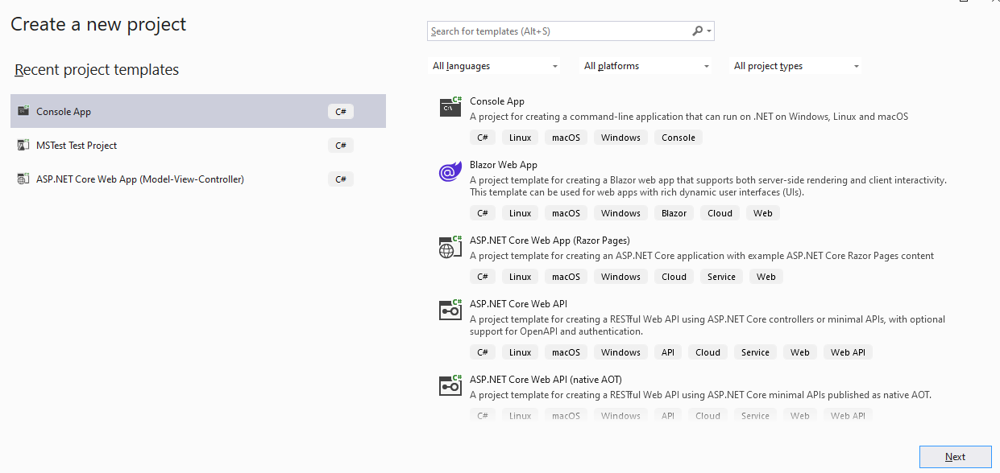

We noemen we dit **PRB.ShoppingBasket.Bart** waar je **Bart** **vervangt** door je **eigen naam**...

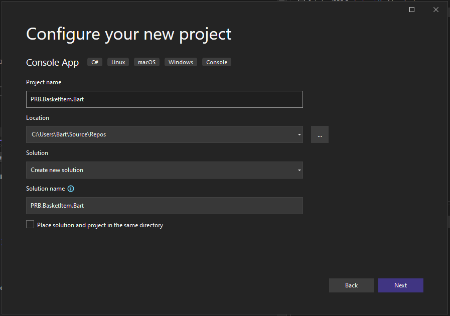

Tenslotte maak je het project aan met de optie **"Do not use top-level statements"**

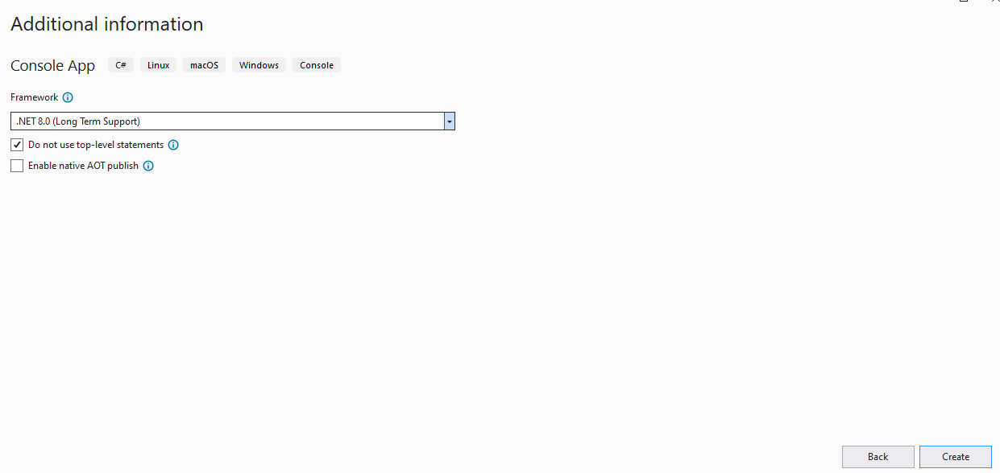

Als **resultaat** zou je een **project** moeten krijgen zoals hieronder...

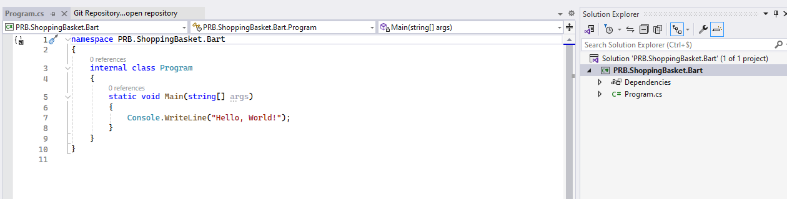

#### Stap 2: Git toevoegen aan dit project

We **selecteren** in het menu **"Git/Create Repository"**

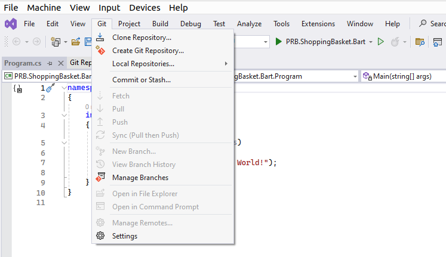

Binnen dat **venster** kiezen we:

* **Local Only** (linkerkant)
* **Optioneel** mag je ook nog **"Add README.md"** toevoegen (komen we later nog op terug)

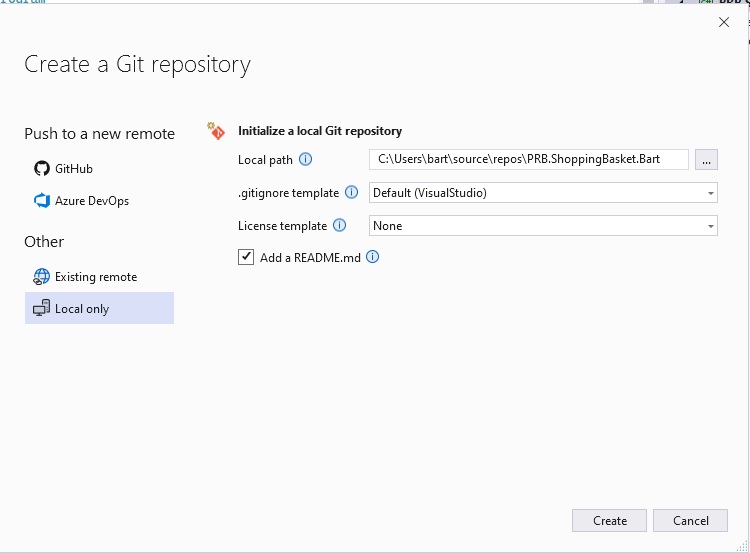

#### Resultaat

Om te weten wat er nu gebeurd is, **selecteer** in het menu **"Git/Open in File Explorer"**, dit opent een **file explorer** met je project.  

> Zie wel dat je in je file explorer aanduidt dat je "hidden files" kan zien

Binnen deze folder zie je dat er aantal nieuwe **hidden files** zijn:

* Een **.git-folder** deze bevat de database-objecten die je code-wijzigingen bijhoudt
* Een **.gitignore** die aanduidt welke files (extensies) er moeten genegeerd worden door git
* **.gitattributes** die configuratie bevat hoe om te gaan met files

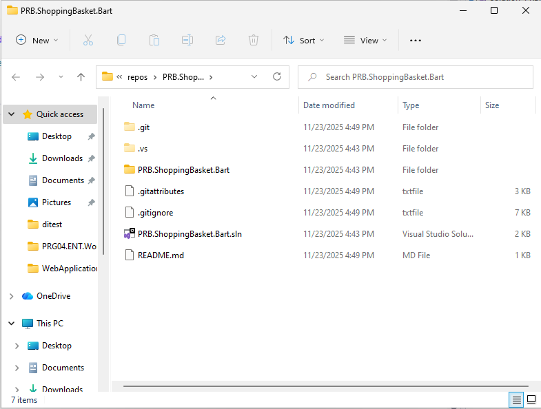

Die **.git**-folder noemen we ook een **lokale** **git-repository**, dit is 

* Een soort van database waar je **code-wijzigingen** kan **bijhouden/traceren**
* Als een soort van **snapshot** (zoals je bijvoorbeeld een snapshot van een harde schijf zou nemen)
* Het stelt je in staat een historiek bij te houden en zelfs terug te keren naar een vorige **revisie**

De files die deze database omvatten bevinden zich in een verborgen folder **.git** .

#### Git Commits

Deze repository houdt dus code-wijzigingen bij, we noemen dit **commits**.  

Deze **commits** zijn eigenlijk **incrementele wijzigingen** aan je code die **samengebundeld** zitten in een **historiek** (fysiek zijn deze geregistreerd in de .git-folder die we eerder vermeldden).  
Vanuit Visual Studio kan je deze **history** van deze commits zien door in het *menu "Git/View Branch History"* te selecteren.

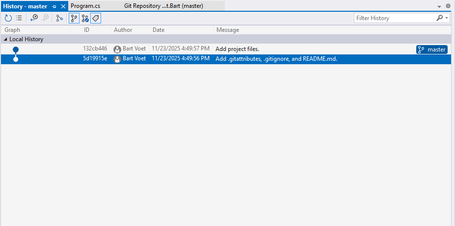

Hier zie je dat Visual Studio voor jou reeds 2 commits heeft aangemaakt.  
Hoe je **zelf** code-**wijzigingen** moeten **registreren** gaan we zo dadelijk in deze **oefening** in de praktijk brengen...

Je kan ook deze commits bekijken door hier met de rechtermuisknop op te klikken "View Commit Details" te selecteren

Vervolgens zie je dan de files die gewijzigd zijn met de inhoud daarbij gelinkt:

In dit geval zie je dat er 3 files zijn toegevoegd, de **A** opzij aan de files staat voor **APPEND**.  
Daarnaast zie je ook in **groen** de inhoud die is **toegevoegd** op de geselecteerde file

### Met VS Code (Linux, Mac, ...)

#### Stap 1: Aanmaken project

Start met het aanmaken van een folder met de naam *PRB.ShoppingBasket.Bart* aan waar je Bart **wijzigt** door je **eigen naam**.  

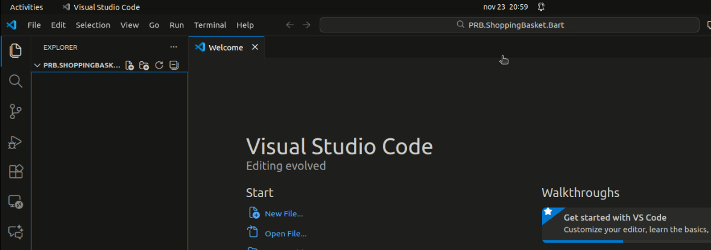

Vervolgens **open** je deze **folder** met **VS Code**.  
Hier gebruik je het command palette (ctrl+shift+p of command+shift+p voor Mac) om een **nieuw project** aan te maken.

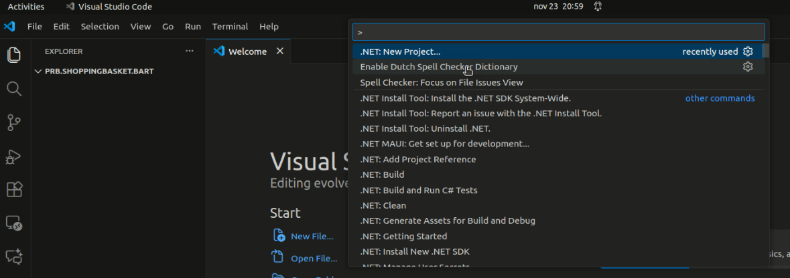

Nadat u de opdracht hebt geselecteerd, moet u de **project template** kiezen. Kies **Console-app**.  
(gemakkelijkste is Console te typen om de selectie te versnellen)

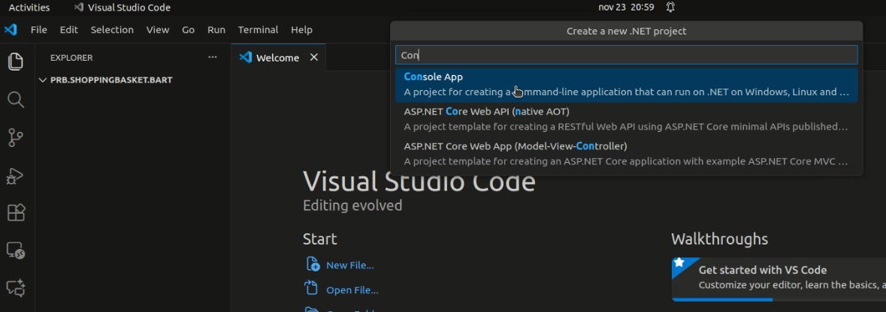

Geef uw nieuwe project dezelfde naam als de solution (folder) "PRB.ShoppingBasket.Bart" waar je Bart
wijzigt door je eigen naam..

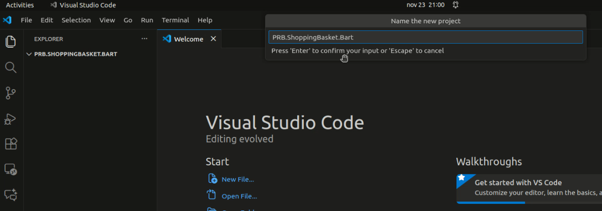

Selecteer vervolgens de locatie van nieuwe project (kies hier de default zijnde deze folder).

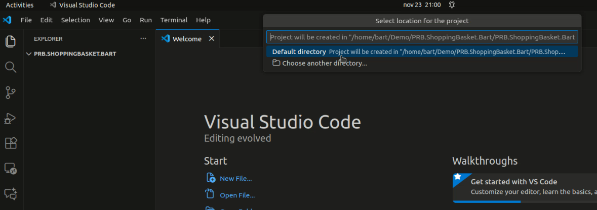

Alvorens je het project "aanmaakt" zorg er eerst voor dat je de top-level statements uitschakelt.   Selecteer "Show all template options." zoals je hieronder ziet:

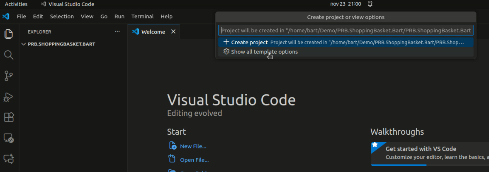

Stel "Do not use top-level statements" in op "true".  

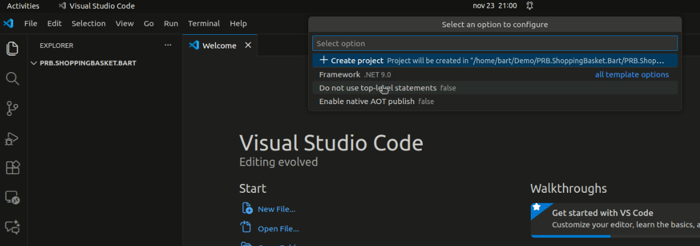

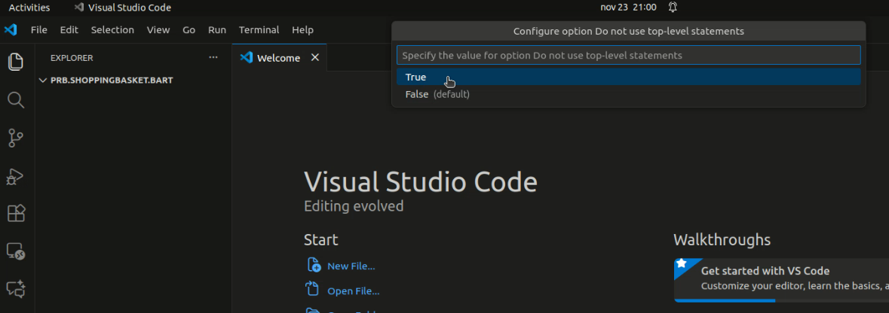

Selecteer tot slot "Create Project".  
Nadien is het project aangemaakt bestaande uit een solution met 1 project (beiden zelfde naam)

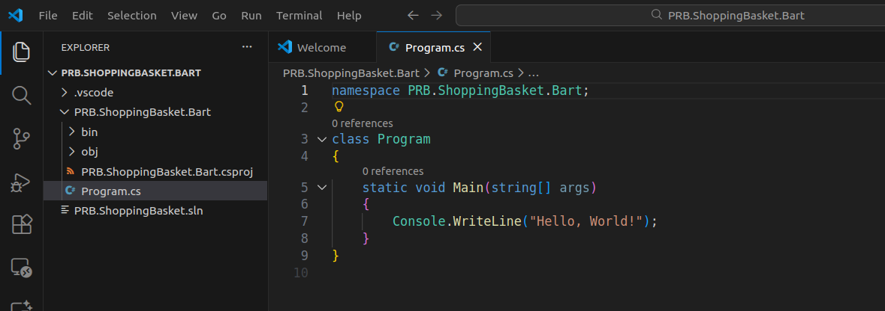

1 klasse is aangemaakt als gevolg, als je de top-level-statements hebt uitgeschakeld zal 
deze als volgt eruit zien:

~~~cs
namespace PRB.ShoppingBasket.Bart
{
    internal class Program
    {
        static void Main(string[] args)
        {
            Console.WriteLine("Hello, World!");
        }
    }
}
~~~

#### Stap 2: git-repo aanmaken

Om met git te werken in VS Code heb je iets meer setup werk nodig vergeleken tot Visual Studio.  

Visual Studio maakt namelijk automatisch reeds een .gitignore file aan, dit is een file die er voor zorgt dat git niet-source-code elementen negeert (zoals de eigenlijke executable)

Je maakt hiervoor een nieuwe file aan in de root van je solution met de naam .gitignore.

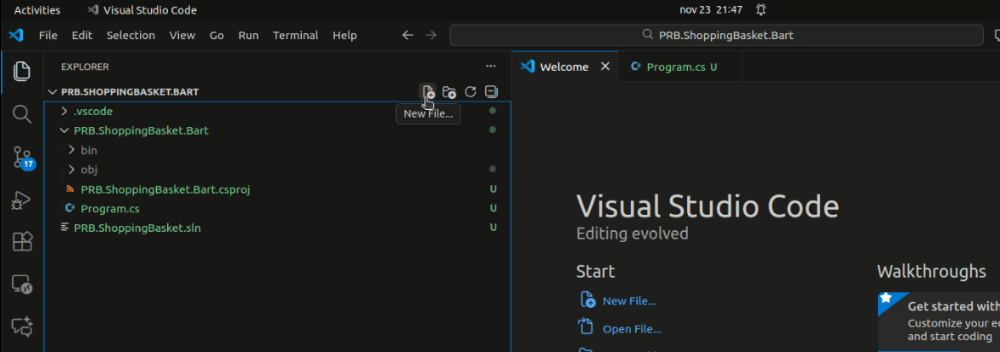

Vervolgens copieer je onderstaande inhoud in deze file

~~~.gitignore
[Dd]ebug/
[Rr]elease/
x64/
[Bb]in/
[Oo]bj/
~~~

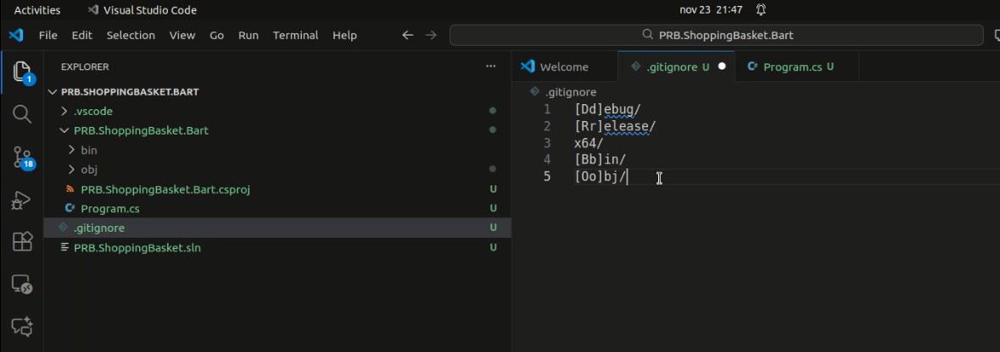

Vervolgens maken we een nieuwe git-repository aan door te navigeren naar het "Source Code"-gedeelte.  
Hier druk je op de knop "Create repository".

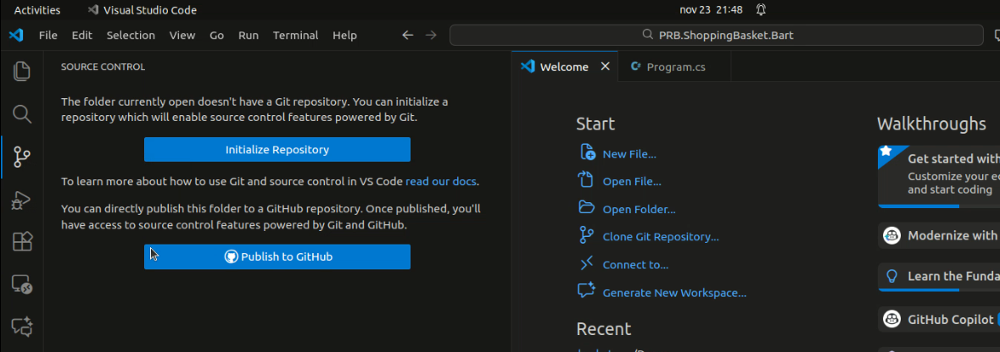

Dit command zal een lokale git-repository aan, als het volgende command in de terminal type zie je dat er wat nieuwe folders zijn aangemaakt:

~~~bash
bart@linuxcomputers:~/Demo/PRB.ShoppingBasket.Bart$ ls -la
total 28
drwxrwxr-x  5 bart bart 4096 nov 23 21:48 .
drwxrwxrwx 17 bart bart 4096 nov 23 20:44 ..
drwxrwxr-x  8 bart bart 4096 nov 23 21:49 .git
-rw-rw-r--  1 bart bart   42 nov 23 21:48 .gitignore
drwxrwxr-x  4 bart bart 4096 nov 23 21:47 PRB.ShoppingBasket.Bart
-rw-rw-r--  1 bart bart 1045 nov 23 21:00 PRB.ShoppingBasket.sln
drwxrwxr-x  2 bart bart 4096 nov 23 21:00 .vscode
bart@linuxcomputers:~/Demo/PRB.ShoppingBasket.Bart$ 
~~~

Die .git-folder noemen we ook een **lokale** **git-repository**, dit is 

* Een soort van database waar je **code-wijzigingen** kan **bijhouden/traceren**
* Als een soort van **snapshot** (zoals je bijvoorbeeld een snapshot van een harde schijf zou nemen)
* Het stelt je in staat een historiek bij te houden en zelfs terug te keren naar een vorige **revisie**

De files die deze database omvatten bevinden zich in een verborgen folder **.git**.  
In VS Code ga je dan onderstaande view zien met de files die klaar staan om te **committen**

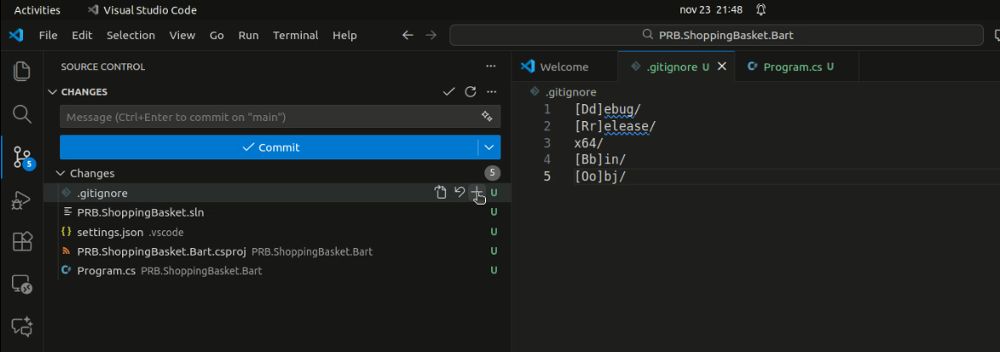

#### Git Repo en Commits

Deze repository houdt dus code-wijzigingen bij, we noemen dit **commits**.  

Deze **commits** zijn eigenlijk **incrementele wijzigingen** aan je code die **samengebundeld** zitten in een **historiek** (fysiek zijn deze geregistreerd in de .git-folder die we eerder vermeldden).  

Momenteel zijn er nog geen commits aanwezig, we gaan echter al onze 1ste commit aanmaken
om het initiele project te registreren.  
Om dit te doen moet je files aanduiden om te committen door op het plusje te klikken naast elke file die je wil toevoegen (in dit geval all files die je ziet)

Vervolgens zal je zien dat al deze files zijn verhuisd naar een "Staging Area".  
Van de files die daar staan zullen de wijzigingen mee worden opgenomen in de commit:

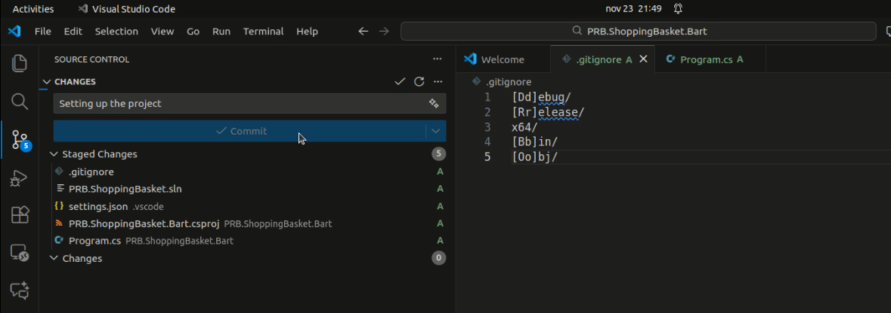

Vervolgens geeft je een comment in het tekstvenstertje "Setting up project" en druk je op de knop "Commit"

#### Git commits en Historiek

Na deze commit zal je - onderaan - zien dat er een 1ste commit is toegevoegd aan je historiek van de 

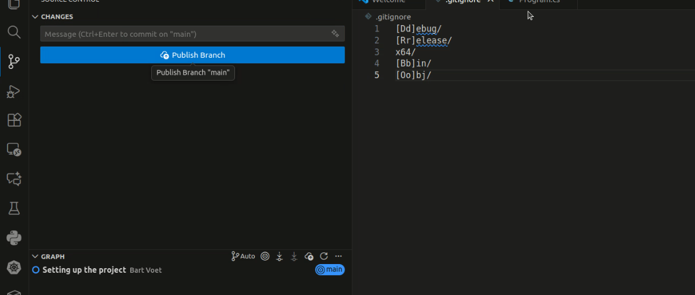

Als je op deze commit klikt kan je dan ook zien welke files en wijzigingen zijn toegevoegd...

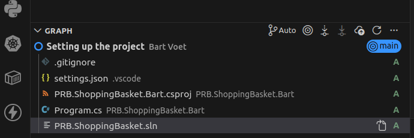

In dit geval zie je dat er 3 files zijn toegevoegd, de **A** opzij aan de files staat voor **APPEND**.  

## Code schrijven (deel 1): klasses, objecten en properties

In dit 1ste deel gaan een kleine basis applicatibouwen

### Basket-item-class

Alvorens met git verder te gaan starten we met **code te schrijven**.  
Bedoeling is dat we een **applicatie** gaan maken die een **winkelmandje** (of **winkellijstje**) gaat beheren.

Zo'n winkelmandje bestaat uit verschillende **items** die je in dat **mandje** mag droppen.  
Laten we starten met er van uit te gaan dat zo'n **item** een **beschrijving** en een **prijs** bevat...

We hebben in het studenten-voorbeeld gezien hoe je zulke gestructureerde data kan **bijhouden/groeperen** in een **klasse**.

We starten met een file **BasketItem.cs** aan te maken en voorzien daarin een klasse **BasketItem** voorzien:

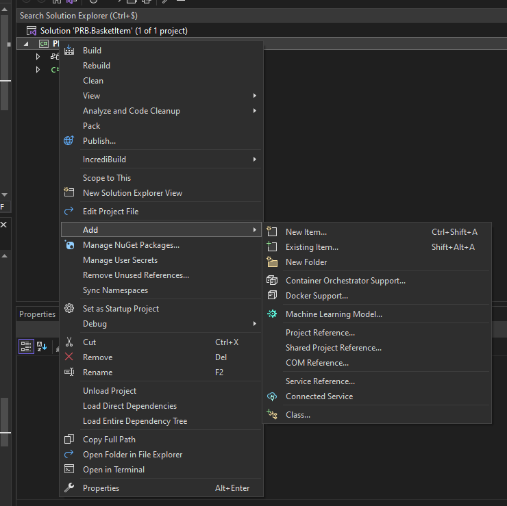

In VS Code gebruik je het command palet, selecteer je "New File" zoals hieronder

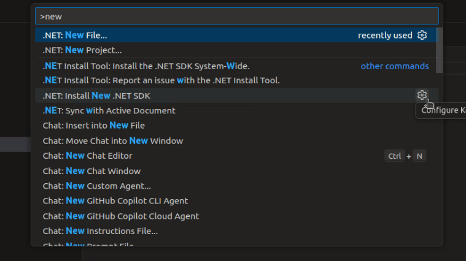

De klasse zou er als volgt moeten uit zien:

~~~cs
namespace PRB.ShoppingBasket.Bart
{
    public class BasketItem
    {

    }
}
~~~

Deze zou je ook moeten zien in je explorer:

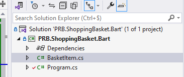

Voorzie vervolgens in de klasse **2 properties**:

* Price
* Description

en **initialiseer** deze via een **constructor**, het resultaat zou er als
volgt moeten uitzien:

~~~cs
namespace PRB.ShoppingBasket.Bart
{
    public class BasketItem
    {
        public BasketItem(int price, string description)
        {
            Price = price;
            Description = description;
        }

        public int Price { get;private set; }

        public string Description { get;private set; }
    }
}
~~~

Bemerk ook dat we de **setter private** hebben gezet, dit doen we ter encapsulatie.  
We willen bijvoorbeeld dat logica gerelateerd aan het beheer in de BasketItem-klasse
zelf zit (en dat je die niet zo maar kan wijzigen)

Om zeker te zijn van correctheid passen we Program.cs aan om zeker te zijn dat deze geen code-fouten bevat, maw we **testen** bij elke **stap**.

~~~cs
namespace PRB.ShoppingBasket.Bart
{
    internal class Program
    {
        static void Main(string[] args)
        {
            BasketItem item = new BasketItem(10, "Patatten");
            Console.WriteLine($"Item {item.Description} met prijs {item.Price}");
        }
    }
}
~~~

#### Testen

**Test** deze code even door deze gewoon uit te voeren, je zou een printout moeten hebben zoals hieronder:

~~~
Item Patatten met prijs 10

C:\Users\bart\myprojects\PRB.ShoppingBasket.Bart\PRB.ShoppingBasket.Bart\bin\Debug\net8.0\PRB.ShoppingBasket.Bart.exe (process 9348) exited with code 0.
Press any key to close this window . . .
~~~

Vanzelfsprekend doet deze nog **niet** erg **veel**, maar het is een 1ste stap...  
Eerst gaan we echter onze eerste **code-wijzigen registereren/revisioneren** in git.

#### Git: Je 1ste (echte) code-commit

We hebben ons **eerste stuk code** geschreven.  
De volgende stap is dat we deze files gaan toevoegen aan een **nieuwe commit**.

Als je nu in het **menu "Git/Commit"** selecteert zie je de wijzigingen die klaarstaan

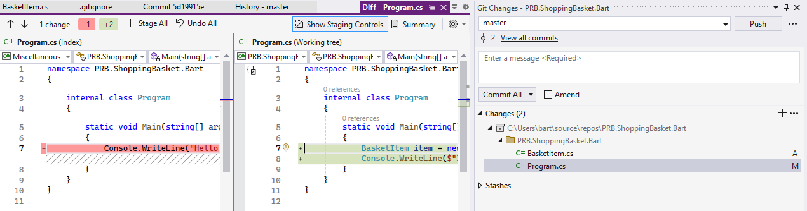

**Merk** ook dat naast de **files** ook nog letters staan, deze tonen aan wat er met de file is gebeurd:

* **A** staat voor toevoegen (**A**ppend)
* **M** staat voor wijzigen (**M**odify)

##### Files naar staging-area

Voor dat je deze commit gaat maken moet je 1st nog de files selecteren die je aan deze commit wil
binden.  Als je dit doet ga je deze brengen naar een staging-omgeving (maw ze staan dan klaar om te committen).

Als je **"hoovert"** over het item zie je dat er een **+** verschijnt:

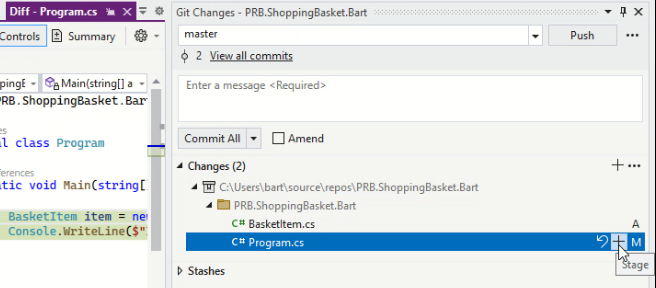

Als je daar op die **+ klikt** komt de specifiek file terecht in de staged area:

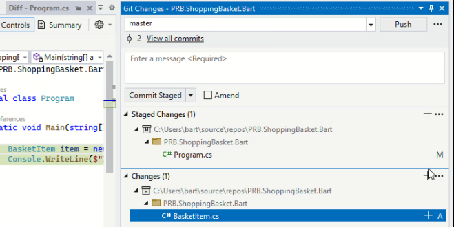

Doe dit vervolgens ook voor de andere file en dan zouden beide wijzigingen moeten klaarstaan:

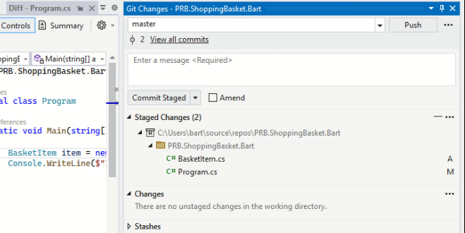

##### Committen...

De volgende stap is nog een **boodschap** te **selecteren** die je wijzigingen documenteert.  
Het is extreem belangrijk dat je deze **boodschap** **duidelijk** (maar wel beknopt) houdt.

Hoe **duidelijker** deze is hoe **gemakkelijker achteraf** om te consulteren wat je wijziging waren.  
Je vult gewoon het tekstveldje met een duidelijk maar korte zin...

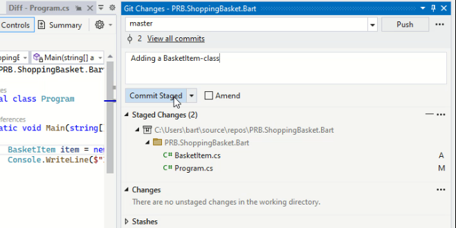

Vervolgens druk je op de button "Commit Staged" en is deze commit geregistreerd in je history.  
Om naar deze history te gaan kies je in het Git-menu "View Branch History" of klik je op de "View all commits"-link.

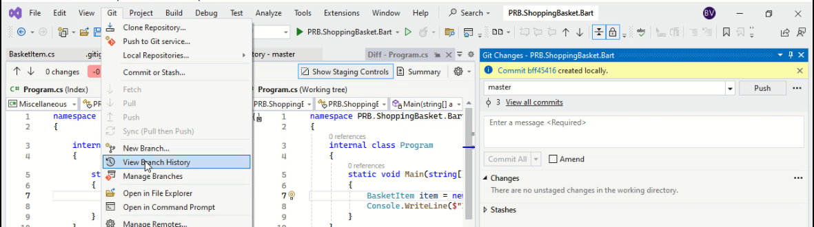

en krijg je een overzicht van de commits die zijn gemaakt met je laatste commit 1st in de rij

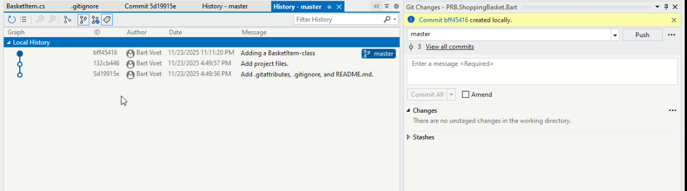

##### Stelselmatig verder werken en committen

Bedoeling nu is dat je dit proces stelselmatig verder werkt:

* **Kleine** maar **significante** wijziging maken
* Dit **testen** op 
  * **regressie** -> werkt je wijziging nog altijd, niets gebroken?
  * werkt de nieuwe **functionaliteit** die je hebt toegevoegd
* Een **commit** samenstellen met je **wijzigingen**

> Het testen gaat na een tijdje veel werk zien, we gaan hievoor later nog 
> de techniek van unit-testen zien die je in staat stelt je testen te automatiseren...

### Code schrijven: event-loop

We hebben nu echter **nog geen applicatie** daarvoor zijn er nog **2** belangrijke **elementen** nodig:

* Een **lijst** van BasketItem-objecten die kan worden bijgewerkt
* Een **event-loop** waar we de nodige acties implementeren

#### Lijst van BasketItem-objecten

De **eerste stap** is een **lijst** aan te maken als globale variable waarin we BasketItems kunnen toevoegen en bewerken.

~~~cs
using PRB.ShoppingBasket.Bart;

namespace PRB.ShoppingBasket.Bart
{
    internal class Program
    {
        static void Main(string[] args)
        {
            List<BasketItem> items = new List<BasketItem>();
        }
    }
}
~~~

#### Event-loop (loop)

De applicatie moet natuurlijk nog wel iets doen, dus om deze lijst aan te vullen
zetten als **eerste stap** zetten we de **interactie met de gebruiker** op.  

Om met de gebruiker te praten voegen we:

* Een **oneindige lus** toe
* Waar we telkens **input** gaan vragen aan de gebruiker
* Als deze gebruiker antwoordt (**event**)
* Voeren we een **actie** uit 
* En geven we **feedback** aan de gebruiker

Zo'n loop is wat we noemen een **event-loop**, telkens als de gebruiker een ingave doet zal deze event-loop een reactie geven.

Een eerste versie van de loop...

~~~cs
using PRB.ShoppingBasket.Bart;

namespace PRB.ShoppingBasket.Bart
{
    internal class Program
    {
        static void Main(string[] args)
        {
            List<BasketItem> items = new List<BasketItem>();

            while(true)
            {
                Console.Write("Geef een item-naam: ");
                string name = Console.ReadLine();

                Console.Write("Geef een prijs");
                int price = int.Parse(Console.ReadLine());

                items.Add(new BasketItem(price, name));
            }
        }
    }
}
~~~

Hier ontbreekt nog een stuk om van een event-loop te spreken maar we hebben reeds de basisstructuur
opgezet die 

#### Event-loop (menu)

Een **oneindige loop** is natuurlijk **niet voldoende**, de gebruiker moet een **menu** hebben (afgeprint).  
We printen hier het menu telkens af en vangen gebruikers-input op via de functie **input()**

> Voor het menu gebruiken we een **multiline string** die start en eindigt met 3 dubbele quotes

~~~cs
namespace PRB.ShoppingBasket.Bart
{
    internal class Program
    {
        static void Main(string[] args)
        {
            List<BasketItem> items = new List<BasketItem>();

            string menu = """
                            1> Voeg item toe
                            2> Print items af
                            3> Sluit af
                            """;

            while(true)
            {
                Console.WriteLine(menu);
                string menuChoice = Console.ReadLine();
                Console.WriteLine(menuChoice);
            }
        }
    }
}
~~~

De **user-input** wordt gevraagd en **opgevangen**, maar er is nog **meer nodig**...

##### En nog een commit...

Maak nu een commit waarin je deze code commit.  
Geen hierbij een duidelijke boodschap zoals bijvoorbeeld "Setting up event-loop with basic menu"

#### Event-loop (if-else)

We moeten er natuurlijk voor zorgen dat deze **user-input verwerkt** wordt.  
Hiervoor plaatsen we een **if/elif-clausule** voor elke **menu-optie**.

~~~cs
    while(true)
    {
        Console.WriteLine(menu);
        string menuChoice = Console.ReadLine();
        
        switch(menuChoice)
        {
            case("1"): Console.WriteLine("TODO: voeg item toe");break;
            case("2"): Console.WriteLine("TODO: print item toe");break;
            case("3"): Console.WriteLine("TODO: sluit de applicatie af");break;
            default: Console.WriteLine("Foutieve keuze");break;
        }
    }
~~~

Voorlopig printen we een **tijdelijke TODO-boodschap** waarmee we kunnen **testen** of onze event-loop correct werkt.  
We voeren even een **korte test** uit zoals hieronder...

~~~
1> Voeg item toe
2> Print items af
3> Sluit af
1
TODO: voeg item toe
1> Voeg item toe
2> Print items af
3> Sluit af
2
TODO: print item toe
1> Voeg item toe
2> Print items af
3> Sluit af
5
Foutieve keuze
1> Voeg item toe
2> Print items af
3> Sluit af
~~~

...en zien dat de boodschappen worden afgeprint overeenkomstig de keuzes.  
Het **basis-skelet** van onze **event-loop** lijkt **ok** te zijn.  

##### En nog een commit...

Maak nu een commit waarin je deze code commit.  
Geen hierbij een duidelijke boodschap zoals bijvoorbeeld *"Feedback within event-loop for each item"*

### Code schrijven: programma/event-loop beëindigen

Tot nog toe moesten we ons eerste programma afsluiten met **ctrl+c**  
Het eerste event dat we al kunnen afwerken is **"3> Sluit af"** opdat we het programma op een elegante manier kunnen afwerken.

Hiervoor stoppen we het programma door uit de **main-functie** een **return** uit te voeren, dat zal er voor zorgen dat het programma wordt afgesloten.

~~~cs
switch(menuChoice)
{
    case("1"): Console.WriteLine("TODO: voeg item toe");break;
    case("2"): Console.WriteLine("TODO: print item toe");break;
    case("3"): Console.WriteLine("Applicatie sluit af");return;
    default: Console.WriteLine("Foutieve keuze");break;
}
~~~

> Bemerk ook dat je hier de break door een return vervangt (gezien bij return de break niet veel zin meer heeft)

En vervolgens testen we:

~~~
1> Voeg item toe
2> Print items af
3> Sluit af
3
Het programma wordt beeindigd
~~~

##### En nog een commit...

Maak nu een commit waarin je deze code commit.  
Geen hierbij een duidelijke boodschap zoals bijvoorbeeld *"Implementing menu-item exit"*

### Git Historiek en Commit-id's

We we zien dat de **git-historiek** zich langzaam maar zeker begint **op te bouwen** ondertussen.  
In git spreken we dan ook van een **history**, letterlijk een historiek van commits

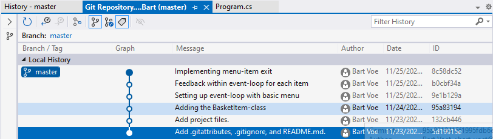

Bemerk ook dat deze **commits** allen een **id** hebben dit is een unieke (hash-)code voor je commit
die je achter kan gebruiken om een specifieke commit te identifieren voor diverse operaties

### Code schrijven: Afdrukken van items

We hebben bij een vorige commit een **lijst** gemaakt die wordt gebruikt om de **items** bij te houden.  

In **deze wijziging/commit** gaan we deze **lijst afdrukken**, gezien we echter de invulling nog niet hebben we uitgewerkt maken we voorlopig een fake/hardcoded lijst aan:

> **Belangrijk:**  
> Het gebruik van deze fake data dient achteraf verwijderd te worden 
> maar het laat ons toe onze code-wijziging te testen.
> In een volgende les gaan we meer geavanceerde technieken zien om onze code te testen
> (en deze testen zelf te automatiseren)

We **voegen** deze **code** **toe** boven de **event-loop**

~~~cs
        items.Add(new BasketItem(10, "Patatten"));
        items.Add(new BasketItem(20, "Bloemkool"));

        while (true)
~~~

Onder **optie 2** voegen we vervolgens een **loop** toe die deze **items afdrukt**.  

~~~cs
        switch (menuChoice)
        {
            case ("1"): Console.WriteLine("TODO: voeg item toe"); break;
            case ("2"):
                foreach (BasketItem item in items)
                {
                    Console.WriteLine($"{item.Description} voor {item.Price} als prijs");
                }
                break;
            case ("3"): Console.WriteLine("Applicatie sluit af"); return;
            default: Console.WriteLine("Foutieve keuze"); break;
        }
~~~

Als we even testen

~~~
1> Voeg item toe
2> Print items af
3> Sluit af
2
Patatten voor 10 als prijs
Bloemkool voor 20 als prijs
1> Voeg item toe
2> Print items af
3> Sluit af
3
Applicatie sluit af
~~~

#### git: ... volgende commit

We voegen onze **wijzigingen** toe aan de git repo met een commit *"Printing the current menu-items"*

### Code schrijven: items toevoegen

Om er een **interactieve applicatie** van te maken moeten we **user-input** gebruiken om de het **winkelmandje** aan te vullen.  
We doen dit door **event 1** te **implementeren** door de 3 volgende taken te implementeren:

* Vraag **user-input** op (beschrijving en prijs)
* **Maak BasketItem-object** aan met input
* Voeg BasketItem-object toe aan **lijst**

* Stap 1: We **verwijderen** hierbij ook de eerder aangemaakte **hard-coded** lijst
* Stap 2: We **vragen** de **prijs** en **beschrijving** op en **voegen** deze als object **toe** aan de lijst

~~~cs
    case ("1"):
        Console.Write("Geef prijs: ");
        int price = int.Parse(Console.ReadLine());

        Console.Write("Geef omschrijving: ");
        string description = Console.ReadLine();

        items.Add(new BasketItem(price, description));

        break;
~~~

Als we dit **testen** zie we dat we nu dynamisch items kunnen toevoegen:

~~~
1> Voeg item toe
2> Print items af
3> Sluit af
1
Geef prijs: 20
Geef omschrijving: Frieten
1> Voeg item toe
2> Print items af
3> Sluit af
1
Geef prijs: 25
Geef omschrijving: Ijsjes
1> Voeg item toe
2> Print items af
3> Sluit af
2
Frieten voor 20 als prijs
Ijsjes voor 25 als prijs
1> Voeg item toe
2> Print items af
3> Sluit af
3
~~~

De test is uitgevoerd:

* We kunnen meerdere items **toevoegen**
* En deze nog altijd **afprinten**

#### git: ... volgende commit

We **voegen** onze wijzigingen **toe** aan de **git** repo met de commit-boodschap *"Adding new items"*

### Code schrijven: Voeg een attribuut quantity toe

#### Nieuwe property Quantity toevoegen

In een winkelmandje dien je soms **meerdere items** van **hetzelfde product** bij te houden.  
Om dit op te lossen voegen we aan onze klasse BasketItem een **attribute quantity** toe

Hiervoor **voegen** we aan de **constructor** een **attribuut toe**...

> *Nota:*  
> Net zoals we eerder bij functies hebben gezien kan je attributen optioneel maken 
> door er een default waarde bij te plaatsen.  
> Als men dan deze waarde zou weglaten (bij aanroep van de constructor) krijgt dit attribuut
> deze default waarde

Hiervoor breiden we onze constructor uit met een nieuw argument.  

~~~cs
namespace PRB.ShoppingBasket.Bart
{
    public class BasketItem
    {
        public BasketItem(int price, string description, int quantity = 1) 
        {
            Price = price;
            Description = description;
            Quantity = quantity;
        }

        public int Quantity { get; set; }

        public int Price { get; private set; }

        public string Description { get; private set; }
    }
}
~~~

Hiervoor gebruiken we een nieuw element in C#, namelijk **default arguments**.  
Als je geen quantity meegeeft aan je constructor zal deze op 1 worden gezet...

#### Nieuwe (afgeleide) property TotalPrice toevoegen

... daarnaast voegen we een extra property **TotalPrice** toe, hiermee bereken we de werkelijke prijs

~~~cs
    public int TotalPrice 
    {      
        get { return Price * Quantity; }
    }
~~~

Bemerk dat deze property **geen setter** heeft en volledig **afhankelijk** is van de 2 **andere properties**...

#### Opvragen van de hoeveelheid

We zorgen nu 1ste dat de hoeveelheid mee wordt opgevraagd:

~~~cs
case ("1"):
    Console.Write("Geef prijs: ");
    int price = int.Parse(Console.ReadLine());

    Console.Write("Geef omschrijving: ");
    string description = Console.ReadLine();

    Console.Write("Geef hoeveelheid: ");
    int quantity = int.Parse(Console.ReadLine());

    items.Add(new BasketItem(price, description, quantity));

    break;
~~~

#### Print wijzigen

Vervolgens passen we dan de weergave aan zodat die niet enkel de prijs van 1 stuk afdrukt maar ook de prijs van de totaal aantal items.

~~~cs
case ("2"):
    foreach (BasketItem item in items)
    {
        Console.WriteLine($"{item.Quantity} maal {item.Description} voor {item.Price} per item, totaal {item.TotalPrice}");
    }
    break;
~~~

Als we dit dan **testen** krijgen we volgende output

~~~
1> Voeg item toe
2> Print items af
3> Sluit af
1
Geef prijs: 10
Geef omschrijving: Patatten
Geef hoeveelheid: 20
1> Voeg item toe
2> Print items af
3> Sluit af
2
20 maal Patatten voor 10 per item, totaal 200
1> Voeg item toe
2> Print items af
3> Sluit af
3
Applicatie sluit af
~~~

Test OK, we kunnen vervolgen met onze commit...

#### git: commit

Als git-comment geef je dan iets zoals *"Adding Quantity to BasketItem"*

### Totaal van de items

Interessant om te weten als gebruiker is de **totaal waarde** van deze items.  
We voegen hier een nieuw event toe aan het menu

~~~cs
string menu = """
                1> Voeg item toe
                2> Print items af
                3> Totaalprijs
                4> Sluit af
                """;
~~~

Vervolgens voegen we een **case** voor **3** toe:

~~~cs
    case ("3"):
        int totalPrice = 0;
        foreach (BasketItem item in items)
        {
            totalPrice += item.TotalPrice;
        }
        Console.WriteLine($"De totale prijs van uw winkelmandje is {totalPrice}");
        break;
~~~

Vergeet niet de oude optie 3 (afsluiten) aan te passen naar optie 4 

~~~cs
    case ("4"):
        Console.WriteLine("Applicatie sluit af");
        return;
~~~

Vervolgens even **testen**:

~~~
1> Voeg item toe
2> Print items af
3> Totaalprijs
4> Sluit af
1
Geef prijs: 10
Geef omschrijving: Bier
Geef hoeveelheid: 25
1> Voeg item toe
2> Print items af
3> Totaalprijs
4> Sluit af
1
Geef prijs: 5   
Geef omschrijving: Cola
Geef hoeveelheid: 15
1> Voeg item toe
2> Print items af
3> Totaalprijs
4> Sluit af
3
De totale prijs van uw winkelmandje is 325
1> Voeg item toe
2> Print items af
3> Totaalprijs
4> Sluit af
4
Applicatie sluit af
~~~

De test is geslaagd...

#### git: volgende commit...

...We kunnen dit **committen** met de boodschap "Adding a total price for the basket"

## Code schrijven (deel 2): hergebruik en error handling

### Optimalisatie en hergebruik: Extractie naar functie inlezen

We starten eerst met **hergebruik** via **functies** om **repetitie** in de **code** te **vermijden**.

#### Extractie naar aparte functie

Een **1ste** (vanzelfsprekende) **optimalisatie** is het vragen naar **input** van een **gebruiker** (binnen een console) adhv **functies**
per "datatype". 

We starten bij het **uitlezen** van een **string** en geven de **vraag** als **functieargument** mee:

~~~cs
public static string ReadString(string message)
{
    Console.Write($"{message}: ");
    return Console.ReadLine();
}
~~~

**Gelijkaardig** daaraan kan je ook een **integer** **opvragen**:

~~~cs
public static int ReadInt(string message)
{
    Console.Write($"{message}: ");
    int result = int.Parse(Console.ReadLine());
    return result;
}
~~~

Hierdoor wordt het **opvragen** van input gemakkelijker en duidelijker.  
**ipv** De volgende **"loodgieter"-code** te schrijven...

~~~cs
Console.Write("Geef prijs: ");
int price = int.Parse(Console.ReadLine());
~~~

...kan je dit herleiden naar een simpele functie-aanroep (1 lijn):

~~~cs
int price = ReadInt("Geef prijs");
~~~

Dit is maar **1 lijn code** en geeft door de **duidelijke naam** - **ReadInt** - ook veel
beter de **intentie** weer van **wat** de **code** **doet**.

#### Nog hergebruik...

Nog **idealer** (of meer **hergebruik**) is dat we onze **ReadInt** kunnen optimaliseren door **ReadString** te **hergebruiken**.

~~~cs
public static int ReadInt(string message)
{
    return int.Parse(ReadString(message));
}
~~~

#### Probleem: ingave van niet-getallen

Het **probleem** is nu dat als we iets **inlezen** dat geen getal is we een **error**
krijgen zoals hieronder geïllustreerd:

~~~
1> Voeg item toe
2> Print items af
3> Sluit af
1
Geef prijs: a2
Unhandled exception. System.FormatException: The input string 'a2' was not in a correct format.
   at System.Number.ThrowFormatException[TChar](ReadOnlySpan`1 value)
   at System.Int32.Parse(String s)
   at PRB.ShoppingBasket.Bart.Program.Main(String[] args) in C:\Users\bart\source\repos\PRB.ShoppingBasket.Bart\PRB.ShoppingBasket.Bart\Program.cs:line 35
~~~

Meer specifiek krijgen we een **ThrowFormatException**.  

#### Oplossing: testen en blijven vragen tot getal is ingegeven

Om dit te **vermijden** een **try-catch** gebruiken om deze op het specifiek type exception op te vangen zoals hieronder geïllustreerd:

~~~cs
try 
{
    string result = int.Parse(ReadString(message));
} 
catch(FormatException e)
{
    Console.WriteLine("Foutieve ingave, dit is geen nummer");
}
~~~

In dit geval **combineren** we dit dan met een **loop** die deze **informatie** 
blijft **opvragen** (maar wel zorgen dat we een duidelijke boodschap hebben)
totdat de gebruiker dit goed ingeeft...

~~~cs
public static int ReadInt(string message)
{
    while (true)
    { 
        try 
        {
            return int.Parse(ReadString(message));
        } 
        catch(FormatException e)
        {
            Console.WriteLine("Foutieve ingave, dit is geen nummer");
        }
    }
}
~~~

#### Program aanpassen testen

Je kan nu in de **Program-klasse** de code aanpassen in de **1ste case** als volgt:

~~~cs
int price = ReadInt("Geef prijs");
string description = ReadString("Geef omschrijving");
int quantity = ReadInt("Geef hoeveelheid");
~~~

Als je daar **bijvoorbeeld geen getal** geeft voor prijs, zie je dat de applicatie dit **opnieuw opvraagt**:

~~~
1> Voeg item toe
2> Print items af
3> Sluit af
1
Geef prijs: abc
Foutieve ingave, dit is geen nummer
Geef prijs: 10
Geef omschrijving:
~~~

#### TryParse gebruiken met loop

Er is echter een **alternatief** op bovenstaande code (try-catch) en dat de functie **TryParse**.  
int.TryParse zal voor jou:

* een **string** waarde converteren naar een **integer**
* een **boolean** teruggeven die aangeeft of de conversie geslaagd is (ipv een exceptie op te werpen)

Hieronder zie je het gebruik van int.Parse binnen de ReadInt-functie

~~~cs
public static int ReadInt(string message)
{
    int result;
    while (!int.TryParse(ReadString(message), out result))
    {
        Console.WriteLine("Foutieve ingave, dit is geen nummer");
    }
    return result;
}
~~~

Hier wordt er gebruik gemaakt van een **speciaal keyword** **out**.  
Dit keyword wordt gebruikt om een integer of andere primitieve (niet objecten) door
te geven als referentie (in tegenstelling tot wat we tot nog toe hebben gezien.)

In tegenstelling tot wat we hebben gezien kan er nu een **int** (primitieve) worden 
meegeven als **referentie** (zoals we dat kennen van objecten).

(achter de schermen zal dit een een soort van pointer vormen naar de bovenliggende stack)

#### Aanpassen van Program.cs

Nu hebben we **2 vliegen in 1 klap** gevangen:

* We **vermijden** dat het programma zal **crashen** (door excepties)
* Onze code in de **Program**-klasse wordt nu wat **gereduceerd** en is ook **duidelijker** doordat de functies een duidelijk naam hebben

#### Commit maken

We maken vervolgens een **commit** met de boodschap *"Extracting read-logic to separate functions"*

### Defensief programmeren: geen negatieve bedragen

De volgende stap - in het defensief programmeren - is er voor te zorgen dat in onze **logica**
**geen negatieve bedragen** terecht kunnen komen.

Deze **controle** gaan we **inlassen** in onze **BasketItem**-klasse door een **exceptie** op te werpen wanneer deze wordt geïnitialiseerd of **gewijzigd** met een **negatieve waarde** (prijs of hoeveelheid)

#### Excepties maken

We maken hiervoor een **specifieke exceptie** aan die we gaan **opwerpen** vanuit onze **property-setters**.  

**Definieer** hiervoor de **volgende exceptie-klasse**:

~~~cs
namespace PRB.ShoppingBasket.Bart
{
    public class NoNegativeAmountAllowedException : Exception
    {
        public NoNegativeAmountAllowedException(string element) : base($"No negative amount allowed for {element}")
        {
            Element = element;
        }

        public string Element { get; private set; }
    }
}
~~~

#### Exceptie werpen

Deze **exceptie** zal dus moet worden **opgeworpen** worden vanuit onze **property-setter**.

Om dit te kunnen doen moeten we echter onze **"lazy"-setter** veranderen door
een **"Field Backed Property"**

Dit  houdt in dat je 2 **extra** **veld**en (geen properties) dient bij te houden in je klasse die dan
je property ondersteunen:

> Nota: C# heeft de **naming-conventie** om zulke properties te laten starten met een **underscore**

~~~cs
public class BasketItem
{
    private int _price;
    private int _quantity;
    //...

    public int Price
    {
        get
        {
            return _price;
        }
        private set
        {
            _price = value;
        }
    }
    //... zelfde voor quantity...
}
~~~
 
Nu kan je vervolgens dan een **controle** **toevoegen** voor de **Price-property**.

~~~cs
public class BasketItem
{
    //... 
    public int Price
    {
        
        get
        {
            return _price;
        }
        private set
        {
            if (value < 0)
            {
                throw new NoNegativeAmountAllowedException("prijs");
            }
            _price = value;
        }
    }
    //... zelfde voor quantity...
}
~~~

!! Doe nu ook **hetzelfde** voor de **Quantity-property** maar let op dat je daar voor de **Element-string** "prijs"
door **"hoeveelheid"** verandert !!

> Zie ook https://learn.microsoft.com/en-us/dotnet/csharp/programming-guide/classes-and-structs/properties voor wat meer verdieping

#### Excepties opvangen

Eénmaal deze **controles** **toegevoegd** kan je dit nu **opvangen** binnen de **Program**-code zoals hieronder:

~~~cs
case ("1"):
    int price = ReadInt("Geef prijs");
    string description = ReadString("Geef omschrijving");
    int quantity = ReadInt("Geef hoeveelheid");
    try
    {
        items.Add(new BasketItem(price, description, quantity));
    }    
    catch(NoNegativeAmountAllowedException e)
    {
        Console.WriteLine($"Geen negatief getal toegelaten voor {e.Element}");
    }
    break;
~~~

We drukken ook de extra **property** **Element** mee af om het **onderscheid** te kunnen maken
tussen de verschillende **velden** in de boodschap naar de gebruiker.

#### En committen maar...

Zorg nu voor een **commit** met de boodschap *"Disallow negative price or quantity"*

## Code schrijven (deel 3): Compositie met meerdere klassen

**Tot nog toe** hebben we enkel met **1 klasse** gewerkt (of 2 als je Program mee telt).  
In de echte wereld heb je meestal **meerdere** **klasses** waarvan deze **objecten**
(van verschillende klassen) met elkaar **samenwerken**.

### Modularisatie door Compositie: Basket-klasse maken

In dit geval gaan we een **2de** klasse **Basket** toevoegen, deze klasse gaat de lijst van
**BasketItem**-objecten wrappen.

Het 1ste stuk logica dat we kunnen toevoegen aan deze klasse is het **toevoegen** van een 
nieuw **BasketItem**

~~~cs
namespace PRB.ShoppingBasket.Bart
{
    public class Basket
    {
        public List<BasketItem> Items {get;private set;} = new List<BasketItem>();

        public void AddNewItem(BasketItem item)
        {
            Items.Add(item);
        }
    }
}
~~~

Hiervoor dienen we ook onze code in Program.cs aan te passen.  
We vervangen hierbij onderstaande code...

~~~cs
static void Main(string[] args)
{
    List<BasketItem> items = new List<BasketItem>();
    //...
}
~~~

...door het gebruik van deze klasse

~~~cs
static void Main(string[] args)
{
    Basket basket = new Basket();
    //...
}
~~~

**Vervang** daarvoor in de verschillende cases de items-lijst door het basket-object.  
Binnen de **1ste case** gaat dit als volgt...

~~~cs
case ("1"):
    int price = ReadInt("Geef prijs");
    string description = ReadString("Geef omschrijving");
    int quantity = ReadInt("Geef hoeveelheid");
    try
    {
        basket.AddNewItem(new BasketItem(price, description, quantity));
    }    
    catch(NoNegativeAmountAllowedException e)
    {
        Console.WriteLine($"Geen negatief getal toegelaten voor {e.Element}");
    }

    break;
case ("2"):
    foreach (BasketItem item in basket.Items)
~~~

In de **2de case** moet je de property van Items van basket gebruiken voor het afdrukkken van de verschillende items.  
Voor de 3de case gaan we een property toevoegen...

#### Property TotalBasketPrice

Het **berekenen** van de **totaalprijs** kan nu ook worden geplaatst binnen de **Basket**-klasse.  
Daarvoor voegen we een **read-only** property **TotalBasketPrice** toe en migreren we de bestaande code:

~~~cs
public int TotalBasketPrice 
{
    get 
    {
        int totalPrice = 0;
        foreach (BasketItem item in Items)
        {
            totalPrice += item.TotalPrice;
        }
        return totalPrice;
    }
}
~~~

Hiervoor passen onze **3de case** aan zoals hieronder (waardoor de loop in de case verdwijnt):

~~~cs
    case ("3"):
        Console.WriteLine($"De totale prijs van uw winkelmandje is {basket.TotalBasketPrice}");
        break;
~~~

#### Commit

Maak hier een **commit** met als comment *"Creating new class to collect the BasketItems"*.

### Increment/Decrement

We gaan nog een **nieuwe optie** toevoegen aan het menu, namelijk de mogelijkheid om de **hoeveelheid**
te **verlagen** of te **verhogen**...

#### Methodes toevoegen aan Basket

We gaan dit doen adhv 2 nieuwe **methodes** in de **BasketItem**-klasse, namelijk
**IncrementQuantity** en **DecrementQuantity** waarvan we de hoeveelheid met 1-tje naar boven
of beneden brengen.

~~~cs
public int IncrementQuantity()
{
    return ++Quantity;
}

public int DecrementQuantity()
{
    return --Quantity;
}
~~~

> Let wel dat je hier op een bepaald moment op een negatief getal kan 
> komen.  Dit wordt echter gecontroleerd met als gevolg een exception
> die we dan ook gaan opvangen in het menu...

#### Opzoeking BasketItem binnen Basket

Hiervoor ga een opzoeking moeten doen **binnen** de **Basket**-klasse op basis van de naam.

~~~cs
public BasketItem Lookup(string description)
{
    foreach(BasketItem item in Items) 
    {
        if(item.Description.Equals(description)) 
        {
            return item;
        }
    }
    return null;
}
~~~

#### Menu-items toevoegen

We voegen een nieuw menu-item (4) toe, daarnaast wijzigen we de vorige optie 4 naar Q.  
Als we dan een nieuwe optie willen toevoegen moeten we niet altijd de "Sluit af" optie wijzigen.

~~~cs
string menu = """
                1> Voeg item toe
                2> Print items af
                3> Totaalprijs
                4> Pas hoeveelheid aan
                Q> Sluit af
                """;
~~~

Wanneer we nu optie 4 selecteren moeten we 2 extra zaken:

* Welke BasketItem adhv van beschrijving?
* Verlagen of verhogen (+ OF -)?

Bemerk dat je ook nog exceptie moet opvangen gezien de hoeveel nog altijd onder 0 kan gaan...

~~~cs
    case ("4"):
        string itemDescription = ReadString("Welk item (beschrijving)");
        BasketItem selectedItem = basket.Lookup(itemDescription);
        if (selectedItem == null)
        {
            Console.WriteLine($"Item met beschrijving '{itemDescription}' bestaat niet");
        }
        else
        {
            string choice = ReadString("Kies lager (-) of hoger (+)");
            try
            {
                switch (choice)
                {
                    case ("+"): selectedItem.IncrementQuantity(); break;
                    case ("-"): selectedItem.DecrementQuantity(); break;
                    default: Console.WriteLine($"{choice} is een ongeldige keuze"); break;
                }
            }
            catch (NoNegativeAmountAllowedException e)
            {
                Console.WriteLine($"Geen negatief getal toegelaten voor {e.Element}");
            }
        }
        break;
    case ("Q"):
    case ("q"):
        Console.WriteLine("Applicatie sluit af");
        return;
~~~

#### Voeg hiervoor een commit toe

Voeg een commit to met als comment *"Incrementing and decrementing BasketItems"*

### Niet 2 maal dezelfde item in Basket

Nu we de lookup functie hebben kunnen we ook gaan opzoeken of een item reeds bestaat.

#### Nieuwe exceptie

We gaan dit op een gelijkaardige manier implementeren als we voor negatieve getallen hadden voorzien, we starten met een nieuwe exceptie.

~~~cs
namespace PRB.ShoppingBasket.Bart
{
    public class ItemAlreadyInBasketException : Exception
    {
        public ItemAlreadyInBasketException(string description) : base($"No negative amount allowed for {description}")
        {
            Description = description;
        }

        public string Description { get; private set; }
    }
}
~~~

We gebruiken een property Description als extra informatie...

#### Exceptie opwerpen vanuit de Basket-klasse

In de Basket-klasse kunnen we nu nieuwe **Lookup**-functie gebruiken om 
na te kijken of een item (met de zelfde beschrijving) reeds voorzien is
in deze Basket.

~~~cs
public void AddNewItem(BasketItem item)
{
    if(ItemProvidedInBasket(item)) 
    {
        throw new ItemAlreadyInBasketException(item.Description);
    }
    Items.Add(item);
}

public bool ItemProvidedInBasket(BasketItem item) 
{
    return Lookup(item.Description) != null;
}
~~~

We hebben hiervoor ook nog een extra helper-functie voorzien die ItemProvidedInBasket
een deze verificatie opneemt.

Als deze  true geeft zullen we een exceptie opwerpen.

#### Exceptie opvangen

Het enige resterende is nu nog een extra catch-clausule toe te voegen
aan de huidige try-block

~~~cs
try
{
    basket.AddNewItem(new BasketItem(price, description, quantity));
}
catch (NoNegativeAmountAllowedException e)
{
    Console.WriteLine($"Geen negatief getal toegelaten voor {e.Element}");
}
catch (ItemAlreadyInBasketException e)
{
    Console.WriteLine($"Het item met beschrijving {e.Description} bestaat reeds");
}
~~~

#### Voeg hiervoor een commit toe

Voeg een commit to met als comment *"Not allowing twice item with same description"*

### Extra opdracht: elke case als functie

Gezien momenteel er al veel code gaat staan in de case probeer hier de inhoud van elke case
te extracten naar een functie binnen Program.

**Bijvoorbeeld** de **laatste** **toevoeging** zou je kunnen isoleren in een functie **DecrementOfIncrement**

~~~cs
case ("4"):
    IncrementOrDecrementItem();
    break
~~~

Doe dit voor **elke case** (buiten de exit waar dit niet nodig is) zoasl
in het voorbeeld hieronder:

~~~cs
switch (menuChoice)
{
    case ("1"):
        AksForNewItem(basket);
        break;
    case ("2"):
        PrintAllItems(basket);
        break;
    case ("3"):
        PrintTotalBasketPrice(basket);
        break;
    case ("4"):
        DecrementOrIncrement(basket);
        break;
    case ("Q"):
    case ("q"):
        Console.WriteLine("Applicatie sluit af");
        return;
}
~~~

#### Testen en committen

Test je oplossing en voorzie een commit-boodschap in trend van 
*'Extracting event-functions'*

## Code schrijven (deel 4): Overerving en polymorfisme

Tot nog toe hebben we **1 soort BasketItem** waarin we een prijs en hoeveelheid invullen.  
In het volgende deel gaan we **meerdere soorten BasketItem's** te voorzien

Dit gaan we proberen te verkrijgen door gebruik te maken van **overerving** (om deze verschillende soorten basketitems te kunnen gebruiken).

Om dit te ondersteunen gaan we onze code wat aanpassen.  

### Verschillende soorten van items

De huidige **structuur** van **BasketItem** ziet er als volgt uit:

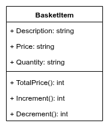

We gaan nu verschillende soorten **BasketItem**-klassen **maken**:

* **QuantityBasketItem** waar je de prijs berekent per item (zoals dat nu wordt gedaan)
* **BulkBasketItem** waar je de prijs zal berekenen per gewicht

Beide klassen gaan **overerven** van **BasketItem** die nog altijd de gedeelde property **Description** zal bevatten.

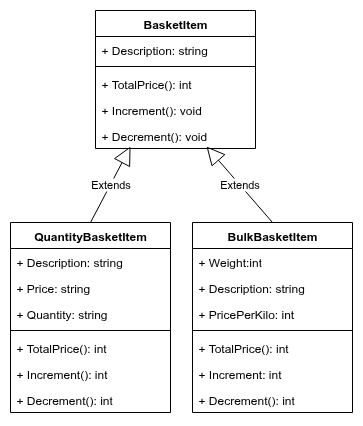

### Stap 1: BasketItem -> QuantityBasketItem

Gezien onze reeds bestaande BasketItem eigenlijk al deze implementatie bevat, gaan we - als 1ste stap -  starten met deze gewoon te **hernoemen** naar **QuantityBasketItem**.

~~~cs
    public class QuantityBasketItem 
    {
        //...
    }
~~~

Als je hier de **renaming** feature gebruikt van **Visual Studio** of **Rider** gaat overal het type worden aangepast in de andere klassen van de applicatie (Basket.cs en Program.cs).  

De volgende code in Program.cs...

~~~cs
basket.AddNewItem(new BasketItem(price, description, quantity));
~~~

zou ook moeten **gewijzigd** worden **naar** 

~~~cs
basket.AddNewItem(new QuantityBasketItem(price, description, quantity));
~~~

#### Commit maken: "Rename BasketItem to QuantityBasketItem"

Niet vergeten hier even kort te **testen** en een nieuwe **commit** te produceren...  
Gebruik hiervoor "Rename BasketItem to QuantityBasketItem"

### Stap 2: BasketItem (opnieuw) maken

De **naam BasketItem** gaan we nu gebruiken voor onze **nieuwe basisklasse**.  

Dus als volgende stap maken we **BasketItem** opnieuw aan, maar deze zal sterk
veréénvoudigd worden tov de vroegere versie...

> Deze (nieuwe) BasketItem gaat later de gedeelde basisklasse zijn van QuantityBasketItem en BulkBasketItem (zie volgende stappen).

#### Nieuwe BasketItem

Hieronder zie je de nieuwe klasse BasketItem:

~~~cs
namespace PRB.ShoppingBasket.Bart
{
    public class BasketItem
    {
        public BasketItem(string description)
        {
            Description = description;
        }

        public string Description { get; private set; }
        
        public virtual int TotalPrice 
        {      
            get { return 0; }
        }
        
        public virtual int IncrementQuantity()
        {
            return 0;
        }

        public virtual int DecrementQuantity()
        {
            return 0;
        }
    }
}
~~~

Deze BasketItem-klasse zal momenteel **enkel verantwoordelijk** voor de **description** bij te houden.  
Andere functies (IncrementQuantity en DecrementQuantity) en de property TotalPrice laten we gewoon een default-waarde teruggeven.  
De werkelijke implementatie zal voorzien worden binnen de **overervende klassen**.

#### QuantityBasketItem erft nu over van BasketItem

Vervolgens zorgen we ervoor dat QuantityBasketItem overerft van BasketItem.  
Hiervoor moet je allereerst:

* Zorgen voor de **overerving** op klasse-niveau
* De **constructor** **aanpassen** zodat de base-constructor wordt aangeroepen

~~~cs
    public class QuantityBasketItem : BasketItem 
    {
        //---
        public QuantityBasketItem(int price, string description, int quantity = 1) : base(description)
        {
            Price = price;
            Quantity = quantity;
        }
        //...
        //!!!! Verwijderen van Description-property
    }
~~~

Als 3de wijziging, vergeet hier ook niet bij de **Description-property** te **verwijderen**, deze valt nu onder BasketItem
en zal dus gedeeld worden over de verschillende klassen die overerven van BasketItem...

Als laatste stap moeten we aan TotalPrice, IncrementQuantity en DecrementQuantity de modifier **override** toevoegen om er voor te 
zorgen dat altijd de implementatie van de QuantityBasketItem wordt gebruikt!!!

~~~cs
    public class QuantityBasketItem : BasketItem 
    {
        //...
        //!!!! Verwijderen van Description-property

        public override int TotalPrice 
        {      
            get { return Price * Quantity; }
        }
        
        public override int IncrementQuantity()
        {
            return ++Quantity;
        }

        public override int DecrementQuantity()
        {
            return --Quantity;
        }
    }
~~~

#### Commit maken: Create BasketItem-hierarchy

Niet vergeten hier even kort te **testen** en een nieuwe **commit** te produceren...  
Gebruik hiervoor "Create BasketItem-hierarchy"

### Aanpassingen in Basket.cs en Program.cs

De bedoeling is dat we nu verschillende soorten BasketItem's kunnen gebruiken.  
Alvorens nieuwe implementatie toe te voegen zorgen we nu dat Basket-klasse **BasketItem**-objecten gaat bevatten (ipv QuantityBasketItem).  

#### Basket.cs aanpassen

De 1ste step is alle voorkomens van **QuantityBasketItem** aan te passen naar **BasketItem**  
Dit start bij de Items-property zoals je hier ziet...

~~~cs
    public class Basket
    {
        public List<BasketItem> Items {get;private set;} = new List<BasketItem>();
        //...

    }
~~~

Je gaat daarna ook binnen alle methodes en properties de signatuur moeten aanpassen:

~~~cs
    public bool ItemProvidedInBasket(BasketItem item) 
    {
        //...
    }

    public int TotalBasketPrice 
    {
        //...
            foreach (BasketItem item in Items)
        //...
    }

    public BasketItem Lookup(string description)
    {
        //...
            foreach(BasketItem item in Items) 
        //...        
    }
~~~

#### Program.cs aanpassen

Nu de Basket-klasse enkel nog maar BasketItem's gebruikt moet er binnen de Program-klasse ook nog de expliciete verwijzingen
naar QuantityBasketItem vervangen worden door verwijzingen naar BasketItem.  

Bijvoorbeeld zal basket.Lookup() nu een BasketItem terug geven

~~~cs
public class Program
{
    //...
    private static void DecrementOrIncrement(Basket basket)
    {
        string itemDescription = ReadString("Welk item (beschrijving)");
        BasketItem selectedItem = basket.Lookup(itemDescription);
    //...
}
~~~

Daarnaast zal de code moeten aangepast die alle items afdrukt...

~~~cs
    //...
    private static void PrintAllItems(Basket basket)
    {
        foreach (BasketItem item in basket.Items)
        {
            Console.WriteLine($"{item.Quantity} maal {item.Description} voor {item.Price} per item, totaal {item.TotalPrice}");
        }
    }
    //...
~~~

...vervangen moeten worden door...

~~~cs
    //...
    private static void PrintAllItems(Basket basket)
    {
        foreach (BasketItem item in basket.Items)
        {
            Console.WriteLine(item);
        }
    }
    //...
~~~

#### QuantityBasketItem.ToString()

Hiervoor gaan we wel de **ToString()**-functie **implementeren** binnen **QuantityBasketItem** opdat
de correcte beschrijving wordt afgedrukt:

~~~cs

public class QuantityBasketItem 
{
    //...
    public override string ToString()
    {
        return $"{Quantity} maal {Description} voor {Price} per item, totaal {TotalPrice}";
    }
}

~~~

#### Testen en committen: "Using BasketItem from Basket instead of QuantityBasketItem"

Niet vergeten hier even kort te **testen** en een nieuwe **commit** te produceren...  
Gebruik hiervoor "Using BasketItem from Basket instead of QuantityBasketItem"

### Toevoegen van nieuw soort item: BulkBasketItem

Op deze moment zijn we klaar om **verschillende soorten BasketItem's** te gebruiken.  
We voegen nu een nieuwe klasse **BulkBasketItem** toe, deze 

* Zal nu gewichten bevatten die in gram worden uitgedrukt
* Een prijs per kilo bevatten

Je mag deze **toevoegen** als volgt:

~~~cs
namespace PRB.ShoppingBasket.Bart
{
    public class BulkBasketItem : BasketItem
    {
        private int _pricePerKilo;
        private int _weightInGrams;
        
        public BulkBasketItem(int pricePerKilo, string description, int weightInGrams = 1000) : base(description)
        {
            PricePerKilo = pricePerKilo;
            WeightInGrams = weightInGrams;
        }

        public int WeightInGrams
        {
            get
            {
                return _weightInGrams;
            }
            private set
            {
                if (value < 0)
                {
                    throw new NoNegativeAmountAllowedException("gewicht");
                }
                
                _weightInGrams = value;
            }
        }

        public int PricePerKilo
        {
            get
            {
                return _pricePerKilo;
            }
            private set
            {
                if (value < 0)
                {
                    throw new NoNegativeAmountAllowedException("prijs");
                }
                _pricePerKilo = value;
            }
        }

        public override int TotalPrice => PricePerKilo * WeightInGrams / 1000;

        public override int IncrementQuantity()
        {
            WeightInGrams += 100;
            return WeightInGrams;
        }
        public override int DecrementQuantity()
        {
            WeightInGrams -= 100;
            return WeightInGrams;
        }

        public override string ToString()
        {
            return $"{WeightInGrams} gram {Description} voor {PricePerKilo} per kilo, totaal {TotalPrice}";
        }
    }
}
~~~

Bemerk ook dat hier **TotalPrice, IncrementQuantity en DecrementQuantity** **andere** **gedragingen** hebben.  
Daarnaast hebben we ook een **expliciete implementatie** voorzien voor **ToString** opdat we correct de gegevens kunnen meegeven bij het afprinten van de lijst van BasketItems.

#### Testen en committen: "Adding BulkBasketItem (new type of BasketItem)"

Niet vergeten hier even kort te **testen** en een nieuwe **commit** te produceren...  
Gebruik hiervoor "Adding BulkBasketItem (new type of BasketItem)"

### Toevoegen van BulkBasketItem

#### Aanpassen Program.cs

Tot nu toe hadden we code zoals hieronder die werd uitgevoerd bij de menu-keuze
om een nieuwe BasketItem toe te voegen...

~~~cs
    private static void AskForNewItem(Basket basket)
    {
        int price = ReadInt("Geef prijs");
        string description = ReadString("Geef omschrijving");
        int quantity = ReadInt("Geef hoeveelheid");
        try
        {
            basket.AddNewItem(new QuantityBasketItem(price, description, quantity));
        //...
~~~

Vanaf nu gaan we deze code aanpassen naar de code hieronder waar de gebruiker de keuze laten
van **verschillende types toe te voegen**.

Hier gaan we dit herschrijven als volgt

~~~cs
    private static void AskForNewItem(Basket basket)
    {
        int choice = RequestChoices(
            "Gelieve een type te kiezen", 
            "Gewoon item", "Bulk item");

        switch (choice)
        {
            case 1 : CreateNewQuantityItem(basket); break;
            case 2 : CreateNewBulkItem(basket); break;
            default: throw new InvalidOperationException();
        }
    }
~~~

Hiervoor wordt er een nieuwe generieke functie toegevoegd **RequestChoices**
die je toelaat van keuze te maken tussen 1 of meerdere keuzes.

Deze functie geeft een nummer terug van 1 tot en met het aantal keuzes waarmee 
je kan beslissen **of** je een **QuantityBasketItem** of **BulkBasketItem** aanmaakt:

~~~cs
        private static int RequestChoices(string question, params string[] choices)
        {
            int counter = 0;
            Console.WriteLine(question);
            foreach (var choice in choices)
            {
                counter++;
                Console.WriteLine($"{counter}. {choice}");
            }

            int numberPicked = 0;
            do
            {
                numberPicked = ReadInt($"Gelieve keuze tussen tussen 1 en {choices.Length} te geven");
            } while (numberPicked < 1 || numberPicked > choices.Length);
     
            return numberPicked;
        }
~~~

In geval dat deze 1 returned komt dit overeen met een QuantityBasketItem, bij 2 met een BulkBasketItem

~~~cs
            case 1 : CreateNewQuantityItem(basket); break;
            case 2 : CreateNewBulkItem(basket); break;
~~~

Er zijn dan 2 verschillende functies verantwoordelijk om ofwel een **QuantityBasketItem** aan te maken...

~~~cs
    private static void CreateNewQuantityItem(Basket basket)
    {
        int price = ReadInt("Geef prijs");
        string description = ReadString("Geef omschrijving");
        int quantity = ReadInt("Geef hoeveelheid");
        AddItemToBasket(basket, new QuantityBasketItem(price, description, quantity));
    }
~~~

... ofwel een **BulkBasketItem** aan te maken ...

~~~cs
    private static void CreateNewBulkItem(Basket basket)
    {
        int pricePerKilo = ReadInt("Geef prijs per kilo");
        string description = ReadString("Geef omschrijving");
        int grams = ReadInt("Geef hoeveelheid in gram");
        
        AddItemToBasket(basket, new BulkBasketItem(pricePerKilo, description, grams));
    }
~~~

Om uiteindelijk een item toe te voegen aan een Basket voer je onderstaande functie uit.  
Deze functie bevat de gemeenschappelijke afhandeling (excepties) die hoort bij het toevoegen van een nieuwe item.

~~~cs
    private static void AddItemToBasket(Basket basket, BasketItem item)
    {
        try
        {
            basket.AddNewItem(item);
        }    
        catch(NoNegativeAmountAllowedException e)
        {
            Console.WriteLine($"Geen negatief getal toegelaten voor {e.Element}");
        }
        catch (ItemAlreadyInBasketException e)
        {
            Console.WriteLine($"Het item met beschrijving {e.Description} bestaat reeds");
        }
    }
~~~

#### Testen en committen: "Provide possibility to enter BulkBasketItem"

Niet vergeten hier even kort te **testen** en een nieuwe **commit** te produceren...  
Gebruik hiervoor "Provide possibility to enter BulkBasketItem"

## Code schrijven (deel 5): Abstracties en interfaces

Het probleem is nog altijd dat we een BasketItem kunnen aanmaken zoals je hieronder ziet.  

~~~cs
BasketItem item = new BasketItem("Dit heeft geen zin");
~~~

### BasketItem abstract maken

#### Klasse abstract maken

Om te vermijden dat je dit kan aanmaken kan je dus ook de klasse BasketItem abstract maken.  
Dit doe je door het keyword abstract toe te voegen aan de klasse-definitie.

~~~cs
public abstract class BasketItem 
{
    //...
}
~~~

Het gevolg hier is dat je niet rechtstreeks meer een BasketItem kan aanmaken (met new) maar
dat je een van de "children" (QuantityBasketItem of BulkBasketItem) moet gebruiken.

#### Methodes abstract maken

De klasse beschermen is 1 aspect, we kunnen echter nog verder gaan door de methodes abstract te maken.  
Momenteel hebben we voor de virtuele properties en functies een default implementatie voorzien.  

~~~cs
public abstract class BasketItem 
{
    //...
    public virtual int TotalPrice 
    {      
        get { return 0; }
    }
    //...
}
~~~

De implementatie hiervan is eigenlijk een beetje zinloos en je loopt zelfs het risico dat
overervende klassen (children) deze vergeten te implementeren.

Om die reden kan je die methodes en properties ook abstract maken.  
Dit doe je door een abstract-modifier toe te voegen aan de definitie van de methode.

~~~cs
public abstract class BasketItem 
{
    //...
        public abstract int TotalPrice { get; }

        public abstract int IncrementQuantity();

        public abstract int DecrementQuantity();
}
~~~

Nieuwe (of bestaande) klassen die nu overerven van BasketItem gaan nu verplicht
zijn deze methodes en properties te implementeren...

#### Testen en committen: "Make BasketItem abstract"

Niet vergeten hier even kort te **testen** en een nieuwe **commit** te produceren...  
Gebruik hiervoor "Provide possibility to enter BulkBasketItem"

### IBasketItem-interface toevoegen

Een **laatste wijziging** die we nog kunnen toevoegen is het toevoegen van interface.  
Voeg de volgende interface-definitie IBasketItem toe.

~~~cs
namespace PRB.ShoppingBasket.Bart;

public interface IBasketItem
{
    string Description { get; }
    int TotalPrice { get; }
    int IncrementQuantity();
    int DecrementQuantity();
}
~~~

Deze is nu volledig losgekoppeld van eender welke klasse en kan
hierdoor rechtstreeks gebruikt worden binnen Basket.

Zorg wel dat alle klassen deze interface implementeren, dit kan je
doen door BasketItem de interface IBasketItem te laten implementeren.

~~~cs
namespace PRB.ShoppingBasket.Bart
{
    public abstract class BasketItem : IBasketItem
    {
        public BasketItem(string description)
        {
            Description = description;
        }

        public string Description { get; private set; }
        
        public abstract int TotalPrice { get; }

        public abstract int IncrementQuantity();

        public abstract int DecrementQuantity();
    }
}
~~~

Zorg er vervolgens wel voor dat de Basket en Program-klasse gebruik maakt van
deze IBasketItem-abstractie...

~~~cs
public class Basket
{
    public List<IBasketItem> Items {get;private set;} = new List<IBasketItem>();

    public bool ItemProvidedInBasket(IBasketItem item) 
    {
        //...
    }
    

    public IBasketItem Lookup(string description)
    {
        //...
    }
}
~~~

#### Testen en committen: "Provide an interface IBasketItem"

Niet vergeten hier even kort te **testen** en een nieuwe **commit** te produceren...  
Gebruik hiervoor "Provide an interface IBasketItem"

## Code schrijven (deel 6): Unit testing

Tot nu toe hebben we onze applicatie vooral **manueel getest**:

* We **starten** het programma
* We **kiezen** opties in het **menu**
* We **typen** **waarden** in
* We **controleren** zelf of de output klopt

Dat is een goede **1ste stap**, maar bij grotere applicaties wordt dit al snel **tijdrovend** en **foutgevoelig**.

Telkens wanneer we iets **wijzigen**, moeten we namelijk opnieuw **controleren** of:

* De **nieuwe** functionaliteit **werkt**
* De **oude** functionaliteit **nog** **altijd** **werkt**

> Dat laatste noemen we **regressie-testen**.

### Waarom unit testing?

Bij **unit testing** gaan we **kleine** stukjes **code** **automatisch** testen.  
Een **unit** is meestal een **kleine**, afgebakende eenheid code, bijvoorbeeld:

* Een **methode** of **functie**
* Een **klasse**
* Een **methode**
* Een **property**

In onze applicatie kunnen we bijvoorbeeld de klasse `BasketItem` of `Basket` testen zonder het volledige consoleprogramma **manueel** te moeten doorlopen.

Unit testing zal ons helpen om:

* **Fouten sneller** te **vinden**
* Bestaande functionaliteit te **beschermen** tegen **regressie**
* Met meer **vertrouwen** **code** te **wijzigen**
* Onze code **stap voor stap** verder uit te bouwen

### Wat testen we?

Niet alles is even gemakkelijk of nuttig om rechtstreeks te testen.

Code die sterk afhangt van `Console.ReadLine()` en `Console.WriteLine()` is moeilijker automatisch te testen, omdat die interactie vraagt met een gebruiker.

Daarom testen we vooral de **logica** die in onze klassen zit.

Voorbeelden uit onze applicatie:

* Een `BasketItem` berekent correct zijn totaalprijs
* Een negatieve prijs of hoeveelheid wordt geweigerd
* Een `Basket` kan items toevoegen
* Een `Basket` berekent correct de totaalprijs
* Een `Basket` laat niet toe dat hetzelfde item twee keer wordt toegevoegd

### Testproject toevoegen

In professionele C#-projecten plaatsen we testen meestal in een **apart testproject**.

Een mogelijke structuur wordt dan:

~~~text
PRB.ShoppingBasket.Bart
│
├── PRB.ShoppingBasket.Bart
│   ├── Program.cs
│   ├── Basket.cs
│   ├── BasketItem.cs
│   └── ...
│
└── PRB.ShoppingBasket.Bart.Tests
    ├── BasketItemTests.cs
    └── BasketTests.cs
~~~

Het **hoofdproject** bevat de **echte applicatie**.  
Het **testproject** bevat enkel **automatische testen**.

> We maken gebruik van XUnit-framework.  
> Er zijn naast XUnit ook nog NUnit en MSTest, de basis-functionaliteiten die je hieronder ziet zijn heel gelijkaardig.  
> Zie voor meer ook info naar https://learn.microsoft.com/en-us/dotnet/core/testing/unit-testing-best-practices

#### Testproject Visual Studio

Hoe zetten we dit nu op in Visual Studio (Rider en VS Code zie verder...)?  
In **Visual Studio** kan je een testproject **toevoegen** via:

* Rechtermuisknop op de solution
* **Add** en dan **New Project**
* Kies **xUnit Test Project** (er zijn ook andere testframeworks maar hier gebruiken we XUnit)
* Geef het project de naam `PRB.ShoppingBasket.Bart.Tests`

Daarna moet het testproject nog een verwijzing krijgen naar het hoofdproject:

* Rechtermuisknop op het testproject
* **Add**
* **Project Reference**
* Selecteer `PRB.ShoppingBasket.Bart`

#### Testproject toevoegen met Rider

Werk je met **JetBrains Rider**, kan je (heel gelijkaardig aan Visual Studio) **ook** daar een **apart testproject** toevoegen aan je solution.

Een mogelijke werkwijze is:

* Klik met de rechtermuisknop op de **solution**
* Kies **Add** en **New Project**
* Selecteer bij de templates een **xUnit Test Project**
* Geef het project de naam `PRB.ShoppingBasket.Bart.Tests`
* Maak het project aan

Daarna moet het testproject nog een verwijzing krijgen naar het hoofdproject:

* Klik met de rechtermuisknop op het testproject `PRB.ShoppingBasket.Bart.Tests`
* Kies **Add**
* Kies **Reference**
* Selecteer het hoofdproject `PRB.ShoppingBasket.Bart`
* Bevestig de keuze

Rider zal de nodige **testpackages** normaal **automatisch** **toevoegen** aan het testproject.  
Daarna kan je testklassen toevoegen, bijvoorbeeld `BasketTests.cs` of `QuantityBasketItemTests.cs`.

Om de testen uit te voeren kan je:

* Op het groene icoontje naast een test klikken
* Of alle testen uitvoeren via het **Unit Tests**-venster

Als alles correct werkt, krijg je een groene aanduiding bij de geslaagde testen.

#### Testproject toevoegen met VS Code

Werk je met **Visual Studio Code**, dan kan je het testproject het gemakkelijkst toevoegen via de **terminal**.

Navigeer eerst naar de folder waar je solution staat.  
Daarna kan je een nieuw **xUnit-testproject** aanmaken met het volgende commando:

~~~bash
dotnet new xunit -n PRB.ShoppingBasket.Bart.Tests
~~~

Voeg daarna het testproject toe aan de solution:

~~~bash
dotnet sln add PRB.ShoppingBasket.Bart.Tests/PRB.ShoppingBasket.Bart.Tests.csproj
~~~

Daarna moet het testproject nog een verwijzing krijgen naar het hoofdproject:

~~~bash
dotnet add PRB.ShoppingBasket.Bart.Tests/PRB.ShoppingBasket.Bart.Tests.csproj reference PRB.ShoppingBasket.Bart/PRB.ShoppingBasket.Bart.csproj
~~~

De structuur van je project ziet er dan ongeveer zo uit:

~~~text
PRB.ShoppingBasket.Bart
│
├── PRB.ShoppingBasket.Bart
│   ├── Program.cs
│   ├── Basket.cs
│   ├── BasketItem.cs
│   └── ...
│
├── PRB.ShoppingBasket.Bart.Tests
│   ├── UnitTest1.cs
│   └── PRB.ShoppingBasket.Bart.Tests.csproj
│
└── PRB.ShoppingBasket.Bart.sln
~~~

Je kan de bestaande `UnitTest1.cs` eventueel hernoemen naar bijvoorbeeld `QuantityBasketItemTests.cs`.

Om alle testen uit te voeren gebruik je:

~~~bash
dotnet test
~~~

Als alles correct is ingesteld, zal je in de terminal zien hoeveel testen geslaagd of gefaald zijn.

In VS Code kan je eventueel ook gebruik maken van de **Test Explorer**.  
Daarmee kan je testen uitvoeren via de interface in plaats van via de terminal.

#### Testen en committen: "Add testproject"

Niet vergeten hier even kort te **testen** en een nieuwe **commit** te produceren...  

Afhankelijk van het platform waar je met test krijg je een overzicht van de testen die bestaan:

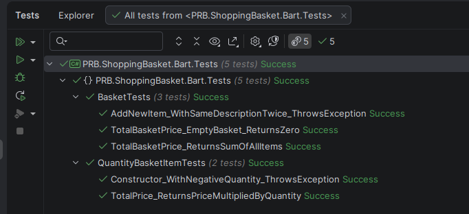

Gebruik de boodschap *"Add testproject"* voor de commit

### Eerste unit test voor QuantityBasketItem

Laten we starten met een 1ste test...

Hiervoor gaan we een een `QuantityBasketItem` met een bepaalde state testen:

* prijs: `10`
* omschrijving: `"Cola"`
* hoeveelheid: `3`

Bij deze state verwachten we dat de totale prijs `30` zal zijn.  
We maken een nieuwe cs-file aan in het testproject met de naam `QuantityBasketItemTests.cs`

~~~cs
using PRB.ShoppingBasket.Bart;

namespace PRB.ShoppingBasket.Bart.Tests
{
    public class QuantityBasketItemTests
    {
        [Fact]
        public void TotalPrice_ReturnsPriceMultipliedByQuantity()
        {
            // Arrange
            QuantityBasketItem item = new QuantityBasketItem(10, "Cola", 3);

            // Act
            int totalPrice = item.TotalPrice;

            // Assert
            Assert.Equal(30, totalPrice);
        }
    }
}
~~~

#### Fact-keyword om te markeren

Zo'n test wordt geannoteerd met **Fact**, dit zorgt ervoor dat als je dit testproject uitvoert
deze test automatisch zal worden gestart.

~~~cs
//...
        [Fact]
        public void TotalPrice_ReturnsPriceMultipliedByQuantity()
//...
~~~

#### Assert-library om te valideren

Binnen deze test gebruik je vervolgens het Assert-keyword om te valideren
zoals hieronder geïllustreerd:

~~~cs
//...
        Assert.Equal(30, totalPrice);
//...
~~~

In dit geval drukken we uit dat we als uitkomst **30** verwachten als 1ste argument,
het 2de argument is dat het de uitkomst die we willen toetsen...

### Patronen voor Unit Tests

Gemeenschappelijk aan de meeste (unit)test-frameworks zijn een aantal patronen

#### AAA

Deze test (en in zeer veel gevallen) bestaat typisch uit 3 delen:

* **Arrange:** we zetten de testdata klaar
* **Act:** we voeren de actie uit die we willen testen
* **Assert:** we controleren of het resultaat klopt

Deze structuur noemen we ook vaak **AAA**: Arrange, Act, Assert.

#### Test dient gefocust te zijn

Let er ook op dat een unittest altijd gefocust is.  
Dit wil zeggen je test meestal maar 1 ding of aspect van je code.  

In het 1ste voorbeeld testen enkel de basiswerking van TotalPrice.  
In ander test ga je dan weer focussen op andere varianten of items...

#### De naam is (zeer) belangrijk

Probeer in je test-methodes altijd een duidelijke naam te geven die beschrijft wat de test doet.  
Probeer daar in mee te geven welke methode of property je test en ook wat je specifiek wil testen.  

In ons voorbeeld **"TotalPrice_ReturnsPriceMultipliedByQuantity"** geven we aan:

* We **testen** de **TotalPrice**-property
* We kijken na of de **prijs** met de **hoeveelheid** wordt **vermenigvuldigd**

### Testen of een exception wordt opgegooid (niet happy case)

**Tot nog toe** hebben we een **happy case** of het normale "path" getest.  
Bij Unit Testen wil je ook nagaan hoe dat de **code** **reageert** **als er zaken fout** lopen...

We hebben bijvoorbeeld eerder voorzien dat negatieve bedragen niet toegelaten zijn.  
Dat kunnen we dan ook automatisch testen.

~~~cs
using PRB.ShoppingBasket.Bart;

namespace PRB.ShoppingBasket.Bart.Tests
{
    public class QuantityBasketItemTests
    {
        [Fact]
        public void Constructor_WithNegativePrice_ThrowsException()
        {
            Assert.Throws<NoNegativeAmountAllowedException>(() =>
            {
                new QuantityBasketItem(-10, "Cola", 3);
            });
        }

        [Fact]
        public void Constructor_WithNegativeQuantity_ThrowsException()
        {
            Assert.Throws<NoNegativeAmountAllowedException>(() =>
            {
                new QuantityBasketItem(10, "Cola", -3);
            });
        }
    }
}
~~~

Bemerk hier ook dat we gewoon een **nieuwe testmethode** toevoegen aan dezelfde unit test-klasse...

Hier **testen** we niet of er een **gewone waarde** wordt teruggegeven, maar of de juiste **exceptie** wordt opgegooid.   
Hiervoor gebruiken we een specifieke functie van de Assert-library **Assert.Throws**

Deze maakt gebruik van een lambda-expressie om de code (die fout loopt) te testen en op te vangen.  
Alternatief is dat je deze test via onderstaande code, waar je de test opvangt en test of het type wel correct is.

~~~cs
        [Fact]
        public void Constructor_WithNegativeQuantity_ThrowsException()
        {
            try
            {
                new QuantityBasketItem(10, "Cola", -3);
                Assert.Fail("This path should not be reached.");
            }
            catch(NoNegativeAmountAllowedException e)
            {
                 Assert.IsType<NoNegativeAmountAllowedException>(e);
            }
        }
~~~

Let er ook op dat je expliciet een **Fail** aanroept mocht er toch geen exceptie
worden opgeworpen

#### Testen en committen: "Add tests for QuantityBasketItem"

Als de **testen** succesvol zijn kan je een nieuwe **commit** te produceren...  
Gebruik hiervoor *"Add tests for QuantityBasketItem"*

### Nog unit-testen: Unit test voor Basket

Ook de klasse `Basket` bevat logica die we kunnen testen.

Bijvoorbeeld: als we **2 items** toevoegen, moet de **totaalprijs** **correct** berekend worden.

~~~cs
using PRB.ShoppingBasket.Bart;

namespace PRB.ShoppingBasket.Bart.Tests
{
    public class BasketTests
    {
        [Fact]
        public void TotalBasketPrice_ReturnsSumOfAllItems()
        {
            // Arrange
            Basket basket = new Basket();

            basket.AddNewItem(new QuantityBasketItem(10, "Cola", 3));
            basket.AddNewItem(new QuantityBasketItem(5, "Chips", 2));

            // Act
            int totalPrice = basket.TotalBasketPrice;

            // Assert
            Assert.Equal(40, totalPrice);
        }
    }
}
~~~

De **berekening** is hier:

~~~text
Cola:  10 * 3 = 30
Chips:  5 * 2 = 10
Totaal:       = 40
~~~

#### Testen dat hetzelfde item niet twee keer mag worden toegevoegd

We kunnen ook testen dat onze eigen exception `ItemAlreadyInBasketException` correct gebruikt wordt.

~~~cs
using PRB.ShoppingBasket.Bart;

namespace PRB.ShoppingBasket.Bart.Tests
{
    public class BasketTests
    {
        [Fact]
        public void TotalBasketPrice_ReturnsSumOfAllItems()
        {
            // Arrange
            Basket basket = new Basket();

            basket.AddNewItem(new QuantityBasketItem(10, "Cola", 3));
            basket.AddNewItem(new QuantityBasketItem(5, "Chips", 2));

            // Act
            int totalPrice = basket.TotalBasketPrice;

            // Assert
            Assert.Equal(40, totalPrice);
        }

        [Fact]
        public void AddNewItem_WithSameDescriptionTwice_ThrowsException()
        {
            // Arrange
            Basket basket = new Basket();

            basket.AddNewItem(new QuantityBasketItem(10, "Cola", 1));

            // Act + Assert
            Assert.Throws<ItemAlreadyInBasketException>(() =>
            {
                basket.AddNewItem(new QuantityBasketItem(20, "Cola", 2));
            });
        }
    }
}
~~~

Hier **controleren** we of **2 items** met dezelfde beschrijving niet allebei in **hetzelfde winkelmandje** terechtkomen.

#### Wat als er nog geen items inzitten?

Probeer ook altijd aan de **speciale cases** te denken...  
Voor onze `Basket`-klasse kunnen we bijvoorbeeld ook nog testen wat de totaalprijs is van een leeg winkelmandje:

~~~cs
namespace PRB.ShoppingBasket.Bart.Tests;

public class BasketTests
{
    [Fact]
    public void TotalBasketPrice_ReturnsSumOfAllItems()
    {
        // Arrange
        Basket basket = new Basket();

        basket.AddNewItem(new QuantityBasketItem(10, "Cola", 3));
        basket.AddNewItem(new QuantityBasketItem(5, "Chips", 2));

        // Act
        int totalPrice = basket.TotalBasketPrice;

        // Assert
        Assert.Equal(40, totalPrice);
    }
    
    [Fact]
    public void AddNewItem_WithSameDescriptionTwice_ThrowsException()
    {
        // Arrange
        Basket basket = new Basket();

        basket.AddNewItem(new QuantityBasketItem(10, "Cola", 1));

        // Act + Assert
        Assert.Throws<ItemAlreadyInBasketException>(() =>
        {
            basket.AddNewItem(new QuantityBasketItem(20, "Cola", 2));
        });
    }
    
    [Fact]
    public void TotalBasketPrice_EmptyBasket_ReturnsZero()
    {
        // Arrange
        Basket basket = new Basket();

        // Act
        int totalPrice = basket.TotalBasketPrice;

        // Assert
        Assert.Equal(0, totalPrice);
    }
}
~~~

#### Testen en committen: "Add tests for Basket"

Als de **testen** succesvol zijn kan je een nieuwe **commit** te produceren... 
Gebruik hiervoor *"Add tests for Basket"*

### Testen voor BulkBasketItem

We hebben ondertussen testen toegevoegd voor **Basket** en **QuantityBasketItem**,
dus je zou min of meer al moeten begrijpen hoe dit werkt en wat je kan testen.  

Zet nu de **oefening** **verder** met gelijkaardige testen toe voor **BulkBasketItem**.

#### Testen en committen: "Add tests for BulkBasketItem"

Als de **testen** succesvol zijn kan je een nieuwe **commit** te produceren... 
Gebruik hiervoor *"Add tests for BulkBasketItem"*

### Conclusie: Unit testen vs step-by-step

Unit testing **betekent** dat we **kleine onderdelen** van onze applicatie **automatisch** testen.  
Voor deze oefening **testen** we **vooral** de **logica** in onze klassen getest.

We testen **minder de console-interactie zelf**, omdat die afhankelijk is van input van de gebruiker.  
Dit wil niet zeggen dat dit niet dient getest te worden, in zulke gevallen ga je gebruiken van een aantal extra technieken
zoals mocking, integratietesten, ...

> Deze technieken kom later nog aan bod in de opleiding

Door **unit tests** te **combineren** met **Git** krijgen we een **veilige werkwijze**:

* Kleine wijziging maken
* Automatisch testen
* Committen
* Verder bouwen

Op die manier kunnen we onze applicatie stap voor stap uitbreiden zonder telkens bang te moeten zijn dat bestaande functionaliteit ongemerkt kapot gaat.

## Herwerken naar modules -> solution en project (deel 7)

Tot nu toe staat onze applicatie grotendeels in **1 project**.  
Dat is voor kleine oefeningen geen probleem, maar bij **grotere** **applicaties** willen we onze code beter **opsplitsen**.  

**dotnet-solutions** kan je echter vrij gemakkelijk opdelen in **verschillende projecten**.  
Zo'n opdelingen zorgen over het **algemeen** voor een betere **onderhoudbaarheid** van de code.

We gaan onze **solution** daarom **opdelen** in meerdere **projecten**:

* Een project met het **model** en de **business-logica**
* Een project voor de **command line applicatie**
* Een project voor een **MVC webapplicatie**

Op die manier gaan we ook zien dat het dan mogelijk is **dezelfde** **logica** te **hergebruiken** 
in meerdere soorten **user interfaces**.  

Op deze manier krijg je dan al een soort van **gelaagd model** waarin je de modules
onafhankelijk van elkaar kan ontwikkelen

~~~
+------------+------------+                      
|            |            |                      
|     MVC    |    CMD     |                      
|            |            |                      
+------+-----+-----+------+                      
       |           |                             
+------v-----------v------+      +--------------+
|                         |      |              |
|     LOGICA & MODEL      |<-----+    TEST      |
|                         |      |              |
+-------------------------+      +--------------+
~~~

Beide CMD en MVC herbruiken de `Basket`, `BasketItem`, `QuantityBasketItem`, ...  
De logica hoeft dus **niet opnieuw** geschreven te worden voor de verschillende UI/Views

### Gewenste structuur

**Na** deze **herwerking** willen we ongeveer de **volgende structuur** bekomen:

~~~text
PRB.ShoppingBasket.Bart
│
├── PRB.ShoppingBasket.Bart
│   ├── Basket.cs
│   ├── BasketItem.cs
│   ├── QuantityBasketItem.cs
│   ├── BulkBasketItem.cs
│   └── ...
│
├── PRB.ShoppingBasket.Bart.CMD
│   └── Program.cs
│
├── PRB.ShoppingBasket.Bart.Web
│   ├── Controllers
│   ├── Models
│   ├── Views
│   └── ...
│
└── PRB.ShoppingBasket.Bart.sln
~~~

Het project `PRB.ShoppingBasket.Bart` bevat dan de **herbruikbare logica**.  
Het project `PRB.ShoppingBasket.Bart.CMD` bevat enkel de **command line interface**.  
Het project `PRB.ShoppingBasket.Bart.Web` bevat de **MVC webapplicatie**.

> Nota:  
> In de voorbeelden hieronder gebruiken we opnieuw `Bart` als naam.  
> Vervang `Bart` telkens door je eigen naam.

### Stap 1: Aanmaken van een command line project

We voegen eerst een nieuw project toe aan de solution.

Dit project noemen we:

~~~text
PRB.ShoppingBasket.Bart.CMD
~~~

Dit wordt een gewone **Console App**.

De bedoeling is dat alle code die met `Console.ReadLine()` en `Console.WriteLine()` werkt, verhuist naar dit nieuwe command line project.  
Het oorspronkelijke project `PRB.ShoppingBasket.Bart` wordt dan gebruikt als **model-project** of **library-project**.

Dat betekent:

* `Basket.cs` blijft in `PRB.ShoppingBasket.Bart`
* `BasketItem.cs` blijft in `PRB.ShoppingBasket.Bart`
* `QuantityBasketItem.cs` blijft in `PRB.ShoppingBasket.Bart`
* `BulkBasketItem.cs` blijft in `PRB.ShoppingBasket.Bart`
* `Program.cs` verhuist naar `PRB.ShoppingBasket.Bart.CMD`

Het **command line project** heeft dus een **dependency** nodig op het **oorspronkelijke project**.

#### Afhankelijkheid toevoegen in Visual Studio

In **Visual Studio** kan je een project reference toevoegen via de Solution Explorer.

* Klik met de rechtermuisknop op het project `PRB.ShoppingBasket.Bart.CMD`
* Kies **Add**
* Kies **Project Reference...**
* Selecteer het project `PRB.ShoppingBasket.Bart`
* Klik op **OK**

Daarna is het oorspronkelijke project beschikbaar vanuit het command line project.

Ook hier kan je dan bovenaan in `Program.cs` de namespace gebruiken:

~~~cs
using PRB.ShoppingBasket.Bart;
~~~

#### Afhankelijkheid toevoegen in Rider

In **JetBrains Rider** kan je een project reference toevoegen via de solution explorer.

* Klik met de rechtermuisknop op het project `PRB.ShoppingBasket.Bart.CMD`
* Kies **Add**
* Kies **Reference**
* Selecteer het project `PRB.ShoppingBasket.Bart`
* Bevestig met **OK** of **Add**

Daarna kan het command line project de klassen uit het model-project gebruiken.

Bijvoorbeeld:

~~~cs
using PRB.ShoppingBasket.Bart;
~~~

Als Rider de namespace niet onmiddellijk herkent, kan je eventueel het project opnieuw builden:

~~~bash
dotnet build
~~~

#### Command line project aanmaken met VS Code

Navigeer in de terminal naar de folder waar de solution staat.

Maak daarna een nieuw consoleproject aan:

~~~bash
dotnet new console -n PRB.ShoppingBasket.Bart.CMD --use-program-main
~~~

Voeg het nieuwe project toe aan de solution:

~~~bash
dotnet sln add PRB.ShoppingBasket.Bart.CMD/PRB.ShoppingBasket.Bart.CMD.csproj
~~~

Voeg daarna een reference toe naar het model-project:

~~~bash
dotnet add PRB.ShoppingBasket.Bart.CMD/PRB.ShoppingBasket.Bart.CMD.csproj reference PRB.ShoppingBasket.Bart/PRB.ShoppingBasket.Bart.csproj
~~~

Daarna kan je de applicatie uitvoeren met:

~~~bash
dotnet run --project PRB.ShoppingBasket.Bart.CMD
~~~

#### Testen en committen: "Adding a separate Command Line Module"

Niet vergeten hier even kort te **testen** en een nieuwe **commit** te produceren...  
Gebruik hiervoor *"Adding a separate Command Line Module"*

### Intermezzo: Wat gebeurt er als je een afhankelijkheid toevoegt?

Wanneer je een **project reference** toevoegt, wordt er eigenlijk een verwijzing toegevoegd in het `.csproj`-bestand van het project dat de dependency nodig heeft.

In het `.csproj`-bestand van `PRB.ShoppingBasket.Bart.CMD` verschijnt dan een extra `ProjectReference`.

~~~xml
<ItemGroup>
  <ProjectReference Include="..\PRB.ShoppingBasket.Bart\PRB.ShoppingBasket.Bart.csproj" />
</ItemGroup>
~~~

Dit betekent dat het project `PRB.ShoppingBasket.Bart.CMD` de code uit `PRB.ShoppingBasket.Bart` mag gebruiken.

De **richting** van de **afhankelijkheid** is **belangrijk** namelijk, PRB.ShoppingBasket.Bart.CMD gebruikt PRB.ShoppingBasket.Bart

Het model-project mag dus **niets weten** van het CMD-project.  
De logica moet onafhankelijk blijven van de manier waarop ze gebruikt wordt.

### Stap 2: Code verplaatsen naar het command line project

In de 2de stap kunnen we de **verantwoordelijkheden** nu (beter) gaan **scheiden**.

Het model-project bevat enkel nog klassen met logic zoals o.a. Basket, BasketItem, QuantityBasketItem, BulkBasketItem, ...   
Daarnaast IBasketItem en alle exceptions blijven ook binnen deze 

Het command line project zelf gaat nu enkel bevatten wat specifiek is voor de console.  
Verplaats dus de code uit `Program.cs` naar het project `PRB.ShoppingBasket.Bart.CMD`.

Bij de verplaatsing zorg er voor dat je de namespace aanpast naar PRB.ShoppingBasket.<Naam>.CMD

~~~cs

using PRB.ShoppingBasket.Bart;

namespace PRB.ShoppingBasket.Bart.CMD
{
    public class Program
    {
        //... Bestaande code zou nog altijd moeten werken 
        //... indien je de dependencies goed hebt aangepast
    }
}
~~~

In het oorspronkelijke project gaan we zo dadelijk je `Program.cs` verwijderen maar hiervoor dienen
we nog een extra aanpassing te doen.  
Zorg er daarvoor eerst dat je de klasse - in het oorspronkelijke project volledige leeg maakt zoals hieronder...

~~~cs
using PRB.ShoppingBasket.Bart;

namespace PRB.ShoppingBasket.Bart
{
    public class Program
    {
        static void Main(string[] args)
        {
            
        }
    }
}
~~~

#### Testen en committen: "Moving Program.cs to CMD-project"

Niet vergeten hier even kort te **testen** en een nieuwe **commit** te produceren...  
Gebruik hiervoor *"Adding a separate Command Line Module"*

### Stap 3: Het oorspronkelijke project 'zuiver' maken

Het oorspronkelijke project `PRB.ShoppingBasket.Bart` bevat nu geen echte applicatie meer, maar enkel nog herbruikbare code.  
Dat soort project noemen we vaak een **class library**.

Een class library:

* Heeft geen eigen `Main`-methode
* Wordt **niet rechtstreeks** uitgevoerd
* Wordt **gebruikt** door **andere projecten**
* Bevat herbruikbare klassen en logica

In ons geval wordt dit project gebruikt door:

* `PRB.ShoppingBasket.Bart.CMD`
* Later ook door `PRB.ShoppingBasket.Bart.Web`
* Vanzelfsprekend door het **testproject**

#### Project omzetten naar Class Library in Visual Studio

In **Visual Studio** kan je dit aanpassen via de projecteigenschappen

* Klik met de rechtermuisknop op het project `PRB.ShoppingBasket.Bart`
* Kies **Properties**
* Ga naar **Application**
* Zoek de instelling **Output type**
* Verander deze van **Console Application** naar **Class Library**
* Sla de wijziging op

#### Project omzetten naar Class Library in Rider

In **JetBrains Rider** kan je het oorspronkelijke project omzetten naar een **Class Library** via de project properties.

* Klik met de rechtermuisknop op het project `PRB.ShoppingBasket.Bart`
* Kies **Properties**
* Ga naar **Application**
* Zoek de instelling **Output type**
* Verander deze van **Console Application** naar **Class Library**
* Sla de wijziging op

Rider past hierdoor achter de schermen het `.csproj`-bestand aan.  
Je hoeft het `.csproj`-bestand dus niet manueel te wijzigen.

#### Project omzetten naar Class Library in VS Code

In **VS Code** doen we dit via het `.csproj`-bestand.

Open het bestand:

~~~text
PRB.ShoppingBasket.Bart/PRB.ShoppingBasket.Bart.csproj
~~~

Als het project oorspronkelijk als consoleproject werd aangemaakt, zie je waarschijnlijk iets zoals:

~~~xml
<Project Sdk="Microsoft.NET.Sdk">

  <PropertyGroup>
    <OutputType>Exe</OutputType>
    <TargetFramework>net8.0</TargetFramework>
    <ImplicitUsings>enable</ImplicitUsings>
    <Nullable>enable</Nullable>
  </PropertyGroup>

</Project>
~~~

De lijn:

~~~xml
<OutputType>Exe</OutputType>
~~~

zorgt ervoor dat het project als uitvoerbare applicatie wordt gebouwd.

Voor een class library verwijderen we deze lijn.

Het `.csproj`-bestand wordt dan:

~~~xml
<Project Sdk="Microsoft.NET.Sdk">

  <PropertyGroup>
    <TargetFramework>net8.0</TargetFramework>
    <ImplicitUsings>enable</ImplicitUsings>
    <Nullable>enable</Nullable>
  </PropertyGroup>
~~~

#### Verwijder Program.cs uit het oorspronkelijke project

Verwijder daarna eventueel de oude `Program.cs` uit `PRB.ShoppingBasket.Bart`, aangezien de command line code nu in het project `PRB.ShoppingBasket.Bart.CMD` staat.

#### Testen en committen: "Remove Program.cs from Base-project"

Niet vergeten hier even kort te **testen** en een nieuwe **commit** te produceren...  
Gebruik hiervoor *"Remove Program.cs from Base-project"*

### Stap 4: Aanmaken van een nieuwe MVC-component

Nu voegen we een **3de project** toe, in dit geval **ASP.NET Core MVC-project**.  
We geven dit de naam `PRB.ShoppingBasket.<Name>.Web`, de bedoeling is dat dit project een **webinterface** aanbiedt bovenop dezelfde **basket-logica**.

Beide **PRB.ShoppingBasket.Bart.CMD** en **PRB.ShoppingBasket.Bart.Web** zullen dan een afhankelijkheid hebben op 
Tussen `CMD` en `Web` zal er geen afhankelijkheid zijn!!

#### MVC-project aanmaken met Visual Studio

In **Visual Studio** kan je een MVC-project toevoegen via de Solution Explorer.

* Klik met de rechtermuisknop op de solution
* Kies **Add**
* Kies **New Project**
* Selecteer **ASP.NET Core Web App (Model-View-Controller)**
* Geef het project de naam `PRB.ShoppingBasket.<Name>.Web`
* Kies het gewenste .NET-framework
* Maak het project aan

Voeg daarna een project reference toe:

* Klik met de rechtermuisknop op `PRB.ShoppingBasket.<Name>.Web`
* Kies **Add**
* Kies **Project Reference...**
* Selecteer `PRB.ShoppingBasket.<Name>`
* Klik op **OK**

Daarna kan je het webproject starten met de groene run-knop.

#### MVC-project aanmaken met Rider

In **Rider** kan je een MVC-project toevoegen via de solution explorer.

* Klik met de rechtermuisknop op de solution
* Kies **Add**
* Kies **New Project**
* Selecteer een **ASP.NET Core Web App (Model-View-Controller)**
* Geef het project de naam `PRB.ShoppingBasket.<Name>.Web`
* Maak het project aan

Voeg daarna een reference toe naar het model-project:

* Klik met de rechtermuisknop op `PRB.ShoppingBasket.<Name>.Web`
* Kies **Add**
* Kies **Reference**
* Selecteer `PRB.ShoppingBasket.<Name>`
* Bevestig de keuze

Daarna kan je het MVC-project starten via de run-knop bovenaan in Rider.

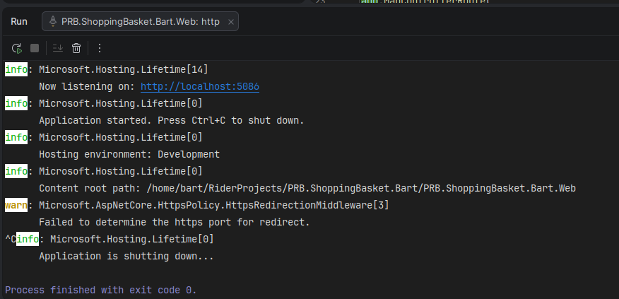

#### MVC-project aanmaken met VS Code

Navigeer naar de folder waar de solution staat.

Maak een nieuw MVC-project aan:

~~~bash
dotnet new mvc -n PRB.ShoppingBasket.<Name>.Web
~~~

Voeg het MVC-project toe aan de solution:

~~~bash
dotnet sln add PRB.ShoppingBasket.Bart.Web/PRB.ShoppingBasket.<Name>.Web.csproj
~~~

Voeg daarna een reference toe naar het model-project:

~~~bash
dotnet add PRB.ShoppingBasket.Bart.Web/PRB.ShoppingBasket.<Name>.Web.csproj reference PRB.ShoppingBasket.Bart/PRB.ShoppingBasket.<Name>.csproj
~~~

Start de webapplicatie met:

~~~bash
dotnet run --project PRB.ShoppingBasket.<Name>.Web
~~~

In de terminal verschijnt daarna een URL waarop de applicatie bereikbaar is, bijvoorbeeld:

~~~text
https://localhost:7001
~~~

of:

~~~text
http://localhost:5000
~~~

#### Testen en committen: "Adding MVC-components"

Niet vergeten hier even kort te **testen** en een nieuwe **commit** te produceren...  

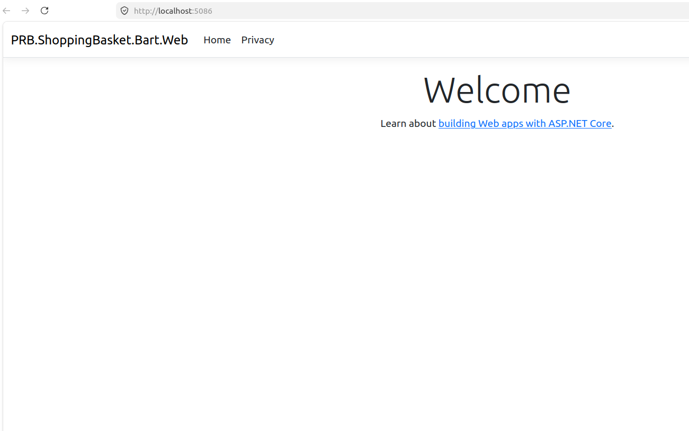

Zorg er voor dat je zowel:

* De **CMD-app** kan starten
* De **testen** nog altijd **groen** zijn
* De **web-applicatie** kan draaien 

Gebruik hiervoor *"Adding MVC-components"*

### Stap 5: Eerste gebruik van het model in MVC

Om te controleren of de MVC-applicatie het model-project correct kan gebruiken, passen we tijdelijk de `HomeController` aan.  
Open `PRB.ShoppingBasket.Bart.Web/Controllers/HomeController.cs` en voeg bovenaan de **namespace** van het **model** toe:

~~~cs
using PRB.ShoppingBasket.Bart;
~~~

In de `Index`-actie kunnen we tijdelijk een `Basket` aanmaken:

~~~cs
public IActionResult Index()
{
    Basket basket = new Basket();

    basket.AddNewItem(new QuantityBasketItem(10, "Cola", 2));
    basket.AddNewItem(new BulkBasketItem(4, "Bloem", 1500));

    ViewBag.TotalPrice = basket.TotalBasketPrice;

    return View();
}
~~~

Daarna kunnen we in de view `Index.cshtml` deze waarde tonen.

Open `PRB.ShoppingBasket.Bart.Web/Views/Home/Index.cshtml`, voeg toe:

~~~html

Totale prijs van test-winkelmandje: @ViewBag.TotalPrice

~~~

Als je nu de **MVC-applicatie** **start**, zou je op de startpagina deze **totaalprijs** moeten zien.

Dit is nog geen volledige webapplicatie, maar het bewijst wel dat:

* Het MVC-project correct werkt
* Het MVC-project het model-project kan gebruiken
* De basket-logica herbruikbaar is buiten de command line applicatie

#### Testen en committen: "Testing dependency from Web to Domain"

Niet vergeten hier even kort te **testen** en een nieuwe **commit** te produceren...  
**Controleer** of de **webpagina** opent en de **totaalprijs** toont.

Gebruik hiervoor *"Testing dependency from Web to Domain"*

### Samengevat

In dit deel hebben we onze applicatie **opgesplitst** in meerdere projecten.

We hebben:

* Een apart command line project gemaakt
* De consolecode verhuisd naar `PRB.ShoppingBasket.Bart.CMD`
* Het oorspronkelijke project herwerkt naar een model/library-project
* Een MVC-project toegevoegd
* Het MVC-project gekoppeld aan dezelfde basket-logica

De uiteindelijke **afhankelijkheden** zijn (zoals eerder vermeld):

~~~text
+------------+------------+                      
|            |            |                      
|     MVC    |    CMD     |                      
|            |            |                      
+------+-----+-----+------+                      
       |           |                             
+------v-----------v------+      +--------------+
|                         |      |              |
|     LOGICA & MODEL      |<-----+    TEST      |
|                         |      |              |
+-------------------------+      +--------------+
~~~

Het model-project staat **centraal**.  
Zowel de **CMD**-applicatie als de **MVC**-applicatie **hergebruiken** dezelfde onderliggende logica.

## Toevoegen van Identity (deel 8)

In dit hoofdstuk voegen we **ASP.NET Core Identity** toe aan onze **MVC**-applicatie.

**Identity** is het standaardmechanisme binnen ASP.NET Core om **authenticatie** en **authorisatie** toe te voegen aan een webapplicatie.  

Naast het **beveiligen** van **controllers** en **pagina's** laat het ons toe om functionaliteit te voorzien zoals:

* Gebruikers **registreren**
* Gebruikers **aanmelden**
* Gebruikers **afmelden**

### Toevoegen van Identity

Voor deze oefening gebruiken we **SQLite** als database.  
Daarin worden de gebruikers, rollen en bijhorende **Identity-gegevens** **opgeslagen**.

De **Identity**-functionaliteit zal worden **toegevoegd** aan het **MVC-project** met de nodige **uitleg** voor **Visual Studio, Rider en VS Code**

> Nota:  
> In tegenstelling tot vorige hoofdstukken make we nu pas bij de laatste stap een commit aan.  
> Dit heeft als reden dat we hier pas onze test kunnen toepassen bij de laatste stap...

### Stap 1: Dependencies toevoegen aan het Web-project

Om **Identity** te gebruiken moeten we eerst een aantal **dependencies** toevoegen aan het **webproject**

~~~text
Microsoft.AspNetCore.Identity.EntityFrameworkCore
Microsoft.AspNetCore.Identity.UI
Microsoft.EntityFrameworkCore.Sqlite
Microsoft.EntityFrameworkCore.Design
Microsoft.EntityFrameworkCore.Tools
Microsoft.VisualStudio.Web.CodeGeneration.Design
~~~

#### Dependencies toevoegen met Visual Studio

In **Visual Studio** kan je NuGet-packages toevoegen via de **NuGet Package Manager**.

* Klik met de rechtermuisknop op het MVC-project, bijvoorbeeld `PRB.ShoppingBasket.Bart.Web`
* Kies **Manage NuGet Packages**
* Ga naar het tabblad **Browse**
* En installeer de bovenvermelde packages

#### Dependencies toevoegen met Rider

In **JetBrains Rider** kan je NuGet-packages toevoegen via de **NuGet-interface**.

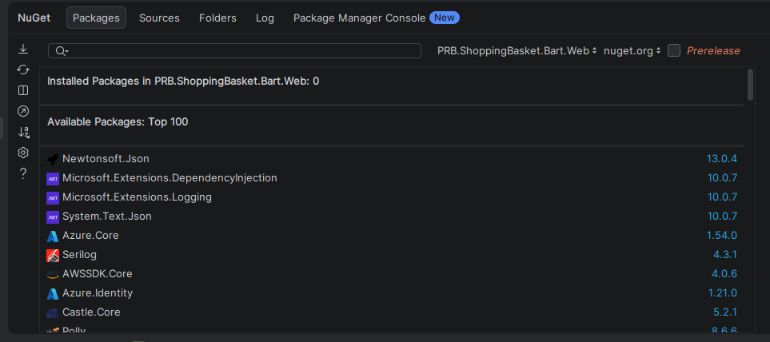

* Klik met de rechtermuisknop op het MVC-project, bijvoorbeeld `PRB.ShoppingBasket.Bart.Web`
* Kies **Manage NuGet Packages**
* En installeer de bovenvermelde packages

#### Dependencies toevoegen met VS Code

In **Visual Studio Code** voeg je de packages toe via de **terminal**.  
Navigeer 1st naar het MVC-project:

~~~bash
cd PRB.ShoppingBasket.Bart.Web
~~~

**Voeg** daarna de volgende **packages** toe:

~~~bash
dotnet add package Microsoft.AspNetCore.Identity.EntityFrameworkCore
dotnet add package Microsoft.AspNetCore.Identity.UI
dotnet add package Microsoft.EntityFrameworkCore.Sqlite
dotnet add package Microsoft.EntityFrameworkCore.Design
dotnet add package Microsoft.EntityFrameworkCore.Tools
dotnet add package Microsoft.VisualStudio.Web.CodeGeneration.Design
~~~

### Stap 2: ApplicationDbContext toevoegen

We gaan **Identity** gebruiken met **"Individual Accounts"**, dit betekent dat we het beheer gaan doen 
via de **database**.  

Het startpunt hiervoor is het aanmaken van een **IdentityDbContext**, voeg daarom de volgende klasse - ApplicationDbContext - toe aan de **Model**-folder

~~~cs
using Microsoft.AspNetCore.Identity.EntityFrameworkCore;
using Microsoft.EntityFrameworkCore;

namespace PRB.ShoppingBasket.Bart.Web.Data
{
    public class ApplicationDbContext : IdentityDbContext
    {
        public ApplicationDbContext(DbContextOptions<ApplicationDbContext> options)
            : base(options)
        {
        }
    }
}
~~~

> Nota:  
> Als je Identity toevoegt bij de start in Visual Studio maakt deze een Data-folder aan.  
> Voor de éénvoud gaan we hier dit echter in de Model-folder houden.  
> Beiden zijn geldige opties...

### Stap 4: appsettings.json aanpassen

We starten met het **configureren** van een **datasource**.  
Open de file "appsettings.json" en voeg de **connection string** toe:

~~~json
{
  "ConnectionStrings": {
    "DefaultConnection": "Data Source=basket.db"
  },
  "Logging": {
    "LogLevel": {
      "Default": "Information",
      "Microsoft.AspNetCore": "Warning"
    }
  },
  "AllowedHosts": "*"
}
~~~

We gebruiken de naam **basket.db** gezien we deze in volgende stap ook gaan hergebruiken voor het gewone model.  

> De SQLite-database zal later worden aangemaakt als we de migrations uitvoeren.

### Stap 5: Program.cs aanpassen

We passen nu in het **MVC**-project **Program.cs** aan en voegen de nodige imports toe

~~~cs
using Microsoft.AspNetCore.Identity;
using Microsoft.EntityFrameworkCore;
using PRB.ShoppingBasket.Bart.Web.Data;
~~~

Voeg daarna, vóór `builder.Build()`, de configuratie voor SQLite en Identity toe.  
Daarnaast voeg je via `.AddRoles<IdentityRole>()` ook nog de mogelijk toe om rollen te gebruiken.

~~~cs
var connectionString = builder.Configuration.GetConnectionString("DefaultConnection")
    ?? throw new InvalidOperationException("Connection string 'DefaultConnection' not found.");

builder.Services.AddDbContext<ApplicationDbContext>(options =>
    options.UseSqlite(connectionString));

builder.Services.AddDefaultIdentity<IdentityUser>(options =>
    {
        options.SignIn.RequireConfirmedAccount = false;
    })
    .AddRoles<IdentityRole>()
    .AddEntityFrameworkStores<ApplicationDbContext>();
~~~

Vervolgens voeg je in de **middleware-pipeline**, vóór de **route-mapping**, authentication en authorization toe.

~~~cs
app.UseRouting();

app.UseAuthentication();
app.UseAuthorization();

app.MapControllerRoute(
    name: "default",
    pattern: "{controller=Home}/{action=Index}/{id?}");

app.MapRazorPages();

app.Run();
~~~

2 belangrijke attentiepunten:

* Kijk ook na of `app.MapRazorPages()` bij staat, dit is achter af voor de Identity-pages
* Let wel op de volgorde, `UseAuthentication()` moet vóór `UseAuthorization()` staan.

~~~cs
app.UseAuthentication();
app.UseAuthorization();
~~~

### Stap 6: Migrations uitvoeren op Identity

#### Migrations uitvoeren met Visual Studio

In **Visual Studio** kan je **migrations** uitvoeren via de **Package Manager Console**.

Open deze via:

* **Tools**
* **NuGet Package Manager**
* **Package Manager Console**

**Controleer** bovenaan in de **Package Manager** Console dat het **Default project** 
ingesteld staat op je MVC-project en voer daarna uit:

~~~powershell
Add-Migration InitIdentity
Update-Database
~~~

Na deze stap wordt de **SQLite-database basket.db** **aangemaakt**

#### Migrations uitvoeren met Rider

Rider heeft ondersteuning voor **Entity Framework Core-commando's** via de **interface** (geen console nodig).

Zorg wel eerst dat `dotnet-ef` geïnstalleerd is:

~~~bash
dotnet tool install --global dotnet-ef
~~~

Als de tool al geïnstalleerd is:

~~~bash
dotnet tool update --global dotnet-ef
~~~

> Nota:  
> Omdat je in deze fase van de cursus al EF hebt gezien zou dit al Ok moeten zijn...

Daarna kan je in **Rider** een **migration** toevoegen:

* Klik met de rechtermuisknop op het MVC-project `PRB.ShoppingBasket.Bart.Web`
* Kies **Entity Framework Core**
* Kies **Add Migration**
* Geef als naam InitIdentity

Controleer dat de juiste `DbContext` geselecteerd is ApplicationDbContext.  
Daarna update je de database:

* Klik met de rechtermuisknop op het MVC-project
* Kies **Entity Framework Core**
* Kies **Update Database**

Na deze stap wordt de SQLite-database basket.db aangemaakt

#### Migrations uitvoeren met VS Code

In VS Code voer je migrations uit via de terminal.

Zorg eerst dat `dotnet-ef` geïnstalleerd is:

~~~bash
dotnet tool install --global dotnet-ef
~~~

Als de tool al geïnstalleerd is:

~~~bash
dotnet tool update --global dotnet-ef
~~~

> Nota:  
> Omdat je in deze fase van de cursus al EF hebt gezien zou dit al Ok moeten zijn...

Navigeer daarna naar het MVC-project:

~~~bash
cd PRB.ShoppingBasket.Bart.Web
~~~

Maak de migration:

~~~bash
dotnet ef migrations add InitIdentity
~~~

Update daarna de database:

~~~bash
dotnet ef database update
~~~

Na deze stap wordt de **SQLite-database basket.db** aangemaakt

### Stap 7: Identity scaffolden

#### Identity scaffolden met Visual Studio

In Visual Studio kan je Identity via de interface scaffolden.

* Klik met de rechtermuisknop op het MVC-project
* Kies **Add**
* Kies **New Scaffolded Item...**
* Kies links **Identity**
* Klik op **Add**

Daarna krijg je een venster waarin je kan kiezen welke Identity-pagina's je wil toevoegen.  
Selecteer bijvoorbeeld:

* `Account\Register`
* `Account\Login`
* `Account\Logout`

Kies bij **Data context class** je bestaande context **ApplicationDbContext**.  
**Bevestig** daarna de **scaffolding**, Visual Studio voegt dan de nodige bestanden `Areas/Identity/Pages/Account` toe

> Als Visual Studio vraagt om extra packages te installeren, bevestig dit dan.

#### Identity scaffolden met Rider

In **JetBrains Rider** kan je **Identity** ook **scaffolden** via het **menu**.

* Klik met de rechtermuisknop op het MVC-project `PRB.ShoppingBasket.Bart.Web`
* Kies **Add**
* Kies **Scaffolded Item...**
* Kies bij de beschikbare scaffolders **Identity**
* Klik op **Next** of **Add**

Daarna krijg je een **venster** waarin je kan aanduiden **welke** Identity-pagina's je wil toevoegen.

Selecteer:

* `Account.Register`
* `Account.Login`
* `Account.Logout`
* 
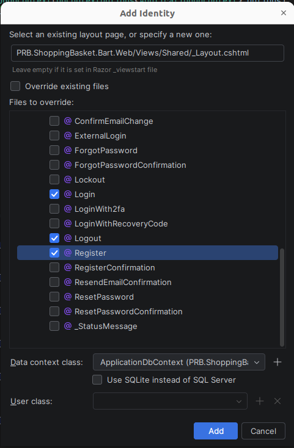

Kies daarna bij **Data context class** je bestaande context **ApplicationDbContext** en bevestig daarna de scaffolding.  
Rider voegt nu de Identity-bestanden toe onder de folder:

~~~text
Areas
└── Identity
    └── Pages
        └── Account
            ├── Login.cshtml
            ├── Login.cshtml.cs
            ├── Logout.cshtml
            ├── Logout.cshtml.cs
            ├── Register.cshtml
            └── Register.cshtml.cs
~~~

> Als Rider vraagt om extra packages te herstellen of het project opnieuw te builden, bevestig dit dan.

#### Identity scaffolden met VS Code

In VS Code **scaffold** je Identity via de **terminal**.

Installeer eerst de code generator indien nodig (dit zou in deze fase van de cursus reeds ok moeten zijn)

~~~bash
dotnet tool install -g dotnet-aspnet-codegenerator
~~~

Of update de tool:

~~~bash
dotnet tool update -g dotnet-aspnet-codegenerator
~~~

Voer daarna in de folder van het MVC-project uit:

~~~bash
dotnet aspnet-codegenerator identity \
  -dc PRB.ShoppingBasket.Bart.Web.Data.ApplicationDbContext \
  --files "Account.Register;Account.Login;Account.Logout"
~~~

> Op Windows PowerShell of in een terminal waar multiline commands (Windows) lastig zijn gebruik je het in 1 lijn
> 
> ~~~powershell
> dotnet aspnet-codegenerator identity -dc PRB.ShoppingBasket.Bart.Web.Data.ApplicationDbContext --files "Account.Register;Account.Login;Account.Logout"
> ~~~

### Stap 8: Login partial toevoegen

Open `Views/Shared/_Layout.cshtml`, zoek de navigatiebalk en voeg daar toe:

~~~html
<partial name="_LoginPartial" />
~~~

Dit zou er ongeveer zo moeten uitzien:

~~~html

    <ul class="navbar-nav flex-grow-1">
        <li class="nav-item">
            <a class="nav-link text-dark" asp-area="" asp-controller="Home" asp-action="Index">Home</a>
        </li>
        <li class="nav-item">
            <a class="nav-link text-dark" asp-area="" asp-controller="Home" asp-action="Privacy">Privacy</a>
        </li>
    </ul>

    <partial name="_LoginPartial" />

~~~

Mocht `_LoginPartial.cshtml` nog niet bestaat, maak deze dan aan in "Views/Shared/_LoginPartial.cshtml" met volgende inhoud:

~~~shtml
@using Microsoft.AspNetCore.Identity
@inject SignInManager<IdentityUser> SignInManager
@inject UserManager<IdentityUser> UserManager

<ul class="navbar-nav">
@if (SignInManager.IsSignedIn(User))
{
    <li class="nav-item">
        Hallo @User.Identity?.Name!
    </li>
    <li class="nav-item">
        <form class="form-inline" asp-area="Identity" asp-page="/Account/Logout" method="post">
            <button type="submit" class="nav-link btn btn-link text-dark">Logout</button>
        </form>
    </li>
}
else
{
    <li class="nav-item">
        <a class="nav-link text-dark" asp-area="Identity" asp-page="/Account/Register">Register</a>
    </li>
    <li class="nav-item">
        <a class="nav-link text-dark" asp-area="Identity" asp-page="/Account/Login">Login</a>
    </li>
}
</ul>
~~~

### Stap 9: Applicatie starten en testen

**Start** de applicate, controleer daarna in de browser of je **links** ziet voor:

* Register
* Login
* Logout

Om te **testen**, maak nu een **user** log in en uit...

### Finale stap: Committen met "Adding Identity to the Web-project"

Zoals eerder vermeld, we hebben hier **niet** voor **elke stap** een **commit** toegevoegd omdat het in principe 1 grote "setup"-actie was.  
Als de laatste stap dus goed werkt commit je wijzigingen met de boodschap *"Adding Identity to the Web-project"*.

### Conclusie Identity

We hebben nu enkel Identity geinstalleerd en geactiveerd.  
In de komende hoofdstuk(jes) zullen we hier ook **authorisatie** op toepassen.

## Entity Framework toevoegen voor Basket en BasketItems (deel 9)

In dit hoofdstuk gaan we onze winkelmandjes bewaren in de database met **Entity Framework Core**.

Tot nu toe bestaan onze `Basket` en `BasketItem`-objecten enkel in het geheugen van de applicatie.  
Zodra de applicatie stopt, zijn de gegevens weg.

Met Entity Framework willen we ervoor zorgen dat we gegevens kunnen bewaren zoals:

* Een `Basket`
* De items in een basket
* Een `QuantityBasketItem`
* Een `BulkBasketItem`
* De totaalprijs van een basket

We gebruiken hiervoor dezelfde SQLite-database als in het vorige hoofdstuk met Identity.

### Huidige modules

Onze solution bevat ondertussen meerdere projecten waar het het project `PRB.ShoppingBasket.Bart`de modelklassen bevat zoals

* `Basket`
* `BasketItem`
* `QuantityBasketItem`
* `BulkBasketItem`

en het project `PRB.ShoppingBasket.Bart.Web` bevat de MVC-applicatie, Identity en `ApplicationDbContext`.

We gaan de winkelmandlogica dus niet naar het webproject verplaatsen.  
We gebruiken hiervoor het model-project als basis, maar maken de modelklassen geschikt om door EF Core bewaard te worden.

### Belangrijk: interfaces en Entity Framework

Op het einde van het vorige deel hebben we mogelijk gewerkt met een interface `IBasketItem`.

Bijvoorbeeld:

~~~cs
public List<IBasketItem> Items { get; private set; } = new List<IBasketItem>();
~~~

Voor gewone OO-code is dat een mooie abstractie.  
Voor Entity Framework is dat echter moeilijker.

EF Core bewaart objecten in **tabellen** en moet dus weten welke **concrete klassen** gebruikt worden.  
Daarom gebruiken we voor de EF-relatie opnieuw de abstracte basisklasse `BasketItem`.

We passen `Basket` (zie volgende stap) dus aan naar:

~~~cs
public List<BasketItem> Items { get; private set; } = new List<BasketItem>();
~~~

Voor de rest wijzigt er niets: `BasketItem` blijft wel abstract.  
en de concrete objecten `QuantityBasketItem` en `BulkBasketItem` blijven.

### Stap 1: Basket aanpassen voor Entity Framework

Naast de wijziging beschreven hierboven hebben we nog een wijziging nodig.  
Entity Framework heeft namelijk een **primary key** nodig.  
Hiervoor voegen we aan `Basket` een property `Id` toe.

~~~cs
namespace PRB.ShoppingBasket.Bart
{
    public class Basket
    {
        public int Id { get; private set; }

        public List<BasketItem> Items { get; private set; } = new List<BasketItem>();

        public void AddNewItem(BasketItem item)
        {
            if (ItemProvidedInBasket(item))
            {
                throw new ItemAlreadyInBasketException(item.Description);
            }

            Items.Add(item);
        }

        public bool ItemProvidedInBasket(BasketItem item)
        {
            return Lookup(item.Description) != null;
        }

        public BasketItem? Lookup(string description)
        {
            foreach (BasketItem item in Items)
            {
                if (item.Description.Equals(description))
                {
                    return item;
                }
            }

            return null;
        }

        public int TotalBasketPrice
        {
            get
            {
                int totalPrice = 0;

                foreach (BasketItem item in Items)
                {
                    totalPrice += item.TotalPrice;
                }

                return totalPrice;
            }
        }
    }
}
~~~

> De `Id` zal later automatisch ingevuld door de database...

### Stap 2: BasketItem aanpassen voor Entity Framework

Binen onze abstracte klassen `BasketItem` voeren we 2 wijzigingen uit:

* We voegen we ook een `Id` toe (deze is dan ineens geldig voor alle subklassen).
* Daarnaast voegen we een `BasketId` toe. Dit wordt gebruikt EF Core om te weten bij welke `Basket` een bepaald item hoort.

~~~cs
namespace PRB.ShoppingBasket.Bart
{
    public abstract class BasketItem
    {
        protected BasketItem()
        {
        }

        public BasketItem(string description)
        {
            Description = description;
        }

        public int Id { get; private set; }

        public int BasketId { get; private set; }

        public string Description { get; private set; } = string.Empty;

        public abstract int TotalPrice { get; }

        public abstract int IncrementQuantity();

        public abstract int DecrementQuantity();
    }
}
~~~

Let op deze **constructor**:

~~~cs
protected BasketItem()
{
}
~~~

Entity Framework heeft een **parameterloze constructor** nodig om objecten opnieuw te kunnen opbouwen vanuit de database.

We maken deze constructor `protected`, zodat **gewone code** nog altijd **niet** zomaar een `BasketItem` kan **aanmaken**.

De klasse blijft abstract:

~~~cs
public abstract class BasketItem
~~~

Je kan dus nog altijd niet rechtstreeks dit doen:

~~~cs
BasketItem item = new BasketItem();
~~~

### Stap 3: QuantityBasketItem aanpassen

**Ook** de concrete klasse `QuantityBasketItem` moet een parameterloze constructor krijgen voor EF Core.

~~~cs
namespace PRB.ShoppingBasket.Bart
{
    public class QuantityBasketItem : BasketItem
    {
        private int _price;
        private int _quantity;

        protected QuantityBasketItem()
        {
        }

        public QuantityBasketItem(int price, string description, int quantity = 1)
            : base(description)
        {
            Price = price;
            Quantity = quantity;
        }

        public int Price
        {
            get
            {
                return _price;
            }
            private set
            {
                if (value < 0)
                {
                    throw new NoNegativeAmountAllowedException("prijs");
                }

                _price = value;
            }
        }

        public int Quantity
        {
            get
            {
                return _quantity;
            }
            private set
            {
                if (value < 0)
                {
                    throw new NoNegativeAmountAllowedException("hoeveelheid");
                }

                _quantity = value;
            }
        }

        public override int TotalPrice
        {
            get
            {
                return Price * Quantity;
            }
        }

        public override int IncrementQuantity()
        {
            Quantity++;
            return Quantity;
        }

        public override int DecrementQuantity()
        {
            Quantity--;
            return Quantity;
        }

        public override string ToString()
        {
            return $"{Quantity} maal {Description} voor {Price} per item, totaal {TotalPrice}";
        }
    }
}
~~~

Belangrijk:

~~~cs
protected QuantityBasketItem()
{
}
~~~

Deze constructor is enkel bedoeld voor Entity Framework.

### Stap 4: BulkBasketItem aanpassen

We doen hetzelfde voor `BulkBasketItem`.

~~~cs
namespace PRB.ShoppingBasket.Bart
{
    public class BulkBasketItem : BasketItem
    {
        private int _pricePerKilo;
        private int _weightInGrams;

        protected BulkBasketItem()
        {
        }

        public BulkBasketItem(int pricePerKilo, string description, int weightInGrams = 1000)
            : base(description)
        {
            PricePerKilo = pricePerKilo;
            WeightInGrams = weightInGrams;
        }

        public int PricePerKilo
        {
            get
            {
                return _pricePerKilo;
            }
            private set
            {
                if (value < 0)
                {
                    throw new NoNegativeAmountAllowedException("prijs");
                }

                _pricePerKilo = value;
            }
        }

        public int WeightInGrams
        {
            get
            {
                return _weightInGrams;
            }
            private set
            {
                if (value < 0)
                {
                    throw new NoNegativeAmountAllowedException("gewicht");
                }

                _weightInGrams = value;
            }
        }

        public override int TotalPrice
        {
            get
            {
                return PricePerKilo * WeightInGrams / 1000;
            }
        }

        public override int IncrementQuantity()
        {
            WeightInGrams += 100;
            return WeightInGrams;
        }

        public override int DecrementQuantity()
        {
            WeightInGrams -= 100;
            return WeightInGrams;
        }

        public override string ToString()
        {
            return $"{WeightInGrams} gram {Description} voor {PricePerKilo} per kilo, totaal {TotalPrice}";
        }
    }
}
~~~

#### Committen 'Adapting model for EF'

Commit deze wijzigingen met de boodschap *'Adapting model for EF'*

### Stap 5: ApplicationDbContext uitbreiden

Open in het MVC-project `Data/ApplicationDbContext.cs`, deze ziet deze er momenteel ongeveer zo uit:

~~~cs
using Microsoft.AspNetCore.Identity.EntityFrameworkCore;
using Microsoft.EntityFrameworkCore;

namespace PRB.ShoppingBasket.Bart.Web.Data
{
    public class ApplicationDbContext : IdentityDbContext
    {
        public ApplicationDbContext(DbContextOptions<ApplicationDbContext> options)
            : base(options)
        {
        }
    }
}
~~~

We voegen nu `DbSet`-properties toe voor `Basket` en `BasketItem`.

Daarnaast configureren we in `OnModelCreating` hoe Entity Framework met de relatie tussen `Basket` en `BasketItem` moet omgaan, en hoe de verschillende soorten `BasketItem` bewaard worden.

~~~cs
using Microsoft.AspNetCore.Identity.EntityFrameworkCore;
using Microsoft.EntityFrameworkCore;
using PRB.ShoppingBasket.Bart;

namespace PRB.ShoppingBasket.Bart.Web.Data
{
    public class ApplicationDbContext : IdentityDbContext
    {
        public ApplicationDbContext(DbContextOptions<ApplicationDbContext> options)
            : base(options)
        {
        }

        public DbSet<Basket> Baskets { get; set; }

        public DbSet<BasketItem> BasketItems { get; set; }

        protected override void OnModelCreating(ModelBuilder builder)
        {
            base.OnModelCreating(builder);

            builder.Entity<Basket>()
                .HasMany(basket => basket.Items)
                .WithOne()
                .HasForeignKey(item => item.BasketId)
                .OnDelete(DeleteBehavior.Cascade);

            builder.Entity<BasketItem>()
                .HasDiscriminator<string>("BasketItemType")
                .HasValue<QuantityBasketItem>("Quantity")
                .HasValue<BulkBasketItem>("Bulk");

            builder.Entity<QuantityBasketItem>()
                .Property(item => item.Price);

            builder.Entity<QuantityBasketItem>()
                .Property(item => item.Quantity);

            builder.Entity<BulkBasketItem>()
                .Property(item => item.PricePerKilo);

            builder.Entity<BulkBasketItem>()
                .Property(item => item.WeightInGrams);

            builder.Entity<BasketItem>()
                .Property(item => item.Description)
                .IsRequired();
        }
    }
}
~~~

#### Wat gebeurt hier?

Met deze twee `DbSet`-properties zeggen we tegen Entity Framework dat deze types in de database bewaard moeten worden:

~~~cs
public DbSet<Basket> Baskets { get; set; }

public DbSet<BasketItem> BasketItems { get; set; }
~~~

De relatie tussen `Basket` en `BasketItem` wordt hier ingesteld:

~~~cs
builder.Entity<Basket>()
    .HasMany(basket => basket.Items)
    .WithOne()
    .HasForeignKey(item => item.BasketId)
    .OnDelete(DeleteBehavior.Cascade);
~~~

Dit betekent:

* Eén `Basket` heeft meerdere `BasketItems`
* Elk `BasketItem` hoort bij één `Basket`
* De foreign key staat in `BasketItem.BasketId`
* Als een `Basket` verwijderd wordt, worden de bijhorende items ook verwijderd

Dat laatste noemen we **cascade delete**.

#### Verduidelijking: inheritance mapping

We hebben een abstracte klasse `BasketItem` met twee concrete child-klassen `QuantityBasketItem` en `BulkBasketItem`

Entity Framework moet echter wel weten hoe het deze overerving moet bewaren in de database.

Daarvoor gebruiken we:

~~~cs
.HasDiscriminator<string>("BasketItemType")
~~~

Dit betekent dat EF Core één extra kolom toevoegt aan de tabel `BasketItems`.

Die kolom heet:

~~~text
BasketItemType
~~~

Daarin komt dan bijvoorbeeld:

~~~text
Quantity
~~~

of:

~~~text
Bulk
~~~

Op die manier weet EF Core welk type object opnieuw moet worden aangemaakt wanneer gegevens uit de database worden gelezen.

Dit mechanisme noemen we **Table Per Hierarchy**, vaak afgekort als **TPH**.

De tabel `BasketItems` bevat dan kolommen voor beide soorten items:

~~~text
Id
BasketId
Description
BasketItemType
Price
Quantity
PricePerKilo
WeightInGrams
~~~

Voor een `QuantityBasketItem` zijn vooral deze kolommen ingevuld:

~~~text
Price
Quantity
~~~

Voor een `BulkBasketItem` zijn vooral deze kolommen ingevuld:

~~~text
PricePerKilo
WeightInGrams
~~~

### Stap 6: Migration maken

Nu maken we een nieuwe migration met de naam `AddBasketModel`, vergeet na de migratie niet de update uit te voeren van de database (zie eerder voor het uitvoeren van migration)

### Stap 7: Testdata toevoegen in een controller

Om snel te testen of EF Core werkt, kunnen we tijdelijk testdata toevoegen in een controller.

Open bijvoorbeeld `Controllers/HomeController.cs, hier moeten je nakijken of volgende using-directives reeds zijn toegevoegd:

~~~cs
using Microsoft.EntityFrameworkCore;
using PRB.ShoppingBasket.Bart;
using PRB.ShoppingBasket.Bart.Web.Models;
~~~

Pas de controller aan zodat `ApplicationDbContext` via dependency injection wordt binnengebracht.

~~~cs
namespace PRB.ShoppingBasket.Bart.Web.Controllers
{
    public class HomeController : Controller
    {
        private readonly ApplicationDbContext _context;

        public HomeController(ApplicationDbContext context)
        {
            _context = context;
        }

        public IActionResult Index()
        {
            return View();
        }
    }
}
~~~

Voeg daarna tijdelijk een actie toe om een basket te maken:

~~~cs
public IActionResult CreateTestBasket()
{
    Basket basket = new Basket();

    basket.AddNewItem(new QuantityBasketItem(10, "Cola", 3));
    basket.AddNewItem(new BulkBasketItem(4, "Bloem", 1500));

    _context.Baskets.Add(basket);
    _context.SaveChanges();

    return RedirectToAction("ShowBaskets");
}
~~~

Voeg ook een actie toe om alle baskets te tonen:

~~~cs
public IActionResult ShowBaskets()
{
    List<Basket> baskets = _context.Baskets
        .Include(basket => basket.Items)
        .ToList();

    return View(baskets);
}
~~~

### Stap 8: View maken om baskets te tonen

Maak een nieuwe view `Views/Home/ShowBaskets.cshtml` en gebruik deze inhoud:

~~~html
@using PRB.ShoppingBasket.Bart
@model List<Basket>

<h1>Winkelmandjes</h1>

@foreach (Basket basket in Model)
{
    <h2>Basket @basket.Id</h2>

    
Totaalprijs: @basket.TotalBasketPrice

    <ul>
        @foreach (BasketItem item in basket.Items)
        {
            <li>@item</li>
        }
    </ul>
}
~~~

Start daarna de applicatie en navigeer via de browser naar `/Home/CreateTestBasket`

Daarna word je doorgestuurd naar `/Home/ShowBaskets`

Je zou nu een winkelmandje moeten zien met:

* Cola
* Bloem
* Totaalprijs

Als je dit de 1ste maal uitvoert krijg je:

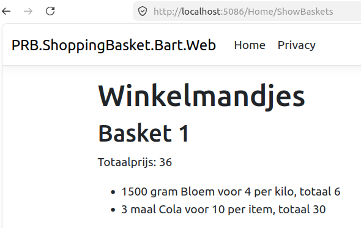

Let wel, telkens als dit opnieuw uitvoert wordt er een nieuwe Basket bijgevoegd...

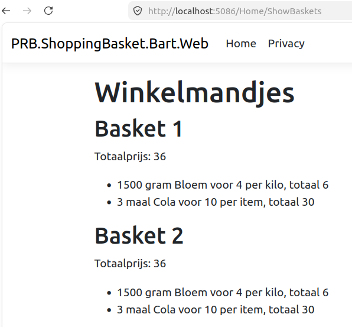

#### Duiding: Waarom Include nodig is

Bij het ophalen van baskets gebruiken we:

~~~cs
_context.Baskets
    .Include(basket => basket.Items)
    .ToList();
~~~

De `Include` is belangrijk, zonder `Include` haalt EF Core enkel de `Basket`-objecten op.  
Met `Include` vragen we expliciet om ook de bijhorende `BasketItems` op te halen.

Dit noemen we **eager loading**.

#### Duiding: Controleren welk type EF teruggeeft

Omdat we met overerving werken, moet EF Core opnieuw de juiste concrete klassen maken.

Dat betekent:

* Een rij met `BasketItemType = Quantity` wordt opnieuw een `QuantityBasketItem`
* Een rij met `BasketItemType = Bulk` wordt opnieuw een `BulkBasketItem`

Onze view gebruikt gewoon:

~~~cs
@foreach (BasketItem item in basket.Items)
{
    <li>@item</li>
}
~~~

Omdat `ToString()` overschreven is in de child-klassen, wordt automatisch de juiste tekst getoond.

Bijvoorbeeld:

~~~text
3 maal Cola voor 10 per item, totaal 30
1500 gram Bloem voor 4 per kilo, totaal 6
~~~

Dit is opnieuw een voorbeeld van **polymorfisme**.

#### Duiding: berekende properties

De property `TotalPrice` wordt niet rechtstreeks opgeslagen in de database.

Dat **hoeft** ook **niet**, want deze waarde kan altijd **opnieuw** **berekend** worden op basis van:

* `Price` en `Quantity`
* of `PricePerKilo` en `WeightInGrams`

Ook de property:

~~~cs
public int TotalBasketPrice
~~~

wordt niet opgeslagen, deze wordt berekend op basis van alle items in de basket.

Dat is een **belangrijk** principe: **sla niet onnodig gegevens op** die je eenvoudig opnieuw kan **berekenen**.

### Testen en committen: 'Add Entity Framework mapping for baskets and basket items'

Als bovenstaande stap getest is maak een commit met bijvoorbeeld `Add Entity Framework mapping for baskets and basket items`

### Entity Framework Samengevat

In dit hoofdstuk hebben we Entity Framework toegevoegd voor onze winkelmandlogica.

We hebben:

* `Basket` een `Id` gegeven
* `BasketItem` een `Id` en `BasketId` gegeven
* Parameterloze constructors toegevoegd voor EF Core
* `ApplicationDbContext` uitgebreid met `DbSet<Basket>` en `DbSet<BasketItem>`
* Inheritance mapping toegevoegd voor `QuantityBasketItem` en `BulkBasketItem`
* Een migration gemaakt
* Testdata opgeslagen in SQLite
* Baskets opnieuw opgehaald met `.Include(...)`

Onze applicatie bewaart nu niet enkel gebruikers via Identity, maar ook winkelmandjes en hun verschillende soorten items.

## BasketService en BasketRepository (deel 10)

In dit hoofdstuk voegen we een **service** en een **repository** toe voor onze winkelmandlogica.  
We gaan hier ook meer gebruik maken van Dependency Injection...

Tot nu toe gebruiken we `ApplicationDbContext` rechtstreeks in onze controller of service.  
Dat werkt, maar het zorgt ervoor dat de code sterker **gekoppeld** is aan Entity Framework.

We gaan daarom twee extra lagen toevoegen:

* Een **repository-laag** voor **database-toegang**
* Een **service-laag** voor **applicatielogica**
* Registratie via **dependency injection**
* **Gebruik** van de **service** in een **controller**

De structuur wordt dan:

~~~text
BasketController
        |
        v
IBasketService
        |
        v
BasketService
        |
        v
IBasketRepository
        |
        v
BasketRepository
        |
        v
ApplicationDbContext
        |
        v
SQLite database
~~~

### Waarom een repository?

Een **repository** is verantwoordelijk voor het ophalen en bewaren van gegevens.

Voorbeelden:

* Alle baskets ophalen
* Eén basket ophalen op basis van id
* Een basket toevoegen
* Wijzigingen bewaren

De repository weet dus hoe de database werkt.  
In ons geval gebruikt de repository `ApplicationDbContext`.

De controller en service hoeven daardoor niet rechtstreeks met Entity Framework te werken.

### Waarom daarnaast nog een service?

Een **service** bevat applicatielogica.

Voorbeelden:

* Een nieuwe testbasket aanmaken
* Controleren of een item mag worden toegevoegd
* Een totaal berekenen
* Later eventueel regels rond gebruikers of rollen toepassen

In eenvoudige applicaties lijken repository en service soms sterk op elkaar.  
Toch houden we ze hier apart, omdat dit goed toont hoe dependency injection werkt.

### Stap 1: Folders maken

Maak in het MVC-project twee nieuwe folders aan:

~~~text
Repositories
Services
~~~

De structuur wordt dan:

~~~text
PRB.ShoppingBasket.Bart.Web
│
├── Controllers
├── Models
├── Repositories
│   ├── IBasketRepository.cs
│   └── BasketRepository.cs
├── Services
│   ├── IBasketService.cs
│   └── BasketService.cs
├── Views
└── Program.cs
~~~

We plaatsen deze klassen in het webproject omdat ze rechtstreeks samenwerken met `ApplicationDbContext`.

### Stap 2: Interface IBasketRepository maken

Maak in de folder `Repositories` een nieuwe klasse `IBasketRepository.cs` aan met als inhoud:

~~~cs
using PRB.ShoppingBasket.Bart;

namespace PRB.ShoppingBasket.Bart.Web.Repositories
{
    public interface IBasketRepository
    {
        List<Basket> GetAll();

        Basket? GetById(int id);

        void Add(Basket basket);

        void SaveChanges();
    }
}
~~~

Deze interface beschrijft welke **database-acties** beschikbaar zijn voor baskets.

> Ze zegt nog niet hoe die acties uitgevoerd worden.

### Stap 3: BasketRepository maken

Maak in de folder `Repositories` een nieuw bestand aan `BasketRepository.cs` met volgende inhoud:

~~~cs
using Microsoft.EntityFrameworkCore;
using PRB.ShoppingBasket.Bart;
using PRB.ShoppingBasket.Bart.Web.Data;

namespace PRB.ShoppingBasket.Bart.Web.Repositories
{
    public class BasketRepository : IBasketRepository
    {
        private readonly ApplicationDbContext _context;

        public BasketRepository(ApplicationDbContext context)
        {
            _context = context;
        }

        public List<Basket> GetAll()
        {
            return _context.Baskets
                .Include(basket => basket.Items)
                .ToList();
        }

        public Basket? GetById(int id)
        {
            return _context.Baskets
                .Include(basket => basket.Items)
                .FirstOrDefault(basket => basket.Id == id);
        }

        public void Add(Basket basket)
        {
            _context.Baskets.Add(basket);
        }

        public void SaveChanges()
        {
            _context.SaveChanges();
        }
    }
}
~~~

De repository gebruikt `ApplicationDbContext`.

Bemerk dat we bij het ophalen van baskets telkens `.Include(...)` gebruiken:

~~~cs
.Include(basket => basket.Items)
~~~

Zo worden de bijhorende `BasketItems` meteen mee opgehaald.

### Stap 4: Interface IBasketService maken

Maak in de folder `Services` een nieuwe klasse `IBasketService.cs` aan met als inhoud:

~~~cs
using PRB.ShoppingBasket.Bart;

namespace PRB.ShoppingBasket.Bart.Web.Services
{
    public interface IBasketService
    {
        List<Basket> GetAllBaskets();

        Basket? GetBasketById(int id);

        Basket CreateTestBasket();
    }
}
~~~

Deze service-interface is gericht op wat de **applicatie** wil doen, de **namen** zijn daarom iets meer **applicatiegericht**:

* `GetAllBaskets`
* `GetBasketById`
* `CreateTestBasket`

### Stap 5: BasketService maken

Maak in de folder `Services` een nieuw bestand aan `BasketService.cs` en plaats daarin:

~~~cs
using PRB.ShoppingBasket.Bart;
using PRB.ShoppingBasket.Bart.Web.Repositories;

namespace PRB.ShoppingBasket.Bart.Web.Services
{
    public class BasketService : IBasketService
    {
        private readonly IBasketRepository _basketRepository;

        public BasketService(IBasketRepository basketRepository)
        {
            _basketRepository = basketRepository;
        }

        public List<Basket> GetAllBaskets()
        {
            return _basketRepository.GetAll();
        }

        public Basket? GetBasketById(int id)
        {
            return _basketRepository.GetById(id);
        }

        public Basket CreateTestBasket()
        {
            Basket basket = new Basket();

            basket.AddNewItem(new QuantityBasketItem(10, "Cola", 3));
            basket.AddNewItem(new BulkBasketItem(4, "Bloem", 1500));

            _basketRepository.Add(basket);
            _basketRepository.SaveChanges();

            return basket;
        }
    }
}
~~~

De service gebruikt geen `ApplicationDbContext`, niet rechtstreeks maar via `IBasketRepository`.  
Daardoor is de service niet rechtstreeks gekoppeld aan het Entity Framework.

### Stap 6: Repository en service registreren in Program.cs

ASP.NET Core moet weten welke **concrete klassen** bij de interfaces horen.  Open `Program.cs` (Web-project) en voeg bovenaan toe:

~~~cs
using PRB.ShoppingBasket.Bart.Web.Repositories;
using PRB.ShoppingBasket.Bart.Web.Services;
~~~

Zoek de plaats waar de services worden geregistreerd, vóór:

~~~cs
var app = builder.Build();
~~~

Voeg daar toe:

~~~cs
builder.Services.AddScoped<IBasketRepository, BasketRepository>();
builder.Services.AddScoped<IBasketService, BasketService>();
~~~

Een groter stuk van `Program.cs` kan er dan zo uitzien:

~~~cs
builder.Services.AddDbContext<ApplicationDbContext>(options =>
    options.UseSqlite(connectionString));

builder.Services.AddDefaultIdentity<IdentityUser>(options =>
    {
        options.SignIn.RequireConfirmedAccount = false;
    })
    .AddRoles<IdentityRole>()
    .AddEntityFrameworkStores<ApplicationDbContext>();

builder.Services.AddScoped<IBasketRepository, BasketRepository>();
builder.Services.AddScoped<IBasketService, BasketService>();

builder.Services.AddControllersWithViews();
~~~

Hier zeggen we:

~~~cs
builder.Services.AddScoped<IBasketRepository, BasketRepository>();
~~~

Als iemand een `IBasketRepository` vraagt, geef dan een `BasketRepository` daarna

~~~cs
builder.Services.AddScoped<IBasketService, BasketService>();
~~~

Als iemand een `IBasketService` vraagt, geef dan een `BasketService`.

#### Duiding: Wat betekent AddScoped?

ASP.NET Core kent verschillende levensduren voor services, met `AddScoped` maken we één object per HTTP-request.

Dat betekent:

* Komt er **1 request** binnen, dan wordt er **1 repository** en **1 service** gemaakt
* Binnen **datzelfde** **request** worden deze objecten **hergebruikt**
* Bij een **volgend** **request** worden **nieuwe** **objecten** gemaakt

Dat past goed bij `ApplicationDbContext`, want ook die wordt typisch als scoped service gebruikt.

Andere mogelijkheden zijn 

* `AddTransient` waarbij telkens een nieuw object gemaakt wanneer de service gevraagd wordt.
* `AddSingleton` waarbij één object gemaakt voor de volledige levensduur van de applicatie.

Voor databasegerichte repositories en services gebruiken we meestal `AddScoped`

### Stap 7: BasketController maken

Maak nu een nieuwe controller aan met de naam `Controllers/BasketController.cs` met als inhoud:

~~~cs
using Microsoft.AspNetCore.Mvc;
using PRB.ShoppingBasket.Bart;
using PRB.ShoppingBasket.Bart.Web.Services;

namespace PRB.ShoppingBasket.Bart.Web.Controllers
{
    public class BasketController : Controller
    {
        private readonly IBasketService _basketService;

        public BasketController(IBasketService basketService)
        {
            _basketService = basketService;
        }

        public IActionResult Index()
        {
            List<Basket> baskets = _basketService.GetAllBaskets();

            return View(baskets);
        }

        public IActionResult Details(int id)
        {
            Basket? basket = _basketService.GetBasketById(id);

            if (basket == null)
            {
                return NotFound();
            }

            return View(basket);
        }

        public IActionResult CreateTestBasket()
        {
            Basket basket = _basketService.CreateTestBasket();

            return RedirectToAction("Details", new { id = basket.Id });
        }
    }
}
~~~

Bemerk dat deze controller geen `ApplicationDbContext` en geen repository gebruikt enkel `IBasketService`

> Het (kunnen) werken met interfaces is een belangrijk voordeel van dependency injection.

### Stap 8: View voor Index maken

Maak een nieuwe folder aan `Views/Basket` met een view `Index.cshtml` met als inhoud

> Je kan in je IDE ook met de rechtermuisknop op de action klikken en de view vandaar aanmaken...

~~~html
@using PRB.ShoppingBasket.Bart
@model List<Basket>

<h1>Winkelmandjes</h1>

    <a asp-controller="Basket" asp-action="CreateTestBasket">Maak testbasket aan</a>

@if (!Model.Any())
{
    
Er zijn nog geen winkelmandjes.

}
else
{
    <ul>
        @foreach (Basket basket in Model)
        {
            <li>
                <a asp-controller="Basket" asp-action="Details" asp-route-id="@basket.Id">
                    Basket @basket.Id
                </a>
                - totaal: @basket.TotalBasketPrice
            </li>
        }
    </ul>
}
~~~

Deze view toont alle bestaande baskets.  
Er is ook een link voorzien om snel een testbasket aan te maken.

### Stap 9: View voor Details maken

Maak in dezelfde folder een detail-view aan `Views/Basket/Details.cshtml`:

~~~html
@using PRB.ShoppingBasket.Bart
@model Basket

<h1>Basket @Model.Id</h1>

Totaalprijs: @Model.TotalBasketPrice

<h2>Items</h2>

@if (!Model.Items.Any())
{
    
Deze basket bevat nog geen items.

}
else
{
    <ul>
        @foreach (BasketItem item in Model.Items)
        {
            <li>@item</li>
        }
    </ul>
}

    <a asp-controller="Basket" asp-action="Index">Terug naar overzicht</a>

~~~

Deze view toont 1 basket met alle items.

### Stap 10: Navigatielink toevoegen

Om de basketpagina gemakkelijk bereikbaar te maken, voegen we een link toe in de layout, open `Views/Shared/_Layout.cshtml` en voeg in de navigatie een link toe:

~~~html
<li class="nav-item">
    <a class="nav-link text-dark" asp-area="" asp-controller="Basket" asp-action="Index">Baskets</a>
</li>
~~~

Plaats deze naast de bestaande Home-link.

### Stap 11: Testen

Start de MVC-applicatie.

Ga naar `/Basket` en controleer dat:

* De pagina toont een overzicht van baskets
* Je kan een testbasket aanmaken
* Je wordt doorgestuurd naar de detailpagina
* De detailpagina toont de items
* De totaalprijs wordt correct getoond

### Duiding: Wat hebben we bereikt?

Voor deze wijziging werkte de controller of service rechtstreeks met `ApplicationDbContext`.

Na deze wijziging ziet de structuur er beter uit:

~~~text
BasketController
        |
        v
IBasketService
        |
        v
BasketService
        |
        v
IBasketRepository
        |
        v
BasketRepository
        |
        v
ApplicationDbContext
        |
        v
SQLite database
~~~

Elke laag heeft nu een duidelijke verantwoordelijkheid.

#### Verantwoordelijkheid per laag

##### Controller

De controller is verantwoordelijk voor webverkeer.

De controller:

* Ontvangt requests
* Roept de service aan
* Geeft een view terug
* Stuurt eventueel door naar een andere action

De controller weet niet hoe de database werkt.

##### Service

De service bevat applicatielogica.

De service:

* Gebruikt de repository
* Maakt bijvoorbeeld een testbasket aan
* Kan later extra regels bevatten
* Weet niet rechtstreeks hoe Entity Framework werkt

##### Repository

De repository bevat database-toegang.

De repository:

* Gebruikt `ApplicationDbContext`
* Haalt baskets op
* Voegt baskets toe
* Bewaart wijzigingen

#### Waarom interfaces?

We hadden ook rechtstreeks `BasketService` en `BasketRepository` kunnen gebruiken.

Bijvoorbeeld:

~~~cs
private readonly BasketService _basketService;
~~~

Toch gebruiken we liever interfaces:

~~~cs
private readonly IBasketService _basketService;
~~~

en:

~~~cs
private readonly IBasketRepository _basketRepository;
~~~

Dat heeft enkele voordelen:

* De code hangt minder vast aan concrete klassen
* We kunnen later een andere implementatie maken
* We kunnen gemakkelijker unit tests schrijven
* De verantwoordelijkheden worden duidelijker

Bijvoorbeeld: later zouden we een fake repository kunnen maken voor testen:

~~~cs
public class FakeBasketRepository : IBasketRepository
{
    private readonly List<Basket> _baskets = new List<Basket>();

    public List<Basket> GetAll()
    {
        return _baskets;
    }

    public Basket? GetById(int id)
    {
        return _baskets.FirstOrDefault(basket => basket.Id == id);
    }

    public void Add(Basket basket)
    {
        _baskets.Add(basket);
    }

    public void SaveChanges()
    {
    }
}
~~~

Dan kunnen we `BasketService` testen zonder echte database.

### Finale stap: Commit maken

Maak na deze stap een commit met *"Add basket service and repository with dependency injection"*

### Services en Repositories samengevat

In dit hoofdstuk hebben we dependency injection toegepast met een service- en repositorylaag.

We hebben:

* Een `Repositories`-folder toegevoegd
* Een `Services`-folder toegevoegd
* Een interface `IBasketRepository` gemaakt
* Een concrete klasse `BasketRepository` gemaakt
* Een interface `IBasketService` gemaakt
* Een concrete klasse `BasketService` gemaakt
* Repository en service geregistreerd in `Program.cs`
* De service gebruikt in `BasketController`
* Views gemaakt voor overzicht en details

Hierdoor is de controller minder afhankelijk van Entity Framework en is de code beter gestructureerd.

## ViewModel gebruiken om BasketItems toe te voegen (deel 11)

In dit hoofdstuk voegen we een formulier toe waarmee een gebruiker items aan een bestaande basket kan toevoegen.

We willen twee soorten items kunnen toevoegen:

* `QuantityBasketItem`
* `BulkBasketItem`

Daarvoor gebruiken we een **ViewModel**.

Tot nu toe gebruikten we in onze views vooral rechtstreeks onze domeinklassen, zoals `Basket`, `BasketItem`, `QuantityBasketItem` en `BulkBasketItem`

Voor eenvoudige weergave kan dat werken.  
Maar voor formulieren is het vaak beter om een aparte klasse te maken die precies beschrijft welke gegevens de view nodig heeft.

Zo'n klasse noemen we een **ViewModel**.

### Waarom een ViewModel?

Een domeinklasse beschrijft de logica van de applicatie.

Bijvoorbeeld `QuantityBasketItem` bevat properties zoals:

* `Description`
* `Price`
* `Quantity`
* `TotalPrice`

Maar een **formulier** om een item toe te voegen heeft soms andere gegevens nodig.

Bijvoorbeeld:

* Welke basket wordt aangepast?
* Welk type item wil de gebruiker toevoegen?
* Gaat het om een gewoon item of bulk item?
* Welke velden moeten ingevuld worden?

Daarom maken we een aparte klasse `AddBasketItemViewModel`, specifiek bedoeld voor het formulier.

### Stap 1: ViewModels-folder maken

Maak in het MVC-project een nieuwe folder `ViewModels` aan, de structuur wordt dan bijvoorbeeld:

~~~text
PRB.ShoppingBasket.Bart.Web
│
├── Controllers
├── Repositories
├── Services
├── ViewModels
│   └── AddBasketItemViewModel.cs
├── Views
└── Program.cs
~~~

### Stap 2: AddBasketItemViewModel maken

Maak in de folder `ViewModels` een nieuw bestand aan `AddBasketItemViewModel.cs` met als inhoud:

~~~cs
using System.ComponentModel.DataAnnotations;

namespace PRB.ShoppingBasket.Bart.Web.ViewModels
{
    public class AddBasketItemViewModel
    {
        public int BasketId { get; set; }

        [Required]
        public string ItemType { get; set; } = "Quantity";

        [Required]
        public string Description { get; set; } = string.Empty;

        public int Price { get; set; }

        public int Quantity { get; set; } = 1;

        public int PricePerKilo { get; set; }

        public int WeightInGrams { get; set; } = 1000;
    }
}
~~~

Deze ViewModel bevat velden voor beide soorten items.

Voor een `QuantityBasketItem` gebruiken we:

* `Description`
* `Price`
* `Quantity`

Voor een `BulkBasketItem` gebruiken we:

* `Description`
* `PricePerKilo`
* `WeightInGrams`

De property `ItemType` bepaalt welk type item we willen aanmaken.

Mogelijke waarden zijn bijvoorbeeld:

~~~text
Quantity
Bulk
~~~

### Stap 3: BasketService uitbreiden

We voegen nu functies toe aan onze service om items toe te voegen aan een bestaande basket.

Open `Services/IBasketService.cs` en breid de interface uit:

~~~cs
using PRB.ShoppingBasket.Bart;

namespace PRB.ShoppingBasket.Bart.Web.Services
{
    public interface IBasketService
    {
        List<Basket> GetAllBaskets();

        Basket? GetBasketById(int id);

        Basket CreateTestBasket();

        bool AddQuantityItem(int basketId, string description, int price, int quantity);

        bool AddBulkItem(int basketId, string description, int pricePerKilo, int weightInGrams);
    }
}
~~~

De nieuwe methodes geven een `bool` terug.

* `true` betekent dat het item is toegevoegd
* `false` betekent dat de basket niet gevonden werd

### Stap 4: BasketService implementeren

Open `Services/BasketService.cs` en voeg de nieuwe methodes toe:

~~~cs
using PRB.ShoppingBasket.Bart;
using PRB.ShoppingBasket.Bart.Web.Repositories;

namespace PRB.ShoppingBasket.Bart.Web.Services
{
    public class BasketService : IBasketService
    {
        private readonly IBasketRepository _basketRepository;

        public BasketService(IBasketRepository basketRepository)
        {
            _basketRepository = basketRepository;
        }

        public List<Basket> GetAllBaskets()
        {
            return _basketRepository.GetAll();
        }

        public Basket? GetBasketById(int id)
        {
            return _basketRepository.GetById(id);
        }

        public Basket CreateTestBasket()
        {
            Basket basket = new Basket();

            basket.AddNewItem(new QuantityBasketItem(10, "Cola", 3));
            basket.AddNewItem(new BulkBasketItem(4, "Bloem", 1500));

            _basketRepository.Add(basket);
            _basketRepository.SaveChanges();

            return basket;
        }

        public bool AddQuantityItem(int basketId, string description, int price, int quantity)
        {
            Basket? basket = _basketRepository.GetById(basketId);

            if (basket == null)
            {
                return false;
            }

            basket.AddNewItem(new QuantityBasketItem(price, description, quantity));

            _basketRepository.SaveChanges();

            return true;
        }

        public bool AddBulkItem(int basketId, string description, int pricePerKilo, int weightInGrams)
        {
            Basket? basket = _basketRepository.GetById(basketId);

            if (basket == null)
            {
                return false;
            }

            basket.AddNewItem(new BulkBasketItem(pricePerKilo, description, weightInGrams));

            _basketRepository.SaveChanges();

            return true;
        }
    }
}
~~~

De service haalt eerst de basket op via de repository, daarna wordt het juiste type item toegevoegd:

~~~cs
new QuantityBasketItem(...)
~~~

of:

~~~cs
new BulkBasketItem(...)
~~~

Daarna worden de wijzigingen opgeslagen met:

~~~cs
_basketRepository.SaveChanges();
~~~

### Stap 5: BasketController uitbreiden

Open `BasketController.cs` en voeg bovenaan de ViewModel-namespace toe:

~~~cs
using PRB.ShoppingBasket.Bart.Web.ViewModels;
~~~

We voegen nu twee acties toe:

* Een `GET`-actie om het formulier te tonen
* Een `POST`-actie om het formulier te verwerken

~~~cs
[HttpGet]
public IActionResult AddItem(int basketId)
{
    AddBasketItemViewModel model = new AddBasketItemViewModel
    {
        BasketId = basketId
    };

    return View(model);
}

[HttpPost]
public IActionResult AddItem(AddBasketItemViewModel model)
{
    if (!ModelState.IsValid)
    {
        return View(model);
    }

    try
    {
        bool basketFound;

        if (model.ItemType == "Quantity")
        {
            basketFound = _basketService.AddQuantityItem(
                model.BasketId,
                model.Description,
                model.Price,
                model.Quantity);
        }
        else if (model.ItemType == "Bulk")
        {
            basketFound = _basketService.AddBulkItem(
                model.BasketId,
                model.Description,
                model.PricePerKilo,
                model.WeightInGrams);
        }
        else
        {
            ModelState.AddModelError("", "Onbekend itemtype");
            return View(model);
        }

        if (!basketFound)
        {
            return NotFound();
        }

        return RedirectToAction("Details", new { id = model.BasketId });
    }
    catch (NoNegativeAmountAllowedException e)
    {
        ModelState.AddModelError("", $"Geen negatief getal toegelaten voor {e.Element}");
        return View(model);
    }
    catch (ItemAlreadyInBasketException e)
    {
        ModelState.AddModelError("", $"Het item met beschrijving {e.Description} bestaat reeds");
        return View(model);
    }
}
~~~

De controller beslist op basis van `ItemType` welke service-methode wordt aangeroepen.

### Stap 6: Vollediger voorbeeld van BasketController

De controller zou er nu ongeveer zo uitzien:

~~~cs
using Microsoft.AspNetCore.Mvc;
using PRB.ShoppingBasket.Bart;
using PRB.ShoppingBasket.Bart.Web.Services;
using PRB.ShoppingBasket.Bart.Web.ViewModels;

namespace PRB.ShoppingBasket.Bart.Web.Controllers
{
    public class BasketController : Controller
    {
        private readonly IBasketService _basketService;

        public BasketController(IBasketService basketService)
        {
            _basketService = basketService;
        }

        public IActionResult Index()
        {
            List<Basket> baskets = _basketService.GetAllBaskets();

            return View(baskets);
        }

        public IActionResult Details(int id)
        {
            Basket? basket = _basketService.GetBasketById(id);

            if (basket == null)
            {
                return NotFound();
            }

            return View(basket);
        }

        public IActionResult CreateTestBasket()
        {
            Basket basket = _basketService.CreateTestBasket();

            return RedirectToAction("Details", new { id = basket.Id });
        }

        [HttpGet]
        public IActionResult AddItem(int basketId)
        {
            AddBasketItemViewModel model = new AddBasketItemViewModel
            {
                BasketId = basketId
            };

            return View(model);
        }

        [HttpPost]
        public IActionResult AddItem(AddBasketItemViewModel model)
        {
            if (!ModelState.IsValid)
            {
                return View(model);
            }

            try
            {
                bool basketFound;

                if (model.ItemType == "Quantity")
                {
                    basketFound = _basketService.AddQuantityItem(
                        model.BasketId,
                        model.Description,
                        model.Price,
                        model.Quantity);
                }
                else if (model.ItemType == "Bulk")
                {
                    basketFound = _basketService.AddBulkItem(
                        model.BasketId,
                        model.Description,
                        model.PricePerKilo,
                        model.WeightInGrams);
                }
                else
                {
                    ModelState.AddModelError("", "Onbekend itemtype");
                    return View(model);
                }

                if (!basketFound)
                {
                    return NotFound();
                }

                return RedirectToAction("Details", new { id = model.BasketId });
            }
            catch (NoNegativeAmountAllowedException e)
            {
                ModelState.AddModelError("", $"Geen negatief getal toegelaten voor {e.Element}");
                return View(model);
            }
            catch (ItemAlreadyInBasketException e)
            {
                ModelState.AddModelError("", $"Het item met beschrijving {e.Description} bestaat reeds");
                return View(model);
            }
        }
    }
}
~~~

### Stap 7: AddItem-view maken

Maak in de folder `Views/Basket` een nieuwe view aan met de naam 
`AddItem.cshtml` (of maak deze aan via de IDE) met als inhoud:

~~~html
@model PRB.ShoppingBasket.Bart.Web.ViewModels.AddBasketItemViewModel

<h1>Item toevoegen</h1>

<form asp-controller="Basket" asp-action="AddItem" method="post">
    <input type="hidden" asp-for="BasketId" />

    

    

        <label asp-for="ItemType" class="form-label">Type item</label>
        <select asp-for="ItemType" class="form-control">
            <option value="Quantity">Gewoon item</option>
            <option value="Bulk">Bulk item</option>
        </select>
    

    

        <label asp-for="Description" class="form-label">Omschrijving</label>
        <input asp-for="Description" class="form-control" />
        
    

    <h2>Gewoon item</h2>

    

        <label asp-for="Price" class="form-label">Prijs per item</label>
        <input asp-for="Price" class="form-control" />
    

    

        <label asp-for="Quantity" class="form-label">Hoeveelheid</label>
        <input asp-for="Quantity" class="form-control" />
    

    <h2>Bulk item</h2>

    

        <label asp-for="PricePerKilo" class="form-label">Prijs per kilo</label>
        <input asp-for="PricePerKilo" class="form-control" />
    

    

        <label asp-for="WeightInGrams" class="form-label">Gewicht in gram</label>
        <input asp-for="WeightInGrams" class="form-control" />
    

    <button type="submit" class="btn btn-primary">Toevoegen</button>

    <a asp-controller="Basket" asp-action="Details" asp-route-id="@Model.BasketId" class="btn btn-secondary">
        Annuleren
    </a>
</form>
~~~

Deze view toont voorlopig alle invoervelden, de gebruiker kiest bovenaan of het gaat om:

* Een gewoon item
* Een bulk item

Afhankelijk van die keuze gebruikt de controller de juiste velden.

### Stap 8: Link toevoegen aan de Details-view

Open `Views/Basket/Details.cshtml` en voeg een link toe om een item toe te voegen:

~~~html

    <a asp-controller="Basket" asp-action="AddItem" asp-route-basketId="@Model.Id">
        Item toevoegen
    </a>

~~~

Een volledige versie ziet er ongeveer zo uit:

~~~html
@using PRB.ShoppingBasket.Bart
@model Basket

<h1>Basket @Model.Id</h1>

Totaalprijs: @Model.TotalBasketPrice

    <a asp-controller="Basket" asp-action="AddItem" asp-route-basketId="@Model.Id">
        Item toevoegen
    </a>

<h2>Items</h2>

@if (!Model.Items.Any())
{
    
Deze basket bevat nog geen items.

}
else
{
    <ul>
        @foreach (BasketItem item in Model.Items)
        {
            <li>@item</li>
        }
    </ul>
}

    <a asp-controller="Basket" asp-action="Index">Terug naar overzicht</a>

~~~

### Stap 9: Testen

#### QuantityBasketItem

Start de applicatie en navigeer naar `/Basket` (maak eventueel eerst een testbasket aan), ga daarna naar de detailpagina van een basket en klik op `Item toevoegen` en vul in:

~~~text
Type item: Gewoon item
Omschrijving: Chips
Prijs per item: 5
Hoeveelheid: 2
~~~

Na het verzenden keer je terug naar de detailpagina.  
Je zou nu het nieuwe item moeten zien:

~~~text
2 maal Chips voor 5 per item, totaal 10
~~~

#### BulkBasketItem

Voeg daarna een bulk item toe.

Bijvoorbeeld:

~~~text
Type item: Bulk item
Omschrijving: Rijst
Prijs per kilo: 4
Gewicht in gram: 1500
~~~

Na het verzenden zou je bijvoorbeeld moeten zien:

~~~text
1500 gram Rijst voor 4 per kilo, totaal 6
~~~

#### Foutafhandeling testen

Test ook foutieve situaties.

Bijvoorbeeld een negatieve prijs:

~~~text
Prijs per item: -5
~~~

Dan zou je een foutmelding moeten krijgen:

~~~text
Geen negatief getal toegelaten voor prijs
~~~

Test ook een dubbele omschrijving.

Bijvoorbeeld als `Chips` al bestaat in de basket en je voegt opnieuw `Chips` toe, dan zou je een foutmelding moeten krijgen:

~~~text
Het item met beschrijving Chips bestaat reeds
~~~

### Duiding: Waarom is dit beter dan rechtstreeks BasketItem gebruiken?

We hadden kunnen proberen om rechtstreeks `QuantityBasketItem` of `BulkBasketItem` als model in de view te gebruiken.

Maar dat zou onhandig zijn, omdat het formulier eerst moet weten welk type item de gebruiker wil maken.

De ViewModel bevat precies de gegevens die het formulier nodig heeft:

~~~cs
public class AddBasketItemViewModel
{
    public int BasketId { get; set; }

    public string ItemType { get; set; } = "Quantity";

    public string Description { get; set; } = string.Empty;

    public int Price { get; set; }

    public int Quantity { get; set; } = 1;

    public int PricePerKilo { get; set; }

    public int WeightInGrams { get; set; } = 1000;
}
~~~

De **ViewModel** is dus **geen domeinmodel**.  
Het is een model specifiek voor de view.

### Duiding: Verantwoordelijkheden

Na deze stap hebben we de verantwoordelijkheden als volgt verdeeld:

* De view werkt met een ViewModel.
* De controller ontvangt de ingevulde ViewModel.
* De controller beslist welk type item wordt toegevoegd.
* De service voert de applicatielogica uit.
* De repository bewaart de gegevens.

### Finale stap: Commit maken 'Add ViewModel for creation'

Maak na deze stap een commit met *'Add ViewModel for creation'*

### ViewModel Samengevat

In dit hoofdstuk hebben we een ViewModel toegevoegd om items aan een basket toe te voegen.

We hebben:

* Een `ViewModels`-folder gemaakt
* Een `AddBasketItemViewModel` gemaakt
* De `IBasketService` uitgebreid
* De `BasketService` uitgebreid
* Een `AddItem`-actie toegevoegd aan `BasketController`
* Een `AddItem.cshtml`-view gemaakt
* Een link toegevoegd vanuit de detailpagina
* Zowel `QuantityBasketItem` als `BulkBasketItem` kunnen toevoegen

Hierdoor gebruiken we nu een duidelijker MVC-patroon:

* De view gebruikt een ViewModel
* De controller verwerkt de input
* De service bevat de logica
* De repository bewaart de gegevens

## Basket koppelen aan de ingelogde gebruiker (deel 12)

In dit hoofdstuk koppelen we een `Basket` aan de gebruiker die is ingelogd via **ASP.NET Core Identity**.

Tot nu toe zijn onze baskets algemeen.  
Iedereen ziet dezelfde lijst met baskets.

Dat is niet ideaal.

In een echte applicatie wil je meestal dat:

* Elke gebruiker zijn eigen winkelmandjes heeft
* Een gebruiker enkel zijn eigen baskets ziet
* Nieuwe baskets automatisch gekoppeld worden aan de ingelogde gebruiker

We gebruiken hiervoor de `UserId` van ASP.NET Core Identity.

### Situatie

We hebben ondertussen:

* Identity toegevoegd
* Baskets opgeslagen met Entity Framework
* Een repository toegevoegd
* Een service toegevoegd
* Een ViewModel gebruikt om items toe te voegen

Nu gaan we de baskets koppelen aan de ingelogde gebruiker.

### Stap 1: Basket uitbreiden met UserId

Open de klasse `Basket.cs` en voeg een property toe:

~~~cs
public string UserId { get; private set; } = string.Empty;
~~~

We voorzien ook een methode om de basket aan een gebruiker te koppelen:

~~~cs
public void AssignToUser(string userId)
{
    UserId = userId;
}
~~~

De klasse `Basket` ziet er dan bijvoorbeeld zo uit:

~~~cs
namespace PRB.ShoppingBasket.Bart
{
    public class Basket
    {
        public int Id { get; private set; }

        public string UserId { get; private set; } = string.Empty;

        public List<BasketItem> Items { get; private set; } = new List<BasketItem>();

        public void AssignToUser(string userId)
        {
            UserId = userId;
        }

        public void AddNewItem(BasketItem item)
        {
            if (ItemProvidedInBasket(item))
            {
                throw new ItemAlreadyInBasketException(item.Description);
            }

            Items.Add(item);
        }

        public bool ItemProvidedInBasket(BasketItem item)
        {
            return Lookup(item.Description) != null;
        }

        public BasketItem? Lookup(string description)
        {
            foreach (BasketItem item in Items)
            {
                if (item.Description.Equals(description))
                {
                    return item;
                }
            }

            return null;
        }

        public int TotalBasketPrice
        {
            get
            {
                int totalPrice = 0;

                foreach (BasketItem item in Items)
                {
                    totalPrice += item.TotalPrice;
                }

                return totalPrice;
            }
        }
    }
}
~~~

We gebruiken hier een `string`, omdat de standaard `IdentityUser.Id` ook een `string` is.

### Stap 2: Repository aanpassen

Momenteel haalt de repository alle baskets op:

~~~cs
public List<Basket> GetAll()
{
    return _context.Baskets
        .Include(basket => basket.Items)
        .ToList();
}
~~~

We willen nu enkel baskets ophalen van één gebruiker.  
Open `IBasketRepository.cs` en pas de interface aan:

~~~cs
using PRB.ShoppingBasket.Bart;

namespace PRB.ShoppingBasket.Bart.Web.Repositories
{
    public interface IBasketRepository
    {
        List<Basket> GetAllForUser(string userId);

        Basket? GetByIdForUser(int id, string userId);

        void Add(Basket basket);

        void SaveChanges();
    }
}
~~~

Open daarna `BasketRepository.cs` en pas de implementatie aan:

~~~cs
using Microsoft.EntityFrameworkCore;
using PRB.ShoppingBasket.Bart;
using PRB.ShoppingBasket.Bart.Web.Data;

namespace PRB.ShoppingBasket.Bart.Web.Repositories
{
    public class BasketRepository : IBasketRepository
    {
        private readonly ApplicationDbContext _context;

        public BasketRepository(ApplicationDbContext context)
        {
            _context = context;
        }

        public List<Basket> GetAllForUser(string userId)
        {
            return _context.Baskets
                .Include(basket => basket.Items)
                .Where(basket => basket.UserId == userId)
                .ToList();
        }

        public Basket? GetByIdForUser(int id, string userId)
        {
            return _context.Baskets
                .Include(basket => basket.Items)
                .FirstOrDefault(basket => basket.Id == id && basket.UserId == userId);
        }

        public void Add(Basket basket)
        {
            _context.Baskets.Add(basket);
        }

        public void SaveChanges()
        {
            _context.SaveChanges();
        }
    }
}
~~~

Belangrijk is deze filter:

~~~cs
.Where(basket => basket.UserId == userId)
~~~

en:

~~~cs
basket.Id == id && basket.UserId == userId
~~~

Zo vermijden we dat een gebruiker de basket van een andere gebruiker kan ophalen door gewoon het id in de URL te wijzigen.

### Stap 3: Service aanpassen

De service moet nu weten voor welke gebruiker gewerkt wordt.

Open `Services/IBasketService.cs` en pas de interface aan:

~~~cs
using PRB.ShoppingBasket.Bart;

namespace PRB.ShoppingBasket.Bart.Web.Services
{
    public interface IBasketService
    {
        List<Basket> GetAllBasketsForUser(string userId);

        Basket? GetBasketByIdForUser(int id, string userId);

        Basket CreateTestBasketForUser(string userId);

        bool AddQuantityItemForUser(int basketId, string userId, string description, int price, int quantity);

        bool AddBulkItemForUser(int basketId, string userId, string description, int pricePerKilo, int weightInGrams);
    }
}
~~~

Open daarna `Services/BasketService.cs` en pas de implementatie aan:

~~~cs
using PRB.ShoppingBasket.Bart;
using PRB.ShoppingBasket.Bart.Web.Repositories;

namespace PRB.ShoppingBasket.Bart.Web.Services
{
    public class BasketService : IBasketService
    {
        private readonly IBasketRepository _basketRepository;

        public BasketService(IBasketRepository basketRepository)
        {
            _basketRepository = basketRepository;
        }

        public List<Basket> GetAllBasketsForUser(string userId)
        {
            return _basketRepository.GetAllForUser(userId);
        }

        public Basket? GetBasketByIdForUser(int id, string userId)
        {
            return _basketRepository.GetByIdForUser(id, userId);
        }

        public Basket CreateTestBasketForUser(string userId)
        {
            Basket basket = new Basket();
            basket.AssignToUser(userId);

            basket.AddNewItem(new QuantityBasketItem(10, "Cola", 3));
            basket.AddNewItem(new BulkBasketItem(4, "Bloem", 1500));

            _basketRepository.Add(basket);
            _basketRepository.SaveChanges();

            return basket;
        }

        public bool AddQuantityItemForUser(int basketId, string userId, string description, int price, int quantity)
        {
            Basket? basket = _basketRepository.GetByIdForUser(basketId, userId);

            if (basket == null)
            {
                return false;
            }

            basket.AddNewItem(new QuantityBasketItem(price, description, quantity));

            _basketRepository.SaveChanges();

            return true;
        }

        public bool AddBulkItemForUser(int basketId, string userId, string description, int pricePerKilo, int weightInGrams)
        {
            Basket? basket = _basketRepository.GetByIdForUser(basketId, userId);

            if (basket == null)
            {
                return false;
            }

            basket.AddNewItem(new BulkBasketItem(pricePerKilo, description, weightInGrams));

            _basketRepository.SaveChanges();

            return true;
        }
    }
}
~~~

De service zorgt er nu voor dat een nieuwe basket wordt gekoppeld aan de juiste gebruiker:

~~~cs
basket.AssignToUser(userId);
~~~

### Stap 4: Controller beveiligen met Authorize

Omdat baskets nu per gebruiker zijn, moet de gebruiker ingelogd zijn, open `Controllers/BasketController.cs` en voeg bovenaan toe:

~~~cs
using Microsoft.AspNetCore.Authorization;
using System.Security.Claims;
~~~

Plaats daarna `[Authorize]` boven de controller:

~~~cs
[Authorize]
public class BasketController : Controller
{
    // ...
}
~~~

Hierdoor zijn alle acties in de controller enkel toegankelijk voor ingelogde gebruikers.

### Stap 5: UserId ophalen in de controller

In een controller kunnen we de id van de ingelogde gebruiker ophalen met:

~~~cs
User.FindFirstValue(ClaimTypes.NameIdentifier)
~~~

We maken hiervoor een kleine helper-methode in de controller:

~~~cs
private string GetCurrentUserId()
{
    return User.FindFirstValue(ClaimTypes.NameIdentifier)
        ?? throw new InvalidOperationException("Geen ingelogde gebruiker gevonden.");
}
~~~

De controller kan dan telkens de huidige gebruiker opvragen.

### Stap 6: BasketController aanpassen

De volledige controller kan er nu zo uitzien:

~~~cs
using Microsoft.AspNetCore.Authorization;
using Microsoft.AspNetCore.Mvc;
using PRB.ShoppingBasket.Bart;
using PRB.ShoppingBasket.Bart.Web.Services;
using PRB.ShoppingBasket.Bart.Web.ViewModels;
using System.Security.Claims;

namespace PRB.ShoppingBasket.Bart.Web.Controllers
{
    [Authorize]
    public class BasketController : Controller
    {
        private readonly IBasketService _basketService;

        public BasketController(IBasketService basketService)
        {
            _basketService = basketService;
        }

        public IActionResult Index()
        {
            string userId = GetCurrentUserId();

            List<Basket> baskets = _basketService.GetAllBasketsForUser(userId);

            return View(baskets);
        }

        public IActionResult Details(int id)
        {
            string userId = GetCurrentUserId();

            Basket? basket = _basketService.GetBasketByIdForUser(id, userId);

            if (basket == null)
            {
                return NotFound();
            }

            return View(basket);
        }

        public IActionResult CreateTestBasket()
        {
            string userId = GetCurrentUserId();

            Basket basket = _basketService.CreateTestBasketForUser(userId);

            return RedirectToAction("Details", new { id = basket.Id });
        }

        [HttpGet]
        public IActionResult AddItem(int basketId)
        {
            string userId = GetCurrentUserId();

            Basket? basket = _basketService.GetBasketByIdForUser(basketId, userId);

            if (basket == null)
            {
                return NotFound();
            }

            AddBasketItemViewModel model = new AddBasketItemViewModel
            {
                BasketId = basketId
            };

            return View(model);
        }

        [HttpPost]
        public IActionResult AddItem(AddBasketItemViewModel model)
        {
            string userId = GetCurrentUserId();

            if (!ModelState.IsValid)
            {
                return View(model);
            }

            try
            {
                bool basketFound;

                if (model.ItemType == "Quantity")
                {
                    basketFound = _basketService.AddQuantityItemForUser(
                        model.BasketId,
                        userId,
                        model.Description,
                        model.Price,
                        model.Quantity);
                }
                else if (model.ItemType == "Bulk")
                {
                    basketFound = _basketService.AddBulkItemForUser(
                        model.BasketId,
                        userId,
                        model.Description,
                        model.PricePerKilo,
                        model.WeightInGrams);
                }
                else
                {
                    ModelState.AddModelError("", "Onbekend itemtype");
                    return View(model);
                }

                if (!basketFound)
                {
                    return NotFound();
                }

                return RedirectToAction("Details", new { id = model.BasketId });
            }
            catch (NoNegativeAmountAllowedException e)
            {
                ModelState.AddModelError("", $"Geen negatief getal toegelaten voor {e.Element}");
                return View(model);
            }
            catch (ItemAlreadyInBasketException e)
            {
                ModelState.AddModelError("", $"Het item met beschrijving {e.Description} bestaat reeds");
                return View(model);
            }
        }

        private string GetCurrentUserId()
        {
            return User.FindFirstValue(ClaimTypes.NameIdentifier)
                ?? throw new InvalidOperationException("Geen ingelogde gebruiker gevonden.");
        }
    }
}
~~~

### Stap 7: Migration maken

Omdat we een nieuwe property `UserId` aan `Basket` hebben toegevoegd, moet de database aangepast worden.

Maak een nieuwe migration (via de IDE of via command line zoals hieronder):

~~~bash
dotnet ef migrations add AddUserIdToBasket
~~~

Voer daarna de migration uit:

~~~bash
dotnet ef database update
~~~

Hierdoor krijgt de tabel `Baskets` een extra kolom `UserId`

### Stap 8: Testen

Start de applicatie.

Test daarna het volgende scenario:

* Registreer een gebruiker
* Log in met deze gebruiker
* Ga naar `/Basket`
* Maak een testbasket aan
* Voeg items toe
* Log uit
* Registreer of log in met een tweede gebruiker
* Ga opnieuw naar `/Basket`

De tweede gebruiker zou de baskets van de eerste gebruiker niet mogen zien.

### Stap 9: Waarom is dit veiliger?

Zonder filter op `UserId` zou een gebruiker eventueel een URL kunnen proberen zoals `/Basket/Details/5`

Als basket 5 van iemand anders is, zou die basket dan toch zichtbaar kunnen zijn.

Daarom filteren we in de repository altijd op twee voorwaarden:

~~~cs
basket.Id == id && basket.UserId == userId
~~~

Zo moet zowel het basket-id als het user-id overeenkomen.

### Finale stap: Commit maken "Link baskets to authenticated users"

Maak na deze stap een commit met *"Link baskets to authenticated users"*

### Multi-user Samengevat

In dit hoofdstuk hebben we baskets gekoppeld aan de ingelogde gebruiker.

We hebben:

* `UserId` toegevoegd aan `Basket`
* Een methode `AssignToUser` toegevoegd
* De repository aangepast om per gebruiker te filteren
* De service aangepast om de user-id door te geven
* De controller beveiligd met `[Authorize]`
* De huidige gebruiker opgehaald via `ClaimTypes.NameIdentifier`
* Een migration gemaakt
* Getest met meerdere gebruikers

Vanaf nu ziet elke gebruiker enkel zijn eigen baskets.
